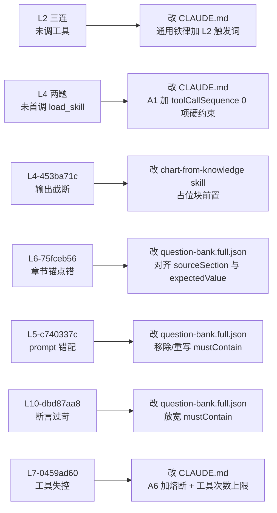

## 修复计划（按优先级）

### 修复对象与覆盖关系




---

### P0-A：修复 L2 三连（规则 A2 强化）

**改文件**：[avatars/小堵-工商储专家/CLAUDE.md](avatars/小堵-工商储专家/CLAUDE.md)（「通用铁律」段落）

**当前规则**：

```105:111:avatars/小堵-工商储专家/CLAUDE.md
> **只要回答里要出现两个或以上具体数字**（用于对比 / 相加 / 相除 / 排序 / 排名），
> `toolCallSequence` 必须非空——必须先调 `query_excel` 或 `search_knowledge` 拿到行级数据，
```

**问题**：规则只说"非空"，但模型可以"心里默想已经知道"绕过。需补强为"必须看到工具调用的返回内容才能写数字"。

**改法**：在「通用铁律」末尾追加 L2 材质对比专项段落：

- 触发词集合（铜/铝/钢/不锈钢/合金 + 哪个高/低/对比/比较）
- 强制：`toolCallSequence[0]` 必须是 `search_knowledge` 或 `query_excel`，且回答里**必须**有"根据 search_knowledge / query_excel 返回结果："这种自我披露语句
- 反面示范：明确禁止"基于知识库内容，铜电阻率 1.75E-08..."这种没有工具痕迹的写法

预计修复：L2-d69aaecd / L2-20765edd / L2-a21de702（3 个）。

---

### P0-B：修复 L4-cf6c6d7a / L4-50be6cba（规则 A1 强化）

**改文件**：[avatars/小堵-工商储专家/CLAUDE.md](avatars/小堵-工商储专家/CLAUDE.md)（A1 节"硬性禁令"段落）

**当前规则**：

```122:124:avatars/小堵-工商储专家/CLAUDE.md
**触发即触发（L4 红线，零例外）**：
> 哪怕 prompt 只有 6 个字（如"画个柱状图"）、哪怕你"已经知道"数据来源、哪怕预感数据可能为空，
> `load_skill` 仍是本轮第一个工具调用。**toolCallSequence 第一项不是 `load_skill` 即视为红线违反**——
```

**问题**：写得很对，但模型实际行为还是"先 query_excel 探数据"。缺一条**先于规则**的反射性指令。

**改法**：在 A1 段首位加一条 **"步骤 0"**：

> **步骤 0（反射动作）**：检测 prompt 文字里是否包含画图触发词。命中 → 立即输出 `<load_skill name="chart-from-knowledge">`，再读 prompt 决定后续。**不要先想"数据存不存在"——load_skill 在前，思考在后。**

并在 A1 末尾加一段 **自检话术**：

> **回答前默念**：我的 toolCallSequence 第一项是 `load_skill` 吗？如果是 `query_excel`，立刻 abort 当前回答，重新从 load_skill 开始。

预计修复：L4-cf6c6d7a / L4-50be6cba（2 个）。

---

### P0-C：修复 L4-453ba71c（chart-from-knowledge 输出顺序）

**改文件**：`skills/chart-from-knowledge/SKILL.md`（或对应 skill 文件，需先 Glob 定位）

**问题**：模型 `toolCallSequence: [load_skill, query_excel, query_excel]` 已合规，但因前置查 schema + 数据耗 token 太多，最终输出在 "## 当前能确认的信息" 处被截断，没走到"输出空数据 ````chart` 占位块"。

**改法**：在 chart-from-knowledge skill 的指令里把"输出 ````chart` 块"提到**回答首段**：

> **回答骨架（强制顺序）**：
>
> 1. 第一段：先输出 ````chart ... ```` 代码块（已知数据画已知，不知数据画占位）
> 2. 第二段：数据来源 `[来源: knowledge/_excel/...]`
> 3. 第三段：补充说明 / 解读
>
> 禁止把"## 当前能确认的信息"等分析文字放在 ````chart` 之前——避免 token 用尽时图表被截断。

预计修复：L4-453ba71c（1 个）。

---

### P0-E：修复 L7-0459ad60（工具调用失控熔断）

**改文件**：[avatars/小堵-工商储专家/CLAUDE.md](avatars/小堵-工商储专家/CLAUDE.md)（规则 A6 + 新增"工具调用上限"全局条款）

**问题**：模型已 `read_knowledge_file` 整个文件后，又 `search_knowledge` × 11 次找"%"，触发 BodyStreamBuffer 超时。

**改法**：

1. **A6 触发场景 A 加一条熔断**：
  > "已调用 `read_knowledge_file` 读取 prompt 指定文件后：
  >
  > - 章节内是否含目标单位 → **必须基于已读内容直接判断**
  > - **禁止**继续调用 `search_knowledge` 在同一文件内找补
  > - 若整个文件确实没有目标单位 → 用 A4 模板回复，不要绕开"
2. **新增「全局工具调用上限」段落**（放在「通用铁律」之后）：
  > "单题工具调用总次数 ≤ 8 次。第 7 次调用前必须自检：是否已具备答题素材？
  >
  > - 是 → 立即开始写回答
  > - 否 → 用 A4 模板说明 '已尝试 N 次仍未命中' 并停手
  > 严禁同一工具（尤其是 search_knowledge）连续 ≥ 4 次调用"

预计修复：L7-0459ad60（1 个），并预防未来类似超时。

---

### P1-D：题库勘误（3 题）

**改文件**：`avatars/小堵-工商储专家/tests/generated/question-bank.full.json` + `question-bank.json`

#### D1. L6-75fceb56：sourceSection 与 expectedValue 错配

- 现状：
  - `prompt` 锚到 `「5. 接线图：描述端子排列、线缆规格」`
  - `expectedValue: { value: 25, unit: "°C" }`
  - 但接线图章节内根本无 °C 数值（25°C 在"一、主要技术参数"节）
- 改法（二选一）：
  - **方案 A（推荐）**：修改 prompt 锚点为 `「一、主要技术参数」`（与 expectedValue=25°C 对齐）
  - **方案 B**：保留 `「5. 接线图」` 锚点，**移除** `expectedValue` 字段，改为 `mustContain: ["未出现", "无"]` 验证"诚实拒答"
  推荐 A，因为 question-bank.json（精简版）里 L6-75fceb56 的 prompt 已经是「一、主要技术参数」——这是已修过的版本，只是 full.json 漏同步。

#### D2. L5-c740337c：mustContain 与 prompt 不对齐

- 现状：
  - `prompt`："客户问到 备注 这个物料，我需要确认它对应的「供应商」"
  - `mustContain: ["1. 交付完成——调试完成——开始投运\n"]`
- 问题：prompt 是问"供应商"，mustContain 却要求引用 BOM 备注列原文。这两件事不一致。
- 改法（二选一）：
  - **方案 A（推荐）**：把 mustContain 改成 `["备注", "不是物料"]` 或 `["未查到", "备注"]`——验证模型识别出"备注是字段名而非物料"
  - **方案 B**：改 prompt 为"`备注` 列里第一行的内容是什么？"，让 mustContain 的固定文本能命中

#### D3. L10-dbd87aa8：mustContain "知识库" 过苛

- 现状：mustContain 要求"知识库"三个字
- 问题：prompt 是合理咨询场景（园区储能适配性），模型给出完整方案 + `[来源: knowledge/...]` 多处，但没出现"知识库"。
- 改法：mustContain 改成数组 OR 关系 `["知识库", "knowledge/", "[来源:"]` 任一命中即可。需要确认评估器是否支持 OR 语义；如果不支持，改为 `["[来源:"]`（更具普适性的弱要求）。

预计修复：L6 / L5 / L10（3 个）。

---

### 预期结果

- A + B 修复后：L2 × 3 + L4 × 2 = 5 题转为 pass
- C 修复后：L4 × 1 = 1 题转为 pass
- E 修复后：L7-0459ad60 转为 pass
- D 修复后：L6 / L5 / L10 = 3 题转为 pass

合计：10 失败 + 1 异常 → 全部修复，通过率从 66.7% 提升到 ≥ 96%（保留 1 个 buffer 给随机性）。

---

### 执行建议（用户确认后再做）

按本项目"任务拆分"规则，本次属于**多文件中等任务**（CLAUDE.md + skill md + question-bank.full.json + question-bank.json），需拆为 4 个子任务逐一执行：

1. 子任务 1：CLAUDE.md 加 L2 / L4 / 工具上限三块强化（单文件，改动 ~ 60 行）
2. 子任务 2：chart-from-knowledge skill 调整输出顺序（单文件，改动 ~ 15 行）
3. 子任务 3：question-bank.full.json 三题勘误（单文件，改动 ~ 12 行）
4. 子任务 4：question-bank.json 同步勘误（单文件，改动 ~ 12 行）

每个子任务独立，完成后跑一次小范围 dry-run（只跑 6 个对应失败题）验证。