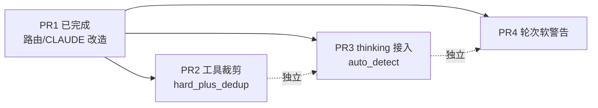
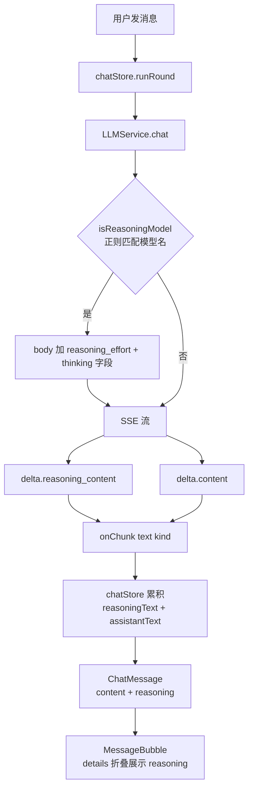

# PR2 / PR3 / PR4 实施计划

## 整体关系




三者**互相独立**，可任意顺序、并行或串行；每个 PR 独立 commit、独立 revert。建议按价值优先级 PR3 → PR2 → PR4，或按风险递增 PR4 → PR2 → PR3。

---

## PR2 工具裁剪（hard_plus_dedup）

**目标**：硬删 2 个伪工具 + 知识查询 4 工具收敛为 2 个 → 节省约 500 prompt token、消除 LLM 决策困扰（"是用 search_knowledge 还是 semantic_search 还是 lookup_policy？"）。

### 改动清单

**文件 1：[desktop-app/src/stores/chatStore.ts](desktop-app/src/stores/chatStore.ts)** — 从 `AVATAR_TOOLS` 删除 4 项工具定义

- 删除 `lookup_policy`（line 819-832）
- 删除 `compare_products`（line 834-852）
- 删除 `list_knowledge_files`（line 705-714）
- 删除 `semantic_search`（line 915-938）
- 修改 `search_knowledge` description：增加可选 `mode: 'search' | 'list'` 参数、追加"覆盖政策/对比/语义检索场景"提示，并删掉 description 里残留的 `→ lookup_policy` 引用（semantic_search line 918 出现过）
- 修改 `read_knowledge_file` description：把"先通过 search_knowledge 或 list_knowledge_files"改为"先通过 search_knowledge(mode='list')"

**文件 2：[packages/core/src/tool-router.ts](packages/core/src/tool-router.ts)** — 路由层删除 + 合并实现

- 删除 `case 'lookup_policy'`（line 711-712）+ 整个 `lookupPolicy()` 方法实现
- 删除 `case 'compare_products'`（line 713-714）+ 整个 `compareProducts()` 方法实现
- 删除 `case 'semantic_search'`（line 727-729，本来就只是 searchKnowledge 别名）
- `searchKnowledge()` 方法增加 `mode` 参数支持：`mode === 'list'` 时复用现有 `listKnowledgeFiles()` 内部逻辑
- 保留 `case 'list_knowledge_files'`（兼容旧 skill 万一硬编码引用），但从 AVATAR_TOOLS 移除让 LLM 看不到

**文件 3：[packages/core/src/tests/journey.test.ts](packages/core/src/tests/journey.test.ts)** — 删除 3 个失效测试

- 删除 7h/7i lookup_policy 用例（line 593-611）
- 删除 7j compare_products 用例（line 613-620）

**文件 4：[packages/core/src/tests/tool-router-stage9.test.ts](packages/core/src/tests/tool-router-stage9.test.ts)**

- line 78-82：`semantic_search` 调用改为 `search_knowledge`，断言不变（同一实现）

**文件 5：[desktop-app/src/lib/tool-name-map.ts](desktop-app/src/lib/tool-name-map.ts)**

- 把 `lookup_policy / compare_products / semantic_search / list_knowledge_files` 4 行从在用区移到"已从 AVATAR_TOOLS 移除"段落（line 20-21 注释段下方），保留中文名以便历史日志可读

### 验收

- `cd packages/core && npm run typecheck && npm test` 全绿
- 手动跑桌面端：让小堵回答"广东工商业储能电价政策"——它不再调 lookup_policy，转用 search_knowledge 命中知识库（行为等价）
- AVATAR_TOOLS 数量从 35+ 降到 31

### 风险与回滚

- 已确认 `avatars/小堵-工商储专家/` 的 skill / CLAUDE.md 都没硬编码引用 lookup_policy / compare_products（只在历史 `tests/runs/*/result.json` 出现，是历史快照不影响）
- 单 commit 可独立 revert

---

## PR3 thinking tokens 自动检测

**目标**：reasoning 模型（DeepSeek-R1 / o1 / GPT-5 / Claude 4 thinking / Qwen-QwQ 等）自动开启 reasoning_effort，UI 折叠展示思考流程；普通模型完全不受影响、零配置成本。

### 数据流




### 改动清单

**文件 1：[desktop-app/src/services/llm-service.ts](desktop-app/src/services/llm-service.ts)** — 核心改造

- 在文件头部新增常量与函数（约 20 行）：

```typescript
/** 已知支持 thinking/reasoning 输出的模型名匹配 */
const REASONING_MODEL_REGEX = /(^|[-/])(deepseek-reasoner|deepseek-r1|o1|o3|gpt-5|qwen-?qwq|glm-4-thinking)|claude.*thinking/i

function detectReasoning(modelName: string): { enabled: boolean; effort: 'low' | 'medium' | 'high' } {
  return REASONING_MODEL_REGEX.test(modelName)
    ? { enabled: true, effort: 'medium' }
    : { enabled: false, effort: 'low' }
}
```

- `ChatOptions` 接口可选新增 `reasoningEffort?: 'low' | 'medium' | 'high'`（用户可显式覆盖）
- `chat()` 方法 body 构造段：先用 `detectReasoning(this.config.model)`，被 `options.reasoningEffort` 覆盖；命中时同时设置：
  - `body.reasoning_effort = effort`（OpenAI / DeepSeek 风格）
  - `body.thinking = { type: 'enabled', budget_tokens: effort === 'high' ? 16000 : effort === 'medium' ? 8000 : 2000 }`（Anthropic 风格）
  - 服务端会忽略不认识的字段（OpenAI 兼容协议保证）
- 升级 `onChunk` 签名为 `(text: string, kind?: 'content' | 'reasoning') => void`（可选第二参，**5 个旧调用方零改动**）
- SSE 解析（line 178-211 附近）增加 `delta.reasoning_content` 分支：

```typescript
if (delta.reasoning_content) onChunk(delta.reasoning_content, 'reasoning')
if (delta.content) { fullText += delta.content; onChunk(delta.content, 'content') }
```

**文件 2：[desktop-app/src/stores/chatStore.ts*](desktop-app/src/stores/chatStore.ts)*

- `ChatMessage` 接口（line 64-68）新增 `reasoning?: string` 字段
- `runRound`（line 2198 附近）增加 `let reasoningText = ''` 累积变量
- `llm.chat` 的 `onChunk` 改为分发 kind：reasoning → 累积到 `reasoningText`、content → 走原 assistantText 流
- 最终轮 `setMessages` 时把 `reasoning: reasoningText` 一并存入 message
- （可选）`<think>...</think>` 内联块的兜底抽取放到 chatStore 落库前一步，避免污染 displayContent

**文件 3：[desktop-app/src/components/MessageBubble.tsx](desktop-app/src/components/MessageBubble.tsx)**

- 在消息体前（line 224-295 之间，紧贴消息气泡顶部）新增 `<details>` 折叠块：

```tsx
{!isUser && message.reasoning && (
  <details className="mb-2 border border-px-border/40 bg-px-bg/50 px-3 py-2">
    <summary className="font-game text-[10px] tracking-wider text-px-text-dim cursor-pointer">
      [▷] THINKING ({message.reasoning.length} 字)
    </summary>
    <pre className="mt-2 text-[12px] text-px-text-dim font-mono whitespace-pre-wrap leading-relaxed">
      {message.reasoning}
    </pre>
  </details>
)}
```

- 新增 `extractThinking(content: string): { thinking: string; clean: string }` 抽取 `<think>...</think>` 块（DeepSeek-R1 走的是 reasoning_content delta，这里只是兜底兼容旧版本服务端）

### 验收

- 切到 deepseek-reasoner 模型问"你怎么决定 215 机型怎么放电"——气泡顶部出现可折叠的 THINKING 块，展开能看到推理过程
- 切回 deepseek-chat 模型——行为完全不变，没有 THINKING 块、token 消耗不变
- 5 个 LLMService 旧调用方（test-runner / soul-step-generator / CreateAvatarWizard / KnowledgePanel / chatStore）测试全绿，因为 onChunk 第二参可选

### 风险与回滚

- 部分服务商对未知字段是"忽略"还是"报错"行为不一致——需要在 `throwOnHttpError` 拿到 400 时，如果 errorText 含 `reasoning_effort` / `thinking` 关键字则给提示"该模型不支持 thinking，请关闭"
- thinking budget 8000 token 让 reasoning 模型调用成本增加约 30%——但只有显式选了 reasoning 模型才会触发
- 三个文件分三次 commit 可独立 revert，最坏情况只 revert MessageBubble 仍能后台累积 thinking 但 UI 不显示

---

## PR4 工具轮次软警告

**目标**：把硬上限 10 改成"软警告 8 + 硬兜底 25"，让"对比 5 个文件并改写"这种 12-15 轮的复杂任务能跑完，同时保留极端失控场景的兜底。

### 改动清单

**文件 1：[desktop-app/src/stores/chatStore.ts](desktop-app/src/stores/chatStore.ts)**

- line 1468：`const MAX_TOOL_ROUNDS = 10` 替换为：

```typescript
/** 软警告轮次：到此向 LLM 注入收敛建议，让它判断是否继续 */
const SOFT_WARN_ROUNDS = 8
/** 硬上限轮次：到此强制收敛（防止失控烧 token） */
const HARD_MAX_ROUNDS = 25
```

- line 2288 工具循环条件改为 `round < HARD_MAX_ROUNDS`
- 在循环内 `round === SOFT_WARN_ROUNDS` 时（且本轮还没注入过）push system 消息：

```typescript
apiMessages.push({
  role: 'system',
  content: `[系统提示] 已执行 ${SOFT_WARN_ROUNDS} 轮工具调用。
如果当前任务接近完成，请基于已有信息直接给最终答案；
如果确实需要继续，请在下一条回复开头说明"继续工具调用的原因：xxx"，然后继续。
硬上限 ${HARD_MAX_ROUNDS} 轮，到达后会强制停止。`
})
```

- line 2528 hit-max-round 分支改为：注入 `[系统硬上限]` system 消息 + 设置 `forceConvergeNoTools = true` + 跑一轮收敛回答

**文件 2：[packages/core/src/tool-budget.ts](packages/core/src/tool-budget.ts)**

- `DEFAULT_TOOL_POLICY.maxRounds`（line 17）从 `10` 改为 `25`（与 HARD_MAX_ROUNDS 对齐，避免 prompt 里规则与 runtime 不一致）
- 同步更新 `buildToolPolicyPromptHints` 提示词措辞（line 217 附近），让 LLM 知道这是"硬上限"

**文件 3：[desktop-app/src/services/regression-telemetry.ts](desktop-app/src/services/regression-telemetry.ts)**

- 新增事件类型 `'tool-loop:soft-warn' | 'tool-loop:hard-stop'`
- chatStore 在对应位置 `regressionTelemetry.emit({ type: 'tool-loop:soft-warn', conversationId, round })` / `'tool-loop:hard-stop'`

### 验收

- 简单问题（≤3 轮）行为不变
- 让小堵跑"对比 5 个机型 6 个指标并画图"——能跑完 12-15 轮拿到完整答案，不再在第 10 轮被硬截断
- 故意构造死循环工具调用（如让 LLM 反复 query 不存在的 sheet）——第 25 轮强制收敛，给纯文本错误说明
- regression-telemetry 后台日志能看到 `soft-warn` / `hard-stop` 事件占比

### 风险与回滚

- 单个对话 token 成本上限提高 2.5 倍（25/10）但只有失控场景才会触达；正常对话依然 1-3 轮收敛
- 软警告 system hint 措辞可能让 LLM 误读为"必须停止"——上面 prompt 已加"如继续请说明原因"缓冲
- 单 commit 可独立 revert

---

## 工作量与提交策略


| PR  | 改动文件数 | 净行数        | 工作量   | 风险  |
| --- | ----- | ---------- | ----- | --- |
| PR2 | 5     | 约 -150 +30 | 1.5 天 | 中   |
| PR3 | 3     | 约 +120 -10 | 1.5 天 | 中   |
| PR4 | 3     | 约 +35 -5   | 0.5 天 | 低   |


每个 PR 一个独立 commit，commit message 建议：

- `refactor(tools): 删除 lookup_policy/compare_products 伪工具，合并知识查询四件套为两件 (PR2)`
- `feat(llm): 自动检测 reasoning 模型并展示思考流程 (PR3)`
- `refactor(chat): 工具循环硬上限改为软警告 8 轮 + 硬兜底 25 轮 (PR4)`

## 不在本次范围

- prompt stable/dynamic 拆分（九层重构 Phase 6.1）
- 多分身联邦检索
- 用户级 cursor 规则改造（需要你自己在 Cursor 设置里改 globs）
- 设置面板加 reasoning effort 选择器（auto_detect 模式不需要）

