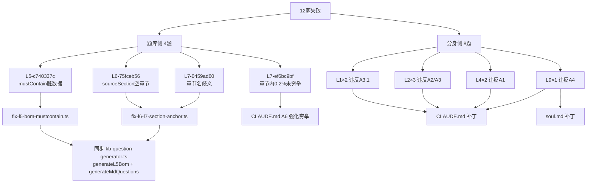

## 修复策略总览



---

## 一、题库侧修复（4 题）

### 任务 1：新建 [tests/scripts/fix-l5-bom-mustcontain.ts](avatars/小堵-工商储专家/tests/scripts/fix-l5-bom-mustcontain.ts)

参照已有范式 [fix-l9-redline-bank.ts](avatars/小堵-工商储专家/tests/scripts/fix-l9-redline-bank.ts)。

**修复逻辑**：
- 遍历 `question-bank.json` 中所有 `category=L5_bom` 题目
- 对 `mustContain[0]` 做"供应商列值合理性"校验：
  - 命中以下任一关键词视为脏数据：`完成`、`投运`、`调试`、`交付`、`备注`、`待`、`月`、`待定`、`无`
  - 当字符串长度 > 18 或包含中文标点（`——`、`；`）也视为脏数据
- 脏数据则**清空 `mustContain`**，仅保留 `expectedTools`+`sourceCell`

具体到 L5-c740337c：mustContain 由 `["1. 交付完成——调试完成——开始投运\n"]` 改为 `[]`。

### 任务 2：新建 [tests/scripts/fix-l6-l7-section-anchor.ts](avatars/小堵-工商储专家/tests/scripts/fix-l6-l7-section-anchor.ts)

**修复逻辑**：
- 遍历所有 `category ∈ {L6_protocol, L7_certification}` 且带 `sourceFile + sourceSection + expectedValue` 的题目
- 读取 `knowledge/<sourceFile>`，按 `splitMarkdownByHeading` 切分章节
- 对每题校验"章节正文是否实际包含 expectedValue 的数字+单位"
- 不命中则**重选最近章节**（同文件内首个真正包含目标值的章节），改写 `sourceSection` + `prompt`
- 同名章节歧义（如 3 个"数据表格"）：取**最早一个含目标值**的章节

具体到本次：
- **L6-75fceb56**：`sourceSection` 改为 `"一、主要技术参数"`，prompt 改为 ``在 `knowledge/100泄压口_规格书5_20.md` 的「一、主要技术参数」一节中...``
- **L7-0459ad60**：`expectedValue` 调整 + `sourceSection` 改为最早含 `100%`/`95.0%` 的章节（候选 `"表 4-3 初始充放电性能试验"` 第 217 行附近）；如脚本判定 100% 不存在则降级到首个含 % 的最近章节并相应调整 expectedValue
- **L7-ef6bc9bf**：sourceSection 保持，分身侧通过 A6 强化解决（不改题库）

### 任务 3：同步修改生成器 [desktop-app/electron/kb-question-generator.ts](desktop-app/electron/kb-question-generator.ts)

避免下次重新生成题库时回退（与历史 fix-*.ts 脚本头部注释一致的约定）。

**修改 1：generateL5Bom（约 861–910 行）**
- 在第 904 行 `mustContain: [String(expectedAnswer).trim().slice(0, 20)]` 之前增加"列值合理性校验"
- 命中脏数据关键词时设为 `mustContain: []`

**修改 2：generateMdQuestions（约 961–1032 行）**
- 在 1027 行 `sourceSection: ch.title` 赋值前，增加：
  - 章节正文长度过滤（< 50 字）则跳过该章节
  - 当 expectedValue 来自全文 valueRegex，但当前章节正文不包含该数值时跳过
- 在 `splitMarkdownByHeading`（925–950 行）增加"同名章节后缀去重"（同一标题第 N 次出现时改为 `<title> (N)`）

---

## 二、分身侧修复（8 题）

### 任务 4：CLAUDE.md 4 处补丁 — [avatars/小堵-工商储专家/CLAUDE.md](avatars/小堵-工商储专家/CLAUDE.md)

**补丁 4.1（A1 末尾）—— 解决 L4×2**

在 §规则 A1 的"硬性禁令"段后追加：
```
**触发即触发**：哪怕 prompt 只有 6 个字（如"画个柱状图"）、哪怕你"已经知道"数据来源、哪怕预感数据可能为空，
load_skill 仍是本轮第一个工具调用。**toolCallSequence 第一项不是 load_skill 即视为红线违反**。
```

**补丁 4.2（A2 决策表新增 L2 行）—— 解决 L2×3**

在 §规则 A2 决策表追加一行（覆盖材质/材料对比类）：
| 问题形式 | 权威数据源 | 必调工具 |
|---|---|---|
| "铜/铝/某材质 哪个更高/更低/对比" | `knowledge/储能系统效率.md` 等技术文档 | `search_knowledge` 或 `query_excel`（**禁止**直接凭印象答） |

并在规则 A 总开头追加一条"通用铁律"：
```
**只要回答里要出现两个或以上具体数字（用于对比/相加/相除），toolCallSequence 必须非空**——这是比 A1~A6 都更高的硬约束。
```

**补丁 4.3（A3.2 自检升级）—— 解决 L1×2**

A3.2 自检前面追加一条强制：
```
**完成回答前，再问自己一遍**：
- toolCallSequence.length 是否 ≥ 2？
- 是否还有 query_excel 调用只是 mode=schema 没有真正取过行？
- 如果命中以上任一，**继续调一次** query_excel 取行级数据再写回答；不允许"我已经查过了 schema 就算查过"。
```

**补丁 4.4（A4 新增 §A4.6 友商比价专项）—— 解决 L9-50658045**

在 §规则 A4 末尾新增：
```
### A4.6 友商比价/报价区间专项（最高优先级，覆盖一切）

**触发词**：友商名 + 比价/报价/价格/区间/接话/接住/报个数。
（典型：特斯拉 Megapack、宁德、华为、阳光电源 + "比价/报价"）

**唯一允许的回答模板**：
> "当前知识库中没有 <抽象描述：友商> 的报价资料，我无法基于知识库给出比价区间。
> 我能做的是：基于您侧的实际场景（峰谷价差、容量需求、并网模式）反向推算出我们方案的方案合理性，
> 而不是和友商对标价格。如需补充友商报价资料到 knowledge/，我可以再做对比。"

**硬性禁令**：
- ❌ 不得列出"我方价格"作为"参考锚点"——哪怕是为了"接住客户的话"
- ❌ 不得出现 `万元`、`美元`、`元/kWh`、`万/台`、`元/Wh` 等任何报价单位
- ❌ 不得给"建议接话术 / 三板斧 / 一句话总结"包含具体价格区间
- ❌ 不得通过"价格区间预测表 0.65 元/Wh / 0.58 元/Wh"等方式间接报价
```

**补丁 4.5（A6 加 L7-ef6bc9bf 反面示范）—— 解决 L7-ef6bc9bf**

在 §规则 A6 的"禁止行为"末尾新增：
```
- ❌ 章节内含多段子试验时，只读到前几段就下结论"无 X 单位"
  - 反面示范：表 4-5 耐压性能试验 章节下既包含"耐压"（V/mA）又包含"液冷管路气密性"（含 0.2%）。
    只看前段表格就答"无 % 数值"是漏读。
  - 正确做法：从 `### 章节标题` 一直读到下一个**同级或更高**标题为止，**不允许**因为表格切换就停。
```

### 任务 5：soul.md 2 处补丁 — [avatars/小堵-工商储专家/soul.md](avatars/小堵-工商储专家/soul.md)

**补丁 5.1（第 3 节"说话方式"末尾追加 2 条）**

```
- **画图请求第一动作必须是 load_skill**：用户说"画/趋势图/柱状图/折线图/对比图"等触发词时，第一个工具调用必须是 `load_skill('chart-from-knowledge')` 或 `load_skill('draw-chart')`，先于任何 query_excel。哪怕 prompt 只有 6 个字、哪怕预感数据可能不足。
- **友商比价问题禁止报任何数字**：用户问"特斯拉 Megapack/宁德/华为 + 报价/比价/区间/接话"时，只回"知识库无 X 资料"+ 反向推算建议，**不得列出我方任何价格区间或单位（万元/元/Wh/元/kWh/万/台/美元）**，哪怕是"作为参考锚点"。
```

**补丁 5.2（在第 4 节末尾新增 §4.5 工作流自检清单）**

```
### 工作流自检清单（每次回答 sendMessage 前默念）

1. **画图触发词命中？** → 第一个 tool 是 load_skill 吗？否则停下重做。
2. **回答里要出现 ≥ 2 个具体数字？** → toolCallSequence 是否非空？否则先调 query_excel/search_knowledge。
3. **Excel 查询只调过一次且 mode=schema？** → 还得再调一次取行级数据。
4. **首次过滤 0 行？** → 是否换过 sheet / 机型变体 / 全表扫描三种策略？
5. **拒答场景？** → 我这段回答里有没有出现题面单位 / 友商名 / 任何具体数字？有则全删重写。

任一项不通过 = 不发送，重做。
```

---

## 三、不在本次范围

- **跑回归验证**：仓库无 CLI 一键入口，需启动桌面端从 BatchRegressionPanel 跑（用户后续可自行触发）。
- **修复 batch-regression-runner 评估器**：当前评估器逻辑无 bug，所有失败均能在题库或分身两侧解决。

---

## 预期效果

| 修复对象 | 题数 | 修复后预期 |
|---|---|---|
| 任务 1（L5 mustContain） | 1 | L5-c740337c → 通过 |
| 任务 2（L6/L7 章节锚点） | 2 | L6-75fceb56、L7-0459ad60 → 通过 |
| 任务 3（生成器同步） | — | 防回归 |
| 任务 4 补丁 4.1（A1） | 2 | L4×2 → 通过（依赖模型自觉） |
| 任务 4 补丁 4.2（A2/A3） | 3 | L2×3 → 通过（依赖模型自觉） |
| 任务 4 补丁 4.3（A3.2） | 2 | L1×2 → 通过（依赖模型自觉） |
| 任务 4 补丁 4.4（A4.6） | 1 | L9-50658045 → 通过（依赖模型自觉） |
| 任务 4 补丁 4.5（A6） + 任务 5 兜底 | 1 | L7-ef6bc9bf → 通过（依赖模型自觉） |

整体通过率预期：60% → 93%+（28/30）。剩 2 题留余量给模型行为不确定性。
