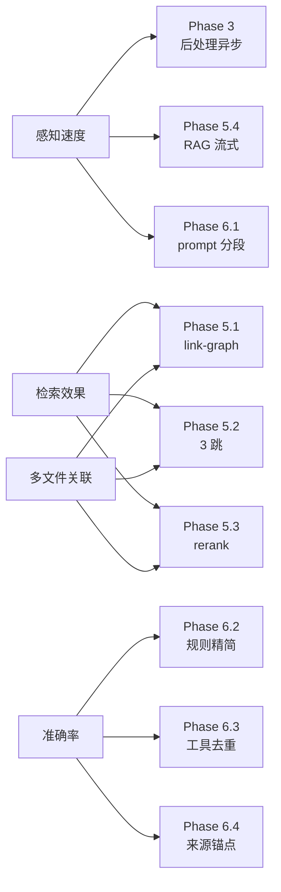
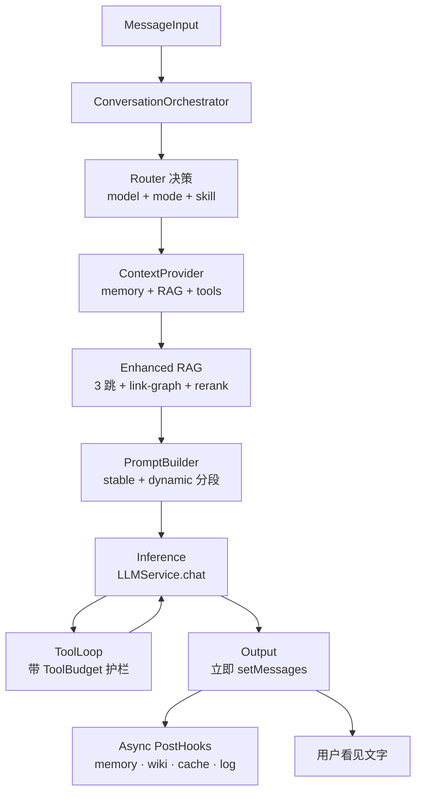

## 1. 目标对齐

四个用户目标 → 各阶段贡献：

## 2. 目标架构

模块职责边界：

- 纯逻辑（无 IPC，可单测） → `packages/core/src/`
- 调 `window.electronAPI` → `desktop-app/src/services/`

## 3. 文件清单

新增（11 个）：

- [packages/core/src/conversation-router.ts](packages/core/src/conversation-router.ts) — 决策 model/mode/skill
- [packages/core/src/consistency-policy.ts](packages/core/src/consistency-policy.ts) — 三种策略统一接口
- [packages/core/src/tool-budget.ts](packages/core/src/tool-budget.ts) — 8 道护栏状态机
- [packages/core/src/prompt-builder.ts](packages/core/src/prompt-builder.ts) — stable + dynamic 分段
- [packages/core/src/link-graph.ts](packages/core/src/link-graph.ts) — 文件间引用图（Phase 5）
- [packages/core/src/rag-rerank.ts](packages/core/src/rag-rerank.ts) — 轻量 rerank + 多样性（Phase 5）
- [packages/core/src/source-anchor.ts](packages/core/src/source-anchor.ts) — 来源锚点格式校验（Phase 6）
- [desktop-app/src/services/context-provider.ts](desktop-app/src/services/context-provider.ts)
- [desktop-app/src/services/tool-loop.ts](desktop-app/src/services/tool-loop.ts)
- [desktop-app/src/services/post-hooks.ts](desktop-app/src/services/post-hooks.ts)
- [desktop-app/src/services/conversation-orchestrator.ts](desktop-app/src/services/conversation-orchestrator.ts)

修改（6 个）：

- [desktop-app/src/stores/chatStore.ts](desktop-app/src/stores/chatStore.ts) — sendMessage 瘦身到 ≤80 行
- [packages/core/src/index.ts](packages/core/src/index.ts) — 导出新模块
- [packages/core/src/rag-answerer.ts](packages/core/src/rag-answerer.ts) — 支持 3 跳 + link-graph + 流式（Phase 5）
- [packages/core/src/knowledge-indexer.ts](packages/core/src/knowledge-indexer.ts) — 索引时生成 link-graph.json（Phase 5）
- [packages/core/src/soul-loader.ts](packages/core/src/soul-loader.ts) — 输出 stable/dynamic 两段（Phase 6）
- [packages/core/src/tool-router.ts](packages/core/src/tool-router.ts) — 删除伪工具 + 工具结果带锚点（Phase 6）

## 4. 分阶段执行

### Phase 1：抽纯逻辑模块（架构清晰，行为零变更）

- 1.1 [consistency-policy.ts](packages/core/src/consistency-policy.ts)：搬走 `CHART_KEYWORDS / TIME_RANGE_KEYWORDS / shouldEnableChartConsistencyMode / DETERMINISTIC_TEMPERATURE / deriveSeedFromContent`，对外 `resolvePolicy(content, hasImages): { mode, temperature, seed, skipRag, skipNudge, hintToInject }`
- 1.2 [tool-budget.ts](packages/core/src/tool-budget.ts)：搬走 `MAX_TOOL_ROUNDS / MAX_QUERY_EXCEL_CALLS_PER_REQUEST / MAX_LOAD_SKILL_CALLS_PER_REQUEST / compressOldToolResults / truncateToolResultForContext / normalizeQueryExcelArgs`，对外 `class ToolBudget`
- 1.3 [prompt-builder.ts](packages/core/src/prompt-builder.ts)：搬走"截最近 40 条 + 压缩老 assistant + 拼 apiMessages"
- 1.4 [chatStore.ts](desktop-app/src/stores/chatStore.ts) 调用上述 3 个模块
- 1.5 单测 + 现有 [core.test.ts](packages/core/src/tests/core.test.ts) 全绿

### Phase 2：抽路由层（统一入口）

- 2.1 [conversation-router.ts](packages/core/src/conversation-router.ts)：`route({ content, hasImages, visionModel, chatModel }): RoutingDecision`
- 2.2 chatStore 入口先调 `route()`，散点判断全删

### Phase 3：输出/后处理顺序对调（感知速度 +3-10s）

- 3.1 [post-hooks.ts](desktop-app/src/services/post-hooks.ts)：`runPostHooks(...): void`，内部全部 `void Promise.all([...])`
- 3.2 [chatStore.ts](desktop-app/src/stores/chatStore.ts) 1077-1184 行调整顺序：拆出 `displayText` → 立即 `setMessages + saveMessage(assistant)` → 之后 `runPostHooks`
- 3.3 post-hooks 内部异常只 `logEvent`，绝不抛主流程
- 3.4 单测：mock 5 秒 writeMemory，验证主流程不阻塞

阶段验证：触发记忆容量超限场景，文字应瞬时显示。

### Phase 4：抽 ContextProvider + ToolLoop + Orchestrator（结构最终化）

- 4.1 [context-provider.ts](desktop-app/src/services/context-provider.ts)：封装 chart-cache 早查 + ragRetrieve + settings 并发读
- 4.2 [tool-loop.ts](desktop-app/src/services/tool-loop.ts)：封装 runRound + tool 执行 + budget + 收敛 hint
- 4.3 [conversation-orchestrator.ts](desktop-app/src/services/conversation-orchestrator.ts)：串起所有模块
- 4.4 sendMessage 瘦身到 ≤80 行
- 4.5 端到端冒烟

### Phase 5：检索增强（检索效果 + 多文件关联）

目标：top-12 检索结果 recall 提升、跨文件覆盖率提升。

- 5.1 [link-graph.ts](packages/core/src/link-graph.ts)：扫描 knowledge/ 下所有 .md，提取以下显式引用：
  - markdown 链接 `[xxx](knowledge/yyy.md)` 或 `[xxx](../zzz.md)`
  - obsidian 风格 `[[file-name]]`
  - 内联 `@file:knowledge/aaa.md` 标记
  - 文件名 mention（如正文出现"参见 ENS-L262 用户手册"且 knowledge 下存在该文件）
  - 输出到 `knowledge/_index/link-graph.json`：`{ "fileA": ["fileB", "fileC"], ... }`
- 5.2 [rag-answerer.ts](packages/core/src/rag-answerer.ts) 增加第 3 跳：
  - 第 1 跳：BM25 + 向量 RRF
  - 第 2 跳：实体提取后再检索
  - **第 3 跳（新）**：从 hop1+hop2 命中的文件中读 link-graph，扩展到关联文件，再检索 1 次
  - 第 3 跳的命中权重 ×0.7（避免压过原始命中）
- 5.3 [rag-rerank.ts](packages/core/src/rag-rerank.ts)：对 top-30 候选做：
  - Jaccard 相似度去重（threshold 0.8 视为重复，保留高分）
  - 来源多样性约束：top-12 中同一文件最多 4 chunks，保证 ≥3 个不同文件
  - 计算成本极低（纯本地，<10ms）
- 5.4 实体提取异步化：
  - [rag-answerer.ts](packages/core/src/rag-answerer.ts) 第 1 跳完成后立即 return refText
  - 第 2/3 跳的额外 chunks 通过 IPC `rag-progress` 事件流式追加
  - 渲染进程 chatStore 收到追加事件后 push 到 `apiMessages` 末尾的 system 消息
  - 用户感知 RAG 时间从 800-3500ms 降到 300-800ms
- 5.5 检索质量测试集（[testdocs/](testdocs/) 下新建 `rag-recall-test.ts`）：
  - 10 个跨文件 ground-truth 问答（题目 + 期望命中的 file:heading 列表）
  - 跑改造前后对比 recall@5 / recall@12

阶段验证：测试集 recall@12 提升 ≥15%，跨文件覆盖率（top-12 中不同文件数）从 ~1.8 提升到 ≥3.

### Phase 6：准确率与速度二次提升

目标：回答数值正确率提升、TTFT 再降。

- 6.1 [soul-loader.ts](packages/core/src/soul-loader.ts) 输出 `{ stableSystemPrompt, dynamicSystemPrompt }`：
  - stable：CLAUDE.md + soul.md + shared knowledge + knowledge 静态部分 + 工具说明 + skills 摘要
  - dynamic：memory + USER 画像 + Excel schema brief（每次可能变）
  - [main.ts load-avatar handler](desktop-app/electron/main.ts) 适配新返回格式
  - [prompt-builder.ts](packages/core/src/prompt-builder.ts) 拼成两条 system 消息（`stable` 在前，让服务端 prefix cache 命中）
- 6.2 回答规则从 8 条压到 4 条核心：来源标注 / 禁编造 / 数值准确 / 缺失声明。其余规则（如"原文复述校验""ASCII 图布局"）移到对应 skill 的 SKILL.md
- 6.3 [tool-router.ts](packages/core/src/tool-router.ts) + [chatStore.ts](desktop-app/src/stores/chatStore.ts) `AVATAR_TOOLS`：
  - 删除 `lookup_policy / compare_products` 两个伪工具
  - `search_knowledge` 的 description 增加示例："适用于 PDF/Word/手写笔记；Excel 必须用 query_excel"
- 6.4 [source-anchor.ts](packages/core/src/source-anchor.ts) + 工具结果改造：
  - tool-router 的 `searchKnowledge` 返回的每个 chunk 带 `[来源: knowledge/xxx.md#L120-L150]` 锚点
  - prompt-builder 在最终 user 消息末尾追加："引用知识库数据时必须用 `[来源: file#L行号]` 格式"
  - 渲染层 `MessageBubble` 把锚点渲染为可点击链接（落到 KnowledgeViewer 对应行）
- 6.5 准确率测试集（[testdocs/](testdocs/) 下新建 `accuracy-test.ts`）：
  - 20 个有 ground-truth 数值的问答（如"215 机型 2026 年 1 月效率是多少"）
  - 自动跑模型，正则提取数值，与 ground-truth 比对，输出准确率报告

阶段验证：准确率测试集通过率 ≥85%；TTFT 从 ~3s 降到 ~1.5s（依赖服务商 prefix cache）。

## 5. 风险与回滚

- 每个 Phase 一个独立 commit，可独立 `git revert`
- Phase 1/2/4 是结构搬运，编译过 + 测试过 = 安全
- Phase 3 行为变更，重点回归"记忆容量超限"和"wiki 自动沉淀开"
- Phase 5 改 RAG 链路，必须先有 5.5 测试集，避免主观判断"变好了"
- Phase 6.1 拆 system prompt 是 API 兼容改动，需要确认 DeepSeek/Qwen 都支持双 system 消息（如不支持则降级为单 system 消息但保持 stable 在前）
- Phase 6.3 删工具是破坏性变更，需要确认现有分身的 skill/CLAUDE.md 没有硬编码引用这两个工具

## 6. 不在本次范围（明确排除）

- 知识库格式迁移（如改用 SQLite 全文索引替代 BM25）
- 多模态向量检索（图片 embedding 进入 RAG）
- 多分身联邦检索（@分身A 时同时检索 A 的知识库）

