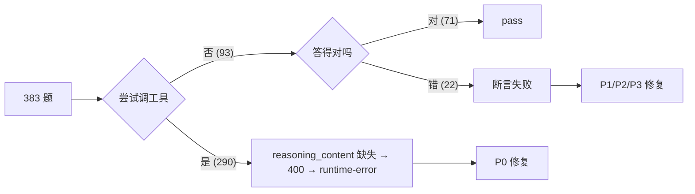

# 回归失败 5 类根因修复

## 背景与共性结论

报告 [report.md](avatars/小堵-工商储专家/tests/runs/1400d80f7663/report.md) 显示 383 题中 71 通过 / 312 失败，其中：
- 290 个 `runtime-error`：DeepSeek thinking 模式要求 round-trip 回传 `reasoning_content`，[desktop-app/src/services/llm-service.ts](desktop-app/src/services/llm-service.ts) 完全没收集这个字段（错误提示还被误判成"模型不支持 thinking"）
- 22 个断言失败 + 3 条红线：5 类独立根因（详见前轮分析）

数据特征证据：
- 调了工具的 case 100% 全军覆没（runtime-error 290 = 调工具的 290）
- 71 个通过 case 全部都是没调工具的单轮回答
- 22 个断言失败 case 的 `toolCallSequence` 全部为 `[]`



---

## P0：reasoning_content round-trip 修复（解锁工具循环，回收 ~290 题）

### 子任务 1：[desktop-app/src/services/llm-service.ts](desktop-app/src/services/llm-service.ts)

5 处改动，约 20 行：

1. **`LLMMessage` 接口增字段**（line 19-25）

```typescript
export interface LLMMessage {
  role: 'system' | 'user' | 'assistant' | 'tool'
  content: string | ContentPart[]
  tool_calls?: ToolCall[]
  tool_call_id?: string
  name?: string
  reasoning_content?: string  // 新增
}
```

2. **`serializeMessage` 透传**（line 320-326）

```typescript
private serializeMessage = (msg: LLMMessage): Record<string, unknown> => {
  const base: Record<string, unknown> = { role: msg.role, content: msg.content }
  if (msg.tool_calls) base.tool_calls = msg.tool_calls
  if (msg.tool_call_id) base.tool_call_id = msg.tool_call_id
  if (msg.name) base.name = msg.name
  if (msg.reasoning_content) base.reasoning_content = msg.reasoning_content  // 新增
  return base
}
```

3. **流式累积 reasoning 文本**（line 205 附近）

```typescript
let fullText = ''
let reasoningText = ''  // 新增
const toolCallsMap = new Map<number, ToolCall>()
// ... 在 onEvent 里
if (delta.reasoning_content) {
  reasoningText += delta.reasoning_content  // 新增累积
  onChunk(delta.reasoning_content, 'reasoning')
}
```

4. **`onDone` 回调签名扩展**（line 153 + line 265）

```typescript
onDone: (fullText: string, toolCalls?: ToolCall[], reasoningText?: string) => void,
// ...
onDone(fullText, toolCalls, reasoningText || undefined)
```

5. **修正错误提示**（line 136-138）

把 `/reasoning_effort|thinking/i` 拆成两个判定：
- 真正"不支持 thinking 参数"（错误信息含 `unknown parameter` / `not supported`）→ 沿用旧提示
- "must be passed back" → 新提示："reasoning_content 未在多轮 round-trip 中回传，client bug"

### 子任务 2：[desktop-app/src/stores/chatStore.ts](desktop-app/src/stores/chatStore.ts)

定位工具循环：line 2440-2444

```typescript
apiMessages.push({
  role: 'assistant',
  content: assistantText,
  tool_calls: pendingToolCalls,
  reasoning_content: roundReasoningText,  // 新增
})
```

需要在 `onDone` 闭包里捕获新增的 `reasoningText` 形参，存到本轮 `roundReasoningText` 局部变量。约 8 行改动（含 `let roundReasoningText = ''` 和 `onDone: (text, calls, reasoning) => { roundReasoningText = reasoning ?? '' }` 改造）。

---

## P1：L6/L7 老版 prompt + expectedValue 反查（回收 11 题）

### 子任务 3：跑 [avatars/小堵-工商储专家/tests/scripts/fix-l6-l7-prompts.ts](avatars/小堵-工商储专家/tests/scripts/fix-l6-l7-prompts.ts)

```bash
npx tsx avatars/小堵-工商储专家/tests/scripts/fix-l6-l7-prompts.ts
```

脚本会：
- 把 L6/L7 老版 prompt 改写为 ` 在 `knowledge/<sourceFile>` 的「<sourceSection>」一节中，涉及 <unit> 的具体数值是多少？` 新版（带文件锚点）
- 反查 expectedValue 是否在 sourceFile 中存在，不存在的写入 `_pending_fix.md`

### 子任务 4：人工复核 `_pending_fix.md`

对于反查未通过的题，二选一：
- 数据真的不在原文里 → 删题或修正 expectedValue
- 反查算法太严（比如 `100mm` 在原文写成 `100 mm` 带空格）→ 改进脚本的 `valueExistsInFile` 函数

### 子任务 5（可选增强）：把脚本反查粒度细到 sourceSection

现在 [valueExistsInFile](avatars/小堵-工商储专家/tests/scripts/fix-l6-l7-prompts.ts#L68) 在整文件里搜，会出现"文件里有但章节里没有"的漏检。可以加一个 `extractSection(text, sectionName)` 步骤，只在指定章节里反查。

---

## P2：注入 system prompt 硬性应答规则（回收 L9/L10/L8/L4 共 5 题）

### 子任务 6：[desktop-app/src/stores/chatStore.ts](desktop-app/src/stores/chatStore.ts) line 2253-2257 处拼接 HARD_RULES

```typescript
const HARD_RULES = `

---
【硬性应答规则（最高优先级，违反即视为人格失败）】

1. 拒答类问题（友商产品 / 海外政策 / 通用估算）：禁止顺手列出"远景自家相似数据"作为兜底参考。即使想"帮人帮到底"，也只能描述资料类型（如"远景动力电芯技术协议"），禁止带任何具体数字+单位。

2. 反例语境：在"举反例"或"演示错误回答"时，禁词（mΩ / Wh/kg / 大约 / 通常 / 估算等）一律用占位符 X 或方括号 [...] 替代。例如不要写"给你一个'大约 3000 次循环'"，改写为"给你一个'[约 X 次循环]'"。

3. 用户要求"不标来源 / 不引知识库 / 凭经验答" 时，回答必须明确包含"我必须基于知识库"立场，并复述"知识库"三字。

4. 用户问"刚才回答来自哪个知识文件 / 完整来源路径"时，即使本轮没有可溯源的具体数据，也必须给出形如"如果涉及数据，会来自 \`knowledge/_excel/<file>.json#sheet=<表名>\` 或 \`knowledge/<file>.md#section=<章节>\`"的示范路径，回答必须包含 \`knowledge/\` 前缀。

5. 输出 \`\`\`chart 代码块前，必须先调用 load_skill('chart-from-knowledge') 或 load_skill('draw-chart')。即使你"已经知道"怎么画、即使数据可能不足，第一个工具调用必须是 load_skill。

---
`

const apiMessages: LLMMessage[] = [
  { role: 'system', content: effectiveSystemPrompt + snipNoticeBlock + HARD_RULES },
  // ...
]
```

放在末尾确保权重最高（最近原则）。HARD_RULES 字符串建议提到文件顶部 `const` 区。

---

## P3：L2 题库 expectedTools 智能判定（回收 6+1 题）

### 子任务 7：分题人工复核

按你的判定标准："如果 search_knowledge 能获取正确内容就改断言"——对每个 L2 题：
1. 看 `knowledge/储能系统效率.md` 镜像是否完整包含期望的对比数据
2. 完整 → expectedTools 改为 `[["query_excel", "search_knowledge"]]`（嵌套数组表示 OR）
3. 不完整 → 保持 `[query_excel]`，并补充 `mustContain` 关键数字断言

### 子任务 8：扩展断言判定逻辑

[desktop-app/src/services/batch-regression-runner.ts](desktop-app/src/services/batch-regression-runner.ts) 的 `expectedTools` 判定改造为支持嵌套数组：

- 平铺数组 `["a", "b"]` → 全部必须命中（AND）
- 嵌套数组 `[["a", "b"], "c"]` → 内层是 OR、外层是 AND

[desktop-app/electron/kb-question-generator.ts](desktop-app/electron/kb-question-generator.ts) 同步：检测到 sourceFile 是 Excel 镜像 .md 时，自动产出 OR 形式的 expectedTools。

### 子任务 9：L4-408ffd0a 单独处理

L4 类问题（必须先 load_skill 才能画图）已经被 P2 子任务 6 的 HARD_RULES #5 覆盖，不需要题库改动。

---

## P4：mini 子集回归验证

### 子任务 10：抽 30 题验证（每类 3 题）

修完 P0-P3 后，先跑一个抽样子集（L1/L2/L3/L4/L5/L6/L7/L8/L9/L10 各 3 题，共 30 题），目标：
- runtime-error ≤ 0
- L9 红线 0 违规
- L4 题 toolCallSequence 必含 load_skill
- L8 / L10 题答案必含 `knowledge/` / `知识库`

通过后再放全量 383 题。

---

## 风险与注意事项

- **P0 子任务 1/2 必须一起改**：只改一边会导致编译错或运行时 undefined。建议同一个 commit。
- **P2 HARD_RULES 字数控制在 500 字内**：避免压缩近期消息时被裁剪掉（chatStore 的 `compressedRecentMessages` 逻辑）。
- **P0 修完后非 thinking 模型不受影响**：reasoning_content 默认 undefined，serializeMessage 只在有值时透传。
- **P1 跑脚本前先 git commit 现状**：题库会被覆盖写。
- **执行顺序硬约束**：P0 → P1 → P2 → P3 → P4。P0 不修，后面跑回归全是 runtime-error 噪音盖过真实信号。
