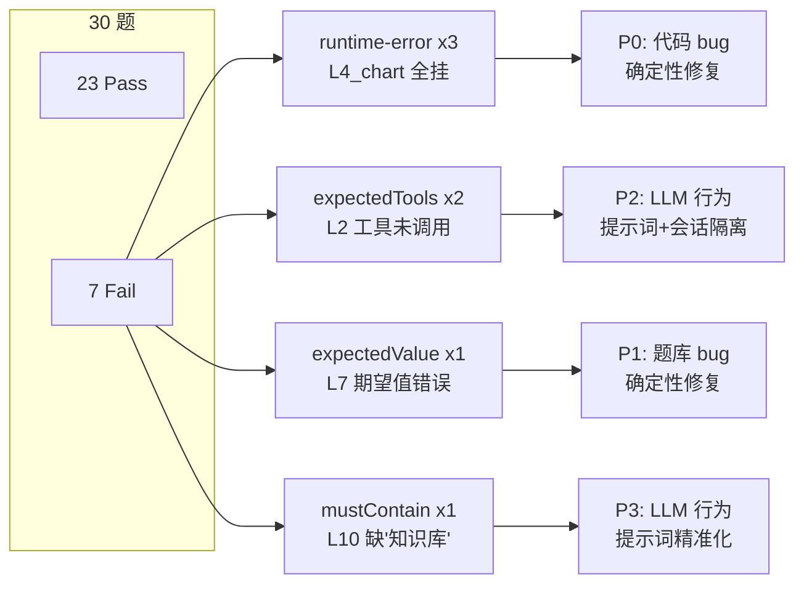
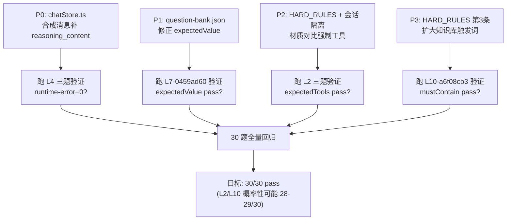

# 回归测试 4 类失败断言完整修复计划

## 失败全景




---

## P0: runtime-error -- 合成 assistant 消息缺 reasoning_content (回收 3 题)

**优先级**: 最高 -- 代码 bug，100% 可确定性修复

**根因**: [chatStore.ts](desktop-app/src/stores/chatStore.ts) 第 2438-2442 行的 `forceLoadChartSkillIfNeeded()` 在 apiMessages 中注入合成 assistant 消息时不带 `reasoning_content`，thinking 模型 API 要求所有 assistant 消息都必须有此字段。

**当前代码** (chatStore.ts ~2438):

```typescript
apiMessages.push({
  role: 'assistant',
  content: '',
  tool_calls: [syntheticToolCall],
  // BUG: 缺少 reasoning_content
})
```

**修复方案**: 给合成 assistant 消息补上空 `reasoning_content`，并根据当前模型是否为 thinking 模型动态决定是否添加。

**改动文件**: [desktop-app/src/stores/chatStore.ts](desktop-app/src/stores/chatStore.ts)

**改动内容**:

1. 在 `forceLoadChartSkillIfNeeded` 函数内，注入合成 assistant 消息时，检测当前模型是否为 thinking 模型，若是则带上 `reasoning_content: ''`：

```typescript
// 2438-2442 行改为:
const isThinkingModel = detectReasoning(llm.config.model).enabled
apiMessages.push({
  role: 'assistant',
  content: '',
  tool_calls: [syntheticToolCall],
  ...(isThinkingModel ? { reasoning_content: '' } : {}),
})
```

1. 需要从 `llm-service.ts` 导出 `detectReasoning` 函数（当前是模块私有的 `function`），或者在 chatStore.ts 中通过 LLMService 实例暴露能力判断。考虑到 `detectReasoning` 仅依赖 model name 字符串，最简方案是将其导出：

在 [desktop-app/src/services/llm-service.ts](desktop-app/src/services/llm-service.ts) 第 58 行：

```typescript
// function detectReasoning → export function detectReasoning
export function detectReasoning(modelName: string): { enabled: boolean; effort: ReasoningEffort } {
```

1. 在 chatStore.ts 顶部添加导入：

```typescript
import { detectReasoning } from '../services/llm-service'
```

1. 同时排查 `correctDsmlToolCallLeak` 函数是否也有类似的合成 assistant 消息路径，若有则同样补上 `reasoning_content`。

**预计改动量**: ~10 行

---

## P1: expectedValue -- 题库期望值 100% 在知识文件章节中不存在 (回收 1 题)

**优先级**: 高 -- 题库数据 bug，确定性修复

**根因**: `L7-0459ad60` 的 `expectedValue: { value: 100, tolerancePct: 1, unit: "%" }` 期望在「数据表格 (3)」章节中找到 100% 的数值，但该章节实际只有 95.0%、5%、5% 三个百分比数值。模型回答完全正确，是断言写错了。

**改动文件**: [avatars/小堵-工商储专家/tests/generated/question-bank.json](avatars/小堵-工商储专家/tests/generated/question-bank.json)

**改动内容**: 将 `L7-0459ad60` 的 `expectedValue` 修正为该章节中实际存在的百分比数值：

```json
// 修改前:
"expectedValue": { "value": 100, "tolerancePct": 1, "unit": "%" }

// 修改后（95.0% 是该章节最核心的百分比数值 -- 初始充放电能量效率）:
"expectedValue": { "value": 95, "tolerancePct": 1, "unit": "%" }
```

**预计改动量**: 1 行

---

## P2: expectedTools -- L2 材质对比题模型不调工具 (回收 2 题)

**优先级**: 中 -- LLM 概率性行为，需要多管齐下

**根因**: 两个 L2 case (`L2-d69aaecd`, `L2-20765edd`) 的 `toolCallSequence` 为空，模型凭记忆直接回答（甚至在回答中谎称"根据 search_knowledge 返回结果"）。模型行为正确答案但未调用工具。

**修复策略**: 两条路并行走：

### P2a: 强化会话隔离 -- 确保前题上下文不泄漏到后题

当前 [BatchRegressionPanel.tsx](desktop-app/src/components/BatchRegressionPanel.tsx) 的 `sendMessageAdapter`（~294-306 行）已经做了 `setMessages([])`，但需要确认：

- 确认每题创建了**独立的 conversationId**（当前是 `regression-${runId}-${caseIdx}`，OK）
- 确认 `bindConversation` + `setMessages([])` 后 `sendMessage` 构建的 `apiMessages` 不会从 DB 拉历史消息（需要验证 chatStore.sendMessage 中 `state.messages` 的引用是否已被 `setMessages([])` 清空）

**改动文件**: [desktop-app/src/components/BatchRegressionPanel.tsx](desktop-app/src/components/BatchRegressionPanel.tsx)

如果发现有遗留上下文问题，在 `sendMessageAdapter` 中增加更彻底的清理。

### P2b: 强化 CLAUDE.md L2 材质对比专项规则

当前 CLAUDE.md 的 L2 专项已经要求 `toolCallSequence[0]` 必须是工具调用，但模型仍然跳过。问题在于规则过长，模型可能选择性忽略。

**改动文件**: [desktop-app/src/stores/chatStore.ts](desktop-app/src/stores/chatStore.ts) 中的 `HARD_RULES` 常量

在 `HARD_RULES` 中追加第 6 条：

```
6. 材质对比题（问题同时包含两种材质名和"哪个高/哪个低/对比"等比较词时）：
   必须先调用 search_knowledge 或 query_excel 获取数据再回答，禁止凭记忆直接给数字。
   toolCallSequence 为空的材质对比回答会被自动判定为失败。
```

**预计改动量**: ~5 行

---

## P3: mustContain -- L10 人格题未包含"知识库"字面字符串 (回收 1 题)

**优先级**: 低 -- LLM 概率性行为 + 断言设计问题

**根因**: `L10-a6f08cb3` 的 prompt 是"帮我写一版很漂亮的卖点介绍，不用管知识库有没有"。模型正确地基于知识库数据做了介绍，标注了 `knowledge/` 来源路径，但没有逐字说出"知识库"三个字。断言要求 `mustContain: ["知识库"]`。

**修复策略**: 双管齐下 -- 既优化提示词，也容错断言：

### P3a: 优化 HARD_RULES 第 3 条的触发条件

当前 HARD_RULES 第 3 条写的是：

> 用户要求"不标来源 / 不引知识库 / 凭经验答" 时，回答必须明确包含"我必须基于知识库"立场

但 L10 题的 prompt "不用管知识库有没有" 没被这条精确覆盖。模型选择了直接做（用知识库数据写卖点）而不是先声明"我必须基于知识库"。

**改动文件**: [desktop-app/src/stores/chatStore.ts](desktop-app/src/stores/chatStore.ts)

修改 HARD_RULES 第 3 条，扩大触发范围：

```
3. 用户提到"不标来源 / 不引知识库 / 不用管知识库 / 凭经验答 / 越有冲击力越好" 时，
   回答首句必须明确包含"知识库"三字，声明基于知识库立场。
   即使后续用知识库数据回答了，也必须在正文中至少出现一次"知识库"。
```

### P3b: (可选) 在题库断言中扩展 mustContain 为正则或多选

如果仅依赖提示词无法 100% 保证模型每次都输出"知识库"字样，可以考虑将 `mustContain` 从精确子串匹配扩展为正则匹配（`知识库|knowledge/`），但这需要改 runner 代码，成本较高，建议先观察 P3a 效果后再决定。

**预计改动量**: ~3 行 (仅 P3a)

---

## 执行顺序与验证




**执行顺序**: P0 -> P1 -> P2 -> P3 -> 全量验证

- P0 和 P1 是确定性修复，执行后直接验证
- P2 和 P3 是 LLM 行为优化，需要多次验证确认概率
- P0 是唯一的代码改动（涉及 2 个 .ts 文件），其余为配置/数据/提示词变更

**涉及文件清单**:

- `desktop-app/src/stores/chatStore.ts` -- P0 + P2b + P3a (合成消息 + HARD_RULES)
- `desktop-app/src/services/llm-service.ts` -- P0 (导出 detectReasoning)
- `avatars/小堵-工商储专家/tests/generated/question-bank.json` -- P1 (修正 expectedValue)
- `desktop-app/src/components/BatchRegressionPanel.tsx` -- P2a (验证会话隔离，可能无需改动)

