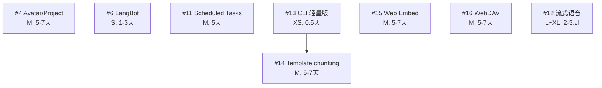

# 对手对比融合执行计划——收官 11 项指挥官启动卡

> **作者**：zhi.qu  
> **创建日期**：2026-05-09  
> **配套文件**：
> - 主计划：`.cursor/plans/对手对比融合执行计划_2026-05.plan.md`
> - 进度看板：`.cursor/plans/对手对比融合-执行进度.md`
> - 多窗口启动卡（W1~W12）：`.cursor/plans/对手对比融合-窗口启动卡.md`
>
> **本文件的特殊性**：用于剩余 8 项任务（#4 / #6 + 6 项 P2/P3）的"序贯执行"。
> 你只复制下方"指挥官 prompt"一次，每个新窗口都用同一段。AI 会自动从进度看板的断点处接续，无需你手动指定任务。
>
> **2026-05-09 决议（已落主计划 §2 + 进度看板）**：
> - ❌ #10 MCP Marketplace（GUI）→ 不做（Soul 用户多为开发者，命令行已足够）
> - ❌ #17 Drizzle ORM 迁移 → 不做（仅代码质量收益，schema 规模可控）
> - ❌ #18 RAGFlow 后端 → 不做（Soul OCR + RAG 已饱和，RAGFlow 重型部署破坏定位）
> - 🔁 #13 Chunk 可视化面板 → 降级为 **Chunk Inspector CLI**（XS，半天，与 #14 配套）

---

## ⚠️ 重要：单窗口"一次性完成 8 项"在技术上仍不现实

8 项总工作量约 **45-65 个工作日**，单窗口必然在第 3~4 项就上下文爆炸。本启动卡采用的**指挥官模式**做法：

| 物理 | 逻辑 | 你的体验 |
|---|---|---|
| 多个窗口（每个跑 2-3 项后熔断） | 1 个连续流程（AI 自动续接） | 复制同一段 prompt，每次开新窗口都能续上 |

如果你坚持"1 个窗口跑完 11 项"，请先认真阅读「方案 X：极限模式（不推荐）」章节。

---

## 一、8 项任务概览

| 序 | # | 任务 | 优先级 | 工作量 | 详细方案 |
|---|---|---|---|---|---|
| 1 | #4 | Avatar 内 Task / Project 二级概念 | P0 | M (5-7 天) | ✅ 主计划 §4.4 |
| 2 | #6 | Soul + LangBot 互补 | P1 | S (1-3 天) | ✅ 主计划 §4.7（仅落方案，未实施代码） |
| 3 | #11 | Scheduled Tasks（定时任务） | P2 | M (5 天) | ❌ 待 §4.10 |
| 4 | #13 | Chunk Inspector CLI（轻量替代版） | P2 | XS (0.5 天) | ❌ 待 §4.11（轻量版方案见本启动卡详细卡） |
| 5 | #14 | Template-based chunking | P2 | M (5-7 天) | ❌ 待 §4.12 |
| 6 | #15 | Web Embed widget | P3 | M (5-7 天) | ❌ 待 §4.13 |
| 7 | #16 | WebDAV 跨设备同步 | P3 | M (5-7 天) | ❌ 待 §4.14 |
| 8 | #12 | 流式语音输入（豆包 ASR） | P2 | L~XL (2-3 周) | ❌ 待 §4.15 |

**排序原则**：
1. **#4 先做**：阶段一最后一块拼图，工作量小见效快
2. **#6 次之**：主计划 §4.7 已有方案，落地最快
3. **#11**：独立 P2，价值清晰
4. **#13 → #14 配套做**：先做 #13 CLI（半天），#14 完成后立即用 #13 验证 chunking 效果
5. **#15/#16**：P3 但独立性强，无架构风险
6. **#12 最后**：本批最大投入（2-3 周），独立窗口长跑

**总工作量**：约 45-65 个工作日，预计 3-4 个新窗口完成。

---

## 二、依赖与文件冲突地图

### 任务依赖



### 文件热点冲突表（除主计划 §10.3 外的新增热点）

| 文件 | 涉及任务 | 冲突策略 |
|---|---|---|
| `desktop-app/electron/database.ts` | #11 | 单一持有 |
| `packages/core/src/soul-loader.ts` | #4 | #4 启动前需 rebase（#8 已修改） |
| `packages/core/src/knowledge-*` | #13, #14 | #14 在 #13 之后（CLI 用于验证 chunking 效果） |
| `desktop-app/electron/proxy-server.ts` | #6, #15 | #15 不直接动 proxy（用独立 widget server） |
| `desktop-app/src/services/scheduler-*`（新增） | #11 | 单一持有 |
| `packages/core/src/audio-*`（新增） | #12 | 单一持有 |
| `packages/core/src/sync-webdav-*`（新增） | #16 | 单一持有 |
| `scripts/knowledge-inspect.ts`（新增） | #13 | 单一持有 |

### 启动顺序约束

- ✅ **#13 → #14 推荐先后做**（CLI 用于验证 chunking 改动效果）
- ✅ 其他任务两两之间可并行（不同窗口）

---

## 三、🎯 指挥官 prompt（复制即用）

**操作**：

1. **首次启动**：开新对话窗口，复制下面三个反引号之间的全部内容，粘贴发送
2. **后续续接**：完成 3 项后窗口会自动让你开新窗口；新窗口仍然复制同一段 prompt，AI 会自动从进度看板找到断点续接

```text
我要执行 [对手对比融合执行计划] 的「收官 11 项指挥官模式」。

请严格按照以下步骤执行：

═══════════════════════════════════════════════
第一步：加载上下文
═══════════════════════════════════════════════

1. 读取主计划：@.cursor/plans/对手对比融合执行计划_2026-05.plan.md
   - 重点读 §10「多窗口执行操作手册」
   - 重点读 §5「Soul 真实能力快照」+ 附录 C「路径校准」

2. 读取进度看板：@.cursor/plans/对手对比融合-执行进度.md
   - 重点看「子任务状态总览」+「已确认的关键决策」+「文件热点表」

3. 读取本指挥官启动卡：@.cursor/plans/对手对比融合-收官指挥官启动卡.md
   - 重点读「五、11 项任务详细卡」+「二、依赖与文件冲突地图」

═══════════════════════════════════════════════
第二步：找到本窗口要做的任务
═══════════════════════════════════════════════

按本启动卡「一、任务概览」表的「序」字段顺序，逐一检查进度看板：
- 找到第一个状态为 ⏳ 待启动 或 🟡 进行中 的任务
- 验证准入条件（依赖任务必须 ✅ 完成）
- 验证文件热点不冲突（如果冲突，跳到下一个）

如果所有 11 项都已 ✅ 完成 → 输出"🎉 收官 11 项已全部完成"并停止。

═══════════════════════════════════════════════
第三步：注册本窗口
═══════════════════════════════════════════════

在进度看板「窗口操作记录」追加一行：
| <时间> | 指挥官-W<新序号>-<任务编号>-<日期> | <任务名> | 启动（指挥官模式） |

在「文件热点表」把本任务涉及的文件持有窗口改为本窗口标识。

═══════════════════════════════════════════════
第四步：实施当前任务
═══════════════════════════════════════════════

1. 检查该任务在主计划是否有 §4.X 详细方案：
   - 如果有（#4 / #6）：直接读 §4.X，输出子任务拆分计划等我确认
   - 如果没有（#10~#18 共 9 项）：按 §10.5 流程：
     a. 派 explore subagent 摸清涉及的现有代码
     b. 派 docs-researcher 拉对手实现 / 第三方 SDK 文档
     c. 输出技术方案文档（与 §4.4 同结构）
     d. 把方案追加到主计划 §4.X（自增编号 §4.10 / §4.11 …）
     e. 然后输出子任务拆分计划等我确认

2. 我确认拆分后，按 §8 派 subagent 实施：
   - 探索类用 explore subagent
   - 实现类用 generalPurpose subagent
   - 跑测试用 shell subagent + run_in_background:true

3. 每完成 1 个子任务输出回执，等我"继续"或"修改"指令。

4. 子任务全部完成后：
   - 跑相关测试验证
   - 按 §10.6 更新进度看板：状态、commit、关键决策、下游解锁
   - 释放文件热点

═══════════════════════════════════════════════
第五步：序贯流程（关键）
═══════════════════════════════════════════════

完成 1 个完整任务后，输出：
"
✅ 任务 #<编号> <任务名> 已完成
   - commit: <hash>
   - 关键决策: <一句话总结>
   
本窗口已完成 <X>/3 个任务。

下一个待做任务：#<下一编号> <下一任务名>（按本启动卡序号）
- 工作量预估：<S/M/L>
- 文件热点：<列表>
- 是否继续？回复"继续"以启动下一任务，或回复"暂停"以结束本窗口。
"

═══════════════════════════════════════════════
第六步：熔断与交接
═══════════════════════════════════════════════

⚠️ 强制熔断信号（满足任一立即停止本窗口）：

1. 完成 3 个任务（无论 S/M/L）→ 立即输出交接摘要并停止：
   "
   🔄 本窗口已完成 3 项任务，强制熔断。
   
   已完成清单：
   - #X1 <名> @ <commit>
   - #X2 <名> @ <commit>
   - #X3 <名> @ <commit>
   
   ⚠️ 请新开 Cursor 对话窗口，重新复制本指挥官 prompt。
   新窗口会自动从 #<下一编号> 开始。
   
   本窗口到此结束，不再接受新指令。
   "

2. 主窗口预估上下文 > 50k tokens → 同上立即熔断

3. 单任务调试 > 3 轮未解决 → 立即熔断该任务，输出阻塞报告：
   "
   🚨 任务 #<编号> 调试 3 轮失败，已熔断。
   - 已尝试方案：<列表>
   - 推测根因：<分析>
   - 建议下一步：<建议>
   - 已在进度看板「待确认事项」登记
   
   本窗口结束，请人工决策后再开新窗口。
   "

4. 模型开始重复之前的错误 → 同上熔断

═══════════════════════════════════════════════
边界约束（绝对不能跨）
═══════════════════════════════════════════════

- ❌ 必须严格按本启动卡「一、任务概览」表的「序」顺序执行，不能跳序
  （#4 → #6 → #11 → #13 → #14 → #15 → #16 → #12）
  例外：如果某项依赖未满足或文件冲突，可以跳到下一项，但必须在交接摘要里说明
- ❌ 每完成 1 项必须等我"继续"才做下一项
- ❌ 完成 3 项必须熔断，绝不允许做第 4 项
- ❌ 单任务调试 > 3 轮立即熔断
- ❌ 禁止跨任务"顺手改"其他文件（即使你觉得"顺便修复一下"）
- ❌ 禁止跳过 §10.5 自行做技术方案的流程（针对 #10~#18）
- ❌ 禁止破坏 §5 已确认的能力（OCR / RAG / 引用 UI 等）

开始吧。
```

---

## 四、3 种执行方案对比

| 方案 | 操作 | 适合场景 | 预计耗时 |
|---|---|---|---|
| **方案 A：指挥官模式（推荐）** | 复制上方 prompt，每开新窗口用同一段 | 想"一气呵成"、不愿手动切窗口的人 | 8 项 / 45-65 天，约 3-4 个新窗口 |
| **方案 B：精选 4 项收尾** | 只做 #4 + #6 + #11 + #13(CLI)，跳过其余 P2/P3 | 只想守好阶段一/二，不追求功能完整 | 4 项 / 13-18 天，约 2 个窗口 |
| **方案 C：原 W14~W21 单窗口模式** | 按主计划 §10.4 标准模板，每项 1 个新窗口 | 最稳但最慢，适合并行多人协作 | 8 项 / 45-65 天，8 个新窗口 |
| **方案 X：极限模式（不推荐）** | 复制上方 prompt 但删除"完成 3 项必须熔断" | 想测试单窗口极限 | 极大概率在第 3~5 项时降智 / 报错 |

---

## 五、11 项任务详细卡（指挥官读这部分）

### 序 1 · #4 Avatar 内 Task / Project 二级概念

- **优先级**：P0 / 阶段一最后一块拼图
- **工作量**：M (5-7 天)
- **详细方案**：✅ 主计划 §4.4 已就绪，**直接读不需要 explore 做方案**
- **准入**：无（独立任务）
- **文件热点**：`packages/core/src/soul-loader.ts`（⚠️ 已被 #8 修改，启动前 rebase 检查）+ `desktop-app/electron/workspace/WorkspaceManager.ts`
- **子任务参考**（来自 §4.4）：
  1. 新增目录约定 `avatars/<id>/projects/<projectId>/`
  2. SoulLoader 支持 projectId 叠加加载
  3. WorkspaceManager 三级路径 `ensure(avatarId, projectId, conversationId)`
  4. KnowledgeManager / Retriever 支持 projectId 过滤
  5. 渲染层左侧栏二级目录
  6. 历史对话兜底默认 projectId="default"
  7. 数据迁移脚本
- **关键约束**：暂不做 Project 级 MCP 隔离（避免重构 mcpManager 单例）

---

### 序 2 · #6 Soul + LangBot 互补

- **优先级**：P1 / 解锁 12 IM 平台
- **工作量**：S (1-3 天)
- **详细方案**：✅ 主计划 §4.7 已就绪，**直接读不需要 explore 做方案**
- **准入**：#1 Proxy ✅（已完成）
- **文件热点**：`desktop-app/electron/proxy-server.ts` 周边配置 + 文档
- **关键约束**：不在 Soul 内重新实现 IM Adapter；LangBot 触发的请求必须走 sendMessage 入口（继承 trustTier 与权限层）

---

### 序 3 · #11 Scheduled Tasks（定时任务）

- **优先级**：P2
- **工作量**：M (5 天)
- **详细方案**：❌ 需 explore + docs-researcher 自行做方案，写入主计划 **§4.10**
- **准入**：无
- **文件热点**：`desktop-app/electron/database.ts`（新增 schedules 表）+ 新增 `desktop-app/electron/scheduler/*`
- **建议探索点**：
  - AnythingLLM 的 Scheduled Tasks 实现路径（cron 表达式 / 触发器 / 历史日志）
  - Soul 现有的 `agent_tasks` 表能否复用作为持久层
  - 触发后是否走 chatStore.sendMessage（继承权限与审计）
- **建议子任务**：
  1. DB schema：schedules 表（id / cron / target_avatar / payload / enabled / last_run）
  2. 主进程 cron runner（轻量库或自实现）
  3. IPC：CRUD + 立即触发 + 暂停/启用
  4. UI：创建 / 编辑 / 历史日志面板
  5. 触发链路：通过 sendMessage 注入对话（继承 #7 trustTier / 灰名单确认）

---

### 序 4 · #13 Chunk Inspector CLI（轻量替代版）

- **优先级**：P2
- **工作量**：XS (0.5 天)
- **详细方案**：❌ 需 explore 做方案，写入主计划 **§4.11（轻量替代版）**
- **准入**：无
- **文件热点**：新增 `scripts/knowledge-inspect.ts` + `desktop-app/package.json`（加 npm script）
- **背景**（必读）：
  - 2026-05-09 决议：原 #13 Chunk 可视化面板（S~M, 3-5 天）**降级**为 CLI 轻量版（XS, 0.5 天）
  - 原因：Soul 现有 chunking（`knowledge-retriever.ts:599-676`）只识别 `.md` 的 `##/###` 切分，chunk 元数据简洁（`{file, heading, content}`），不需要重型可视化面板
  - 价值：调试 RAG 召回问题、验证 #14 Template chunking 改动效果
- **核心需求**：
  - 一个 npm 脚本：`npm run knowledge:inspect <avatarId> [filter]`
  - 输出每个文档被切成哪些 chunk：文件名 / heading / 字符数 / 内容前 80 字预览
  - 输出汇总：总 chunk 数 / 总字符数 / 平均字符数 / 超长 chunk 列表（命中 `CHUNK_SPLIT_THRESHOLD` 二次切分的）
  - 可选 `--full` 输出每个 chunk 完整内容
  - 可选 `--metadata` 输出已构建的 contexts.json / embeddings.json 元数据状态
- **建议子任务**：
  1. 复用 `KnowledgeRetriever` 现有 API（`buildChunks` / `getChunkKeys` 已存在），无需重写
  2. 新建 `scripts/knowledge-inspect.ts`（约 60-100 行）
  3. `desktop-app/package.json` 加 npm script `"knowledge:inspect"`
  4. README 加一节"调试知识库 chunking"
- **关键约束**：
  - ❌ 禁止改 `knowledge-retriever.ts`（只读消费）
  - ❌ 禁止做 GUI（明确替代决策）
  - ✅ 必须只用 Node 内建 + Soul 已有依赖（不引新依赖）

---

### 序 5 · #14 Template-based chunking

- **优先级**：P2
- **工作量**：M (5-7 天)
- **详细方案**：❌ 需 explore 做方案，写入主计划 **§4.12**
- **准入**：建议 #13 ✅（CLI 验证 chunking 改动效果）
- **文件热点**：`packages/core/src/document-parser.ts`（重点改）+ `packages/core/src/knowledge-retriever.ts:599-676`（不动 chunking 主逻辑）
- **背景**（必读）：基于 explore 已确认事实
  - Soul chunking 只识别 `.md` 的 `##/###`（行 617）
  - 非 .md 文档（PDF/Word/PPTX）必须先被 `document-parser` 转成 .md 才能进入 chunking
  - chunk 元数据只有 `{file, heading, content}` —— **没有页码、没有 heading 层级**
- **真实痛点**：
  1. PDF 转 .md 后无 heading → 整个文件作 1 个大 chunk + 超长按段落兜底
  2. PDF 页码元数据丢失 → 引用溯源只能精确到 .md 行号，不能"跳到 PDF 第 12 页"
  3. Word heading 层级丢失 → 强制变 `##`，不区分 H1/H2/H3
  4. PPTX slide 编号可能丢失
- **轻量优先策略**（推荐做法）：**不重写 chunking，只优化 `document-parser` 的 .md 输出质量**
  1. PDF：每页开头插入 `### 第 N 页` 小标题（让现有 chunking 按页切分自然生效）
  2. Word：保留原始 heading 层级（H1→`#`、H2→`##`、H3→`###`）
  3. PPTX：每个 slide 输出 `## Slide N` 块
  4. （可选）扩展 chunk 元数据增加 `pageNumber` / `slideNumber` 字段，引用溯源可跳到具体页
- **建议探索点**：
  - RAGFlow 的 chunk template 设计参考
  - 当前 `document-parser.ts` 各 handler（pdf/word/pptx）的输出结构
  - Excel 已有的结构化处理（`isExcelStructuredRagOnlyMd`）模式可借鉴
- **建议子任务**：
  1. PDF handler：每页开头注入 `### 第 N 页`（不破坏现有 perPageChars / imagePageNumbers）
  2. Word handler：保留 heading 层级映射
  3. PPTX handler：每 slide 一个 `## Slide N`
  4. （可选）chunk 接口扩展可选 `pageNumber` / `slideNumber` 字段
  5. 重建分身知识库索引验证（用 #13 CLI 看效果）
  6. 单测：每种文档类型的 .md 输出快照
- **关键约束**：
  - ❌ 禁止重写 `knowledge-retriever.ts:599-676` 的 chunking 主逻辑
  - ❌ 禁止破坏现有 Excel 结构化路径
  - ✅ 必须保证 .md 输出向后兼容（老分身重建索引后召回不能下降）

---

### 序 6 · #15 Web Embed widget

- **优先级**：P3
- **工作量**：M (5-7 天)
- **详细方案**：❌ 需 explore 做方案，写入主计划 **§4.13**
- **准入**：#1 Proxy ✅
- **文件热点**：新增 `widget/*`（独立打包目标） + `desktop-app/electron/widget-server.ts`（可复用 PublicFileServer）
- **建议探索点**：
  - AnythingLLM 的 Embed widget（iframe vs script tag vs Web Component）
  - Soul 已有的 PublicFileServer 能否扩展静态托管
- **建议子任务**：
  1. widget 独立打包（最小依赖、< 200KB）
  2. 配置面板：生成 embed code（含 token + avatarId）
  3. CORS / origin 白名单
  4. 嵌入对话流走与 Proxy 同样的鉴权

---

### 序 7 · #16 WebDAV 跨设备同步

- **优先级**：P3
- **工作量**：M (5-7 天)
- **详细方案**：❌ 需 explore 做方案，写入主计划 **§4.14**
- **准入**：无
- **文件热点**：新增 `packages/core/src/sync/webdav-*` + 设置面板
- **建议探索点**：
  - Cherry Studio 的 WebDAV 实现
  - 哪些数据要同步（avatar 配置 / 知识库 / 对话历史 / memory）
  - 冲突策略（最后写入获胜 / 用户裁决）
- **建议子任务**：
  1. WebDAV client 抽象
  2. 同步白名单（默认 avatars/ + memory/，不同步对话避免巨量）
  3. 增量同步（基于 mtime + hash）
  4. 设置面板：服务器配置 + 手动触发 + 自动间隔

---

### 序 8 · #12 流式语音输入（豆包 ASR）

- **优先级**：P2
- **工作量**：L~XL (2-3 周) ⚠️ 本批最大投入
- **详细方案**：❌ 需 explore + docs-researcher 做方案，写入主计划 **§4.15**
- **准入**：无
- **文件热点**：新增 `packages/core/src/audio/*` + 录音 UI 入口
- **建议探索点**：
  - Proma 的 ASR 集成（豆包 Streaming ASR API）
  - Electron 录音权限（macOS / Windows）
  - 边录边转写的 UX
- **建议子任务**：
  1. 主进程录音模块（Web Audio API → PCM）
  2. ASR Streaming 客户端（WebSocket）
  3. 转写结果实时回填输入框
  4. 设置：API Key / 语言 / 离线降级
  5. 成本可视化（按时长计费提示）
- **关键约束**：先做 Soul 内输入框，跨应用全局输入做成可选（参考主计划 §8.4 第 5 条）

---

## 六、附：进度看板字段约定（与主计划 §10.6 一致）

每个任务完成后必须更新：

1. 「子任务状态总览」对应行 → ✅ 已完成 + commit hash
2. 「已确认的关键决策」追加该任务的决策（决策内容 + 原因 + 影响下游）
3. 「下游解锁」追加可启动的后续任务
4. 「文件热点表」释放本窗口持有
5. 「窗口操作记录」追加完成行

熔断时必须更新：

1. 状态改为 🚨 阻塞
2. 「待确认事项」追加阻塞详情
3. 「窗口操作记录」追加熔断原因

---

## 七、最佳实践 FAQ

**Q：我能不能在新窗口跳过指挥官 prompt，直接让 AI 做"序 N"任务？**  
A：可以，但必须满足两个条件：① 进度看板显示该任务的所有前置依赖 ✅；② 该任务的文件热点未被其他窗口持有。建议直接用指挥官 prompt，让 AI 自己判断更安全。

**Q：如果某任务我后悔不做了（比如 #17 / #18），怎么办？**  
A：手动编辑进度看板，把对应行状态改为 ❌ 不做 + 在「明确不做」表追加，并补"不做原因"。指挥官模式启动时会自动跳过 ❌ 项。

**Q：如果某任务做到一半我想暂停，但不算阻塞，怎么办？**  
A：让 AI 输出阶段性产物 → 提交 WIP commit → 状态改为 ⏸ 暂缓 + 在「待确认事项」记录"已完成 X 子任务，待续"。下次启动时新窗口可以从 WIP 续做。

**Q：方案 X 极限模式真的不可行吗？**  
A：技术上可以试，但根据 efficient-workflow 经验：单窗口超过 3 个 P0/P1/P2 任务后，AI 会出现 ① 重复读同一文件 ② 忘记前面已确认的决策 ③ 错乱不同任务的上下文。强烈不推荐。
