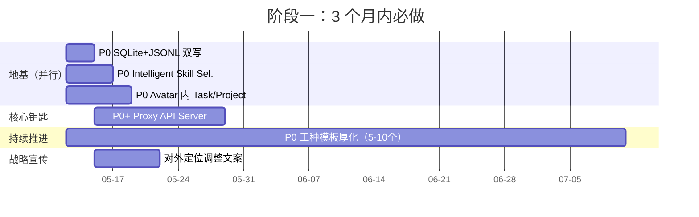
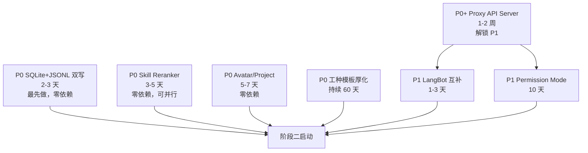
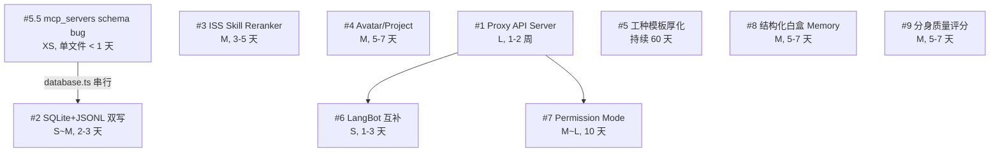

# 对手对比融合执行计划

> **作者**：zhi.qu
> **日期**：2026-05-09
> **状态**：已通过差异化定位评审，待逐项立项执行
> **来源**：基于 Proma / Harness / AnythingLLM / LobeHub / Dify / CherryStudio / RAGFlow / LangBot / 9 个速览项目的对比调研
> **使用方式**：在新对话中 `@.cursor/plans/对手对比融合执行计划_2026-05.plan.md` 作为唯一上下文，逐项推进

---

## 0. 文档导航

| 节 | 内容 | 适合谁读 |
|---|---|---|
| §1 战略层 | 差异化定位 + 不做什么 + 核心原则 | 决策人、产品负责人 |
| §2 19 项优先级总表 | 一表看全部改造项 | 任何人 |
| §3 三阶段路线图 | 时间线与阶段目标 | 项目管理 |
| §4 P0+/P0 详细执行计划 | 具体怎么做 | 实施 subagent |
| §5 Soul 真实能力快照 | 防止后续误判 | 必读，避免重复犯错 |
| §6 各项目对比一览 | 对比来源参考 | 想追溯结论的人 |
| §7 风险与陷阱 | 防止跑偏 | 任何执行人 |
| §8 执行原则 | 怎么并行、怎么熔断 | 任何执行人 |
| §9 下一步行动 | 立刻该做什么 | 立刻读 |
| **§10 多窗口执行操作手册** | **窗口启动模板 + 依赖图 + 回执规范** | **每个新窗口必读** |

---

## 1. 战略层

### 1.1 一句话定位

> Soul 是 **"领域专家 AI 分身的工程化平台"**，不是又一个 AI 桌面应用。

### 1.2 唯一差异化护城河

```text
┌─────────────────────────────────────────────┐
│  领域分身的工程化体系（不可动摇）              │
│                                              │
│   soul.md         强人格档案                  │
│   knowledge/      数据可追溯（[来源:] 红线）   │
│   skills/         三级体系（local/shared/community） │
│   tests/          红线 + LLM 自动评测          │
│   templates/      工厂化创建流程               │
│                                              │
│   👉 这是其他所有项目（包括 Cherry Studio /   │
│      LobeHub / AnythingLLM）都没有的能力      │
└─────────────────────────────────────────────┘
```

### 1.3 已被对手覆盖的能力（不再是差异化，不要在此重复造轮子）

- ❌ 桌面 Electron 形态（AnythingLLM / Cherry Studio / LobeHub Desktop）
- ❌ 本地 RAG + 向量检索（Cherry Studio v2 三层架构与 Soul 同构）
- ❌ MCP 工具协议（全员都有）
- ❌ Agent / 工具调用（全员都有）
- ❌ 多供应商适配（AnythingLLM 35+，Cherry Studio Proxy API Server）—— **Soul 反而是落后方**
- ❌ 子代理协作（LobeHub Agent Groups 已经做完）
- ❌ 项目/工作区抽象（LobeHub Project + Workspace）

### 1.4 战略口号

- **80% 精力守住"领域分身工程化"** → 这是 Soul 唯一能赢的地方
- **20% 精力补外延** → 借力对手实现，不要自造（Provider Adapter / IM 桥接 / Memory）
- **不做的事**：UGC 分身市场（红海必输）/ 自写 IM Adapter（用 LangBot）/ 跟 Cherry Studio 拼 RAG

---

## 2. 19 项优先级总表

| 优先级 | 改造项 | 来源 | 工作量 | 依赖 | 一句话价值 |
|---|---|---|---|---|---|
| **P0+** ⭐ | Proxy API Server（Vercel AI SDK + Anthropic 协议） | Cherry Studio PR #11495 | L (1-2 周) | — | 解锁外部生态接入，是 P1 LangBot 集成的前置 |
| **P0** | SQLite + JSONL 双写 | Proma | S~M (2-3 天) | — | 故障恢复 + 审计 + 备份兜底 |
| **P0** | Intelligent Skill Selection (ISS) | AnythingLLM PR #5236 | M (3-5 天) | — | 每次请求节省 30-80% token |
| **P0** | Avatar 内 Task / Project 二级概念 | LobeHub Project | M (5-7 天) | — | 长期工作沉淀的承载结构 |
| **P0** | 官方工种模板厚化（5-10 个） | Soul 自身 | M (持续) | — | 守护差异化护城河 |
| **P1** | Soul + LangBot 互补（替代自写 IM 桥接） | LangBot | S (1-3 天) | P0+ | 12 个 IM 平台免费拿下 |
| **P1** | Permission Mode + Plan Mode | Proma + Claude Agent SDK | M~L (10 天) | P0+ | 远程触发后必须有的安全层 |
| **P1** | 结构化白盒 Memory | LobeHub Personal Memory | M (5-7 天) | — | 升级 memory/MEMORY.md 为可编辑条目 |
| **P1** | 分身质量评分体系 | Soul 自身 | M (5-7 天) | — | 让"高质量分身"可被识别和背书 |
| **P2** | Scheduled Tasks（定时任务） | AnythingLLM | M (5 天) | — | 让分身可以定时执行（周报/监控） |
| **P2** | 流式语音输入（豆包 ASR） | Proma | L~XL (2-3 周) | — | 现场口述场景，成本 0.9 元/小时 |
| **P2** | Chunk Inspector CLI（轻量替代 / 原 Chunk 可视化面板） | Soul 自身 | XS (0.5 天) | — | 调试 chunking 效果的 CLI 工具，与 #14 配套 |
| **P2** | Template-based chunking | RAGFlow | M (5-7 天) | — | 按文档类型选分块策略，提升 PDF/Word/PPTX 召回粒度与页码追溯 |
| **P3** | Web Embed widget | AnythingLLM | M (5-7 天) | — | 让分身嵌入企业门户 |
| **P3** | WebDAV 跨设备同步 | Cherry Studio | M (5-7 天) | — | 跨设备使用场景 |
| **❌** | MCP Marketplace（GUI） | — | — | — | 2026-05-09 决议不做：Soul 用户多为开发者，sources.yaml + soul-sync.sh 已足够 |
| **❌** | Drizzle ORM 迁移 | — | — | — | 2026-05-09 决议不做：仅代码质量收益，schema 规模可控，需要时再评估 |
| **❌** | RAGFlow 作为可选后端 | — | — | — | 2026-05-09 决议不做：Soul OCR + RAG 已饱和，RAGFlow 重型部署破坏轻量化定位 |
| **❌** | 自写飞书 / 企微 / 钉钉 IM Adapter | — | — | — | 用 LangBot 替代，不要重复造 |
| **❌** | UGC 分身市场（GPTs 风格） | — | — | — | 红海，与 LobeHub 76k stars 拼数量必输 |
| **❌** | 通用 Chat 模式（多模型对比） | — | — | — | 与 Soul 定位冲突，用 Cherry Studio/LobeHub 即可 |
| **❌** | 可视化 Workflow 编辑器（Dify 风格） | — | — | — | 与 Soul 定位冲突 |
| **❌** | 多用户 / SaaS 控制台 | — | — | — | Soul 是个人/小团队工具 |

---

## 3. 三阶段执行路线图

### 阶段一：守住护城河（3 个月内）

**目标**：完成 5 项 P0 改造 + 模板厚化 + 战略宣传定调



**阶段一交付物**：
1. 主进程 HTTP 暴露 Anthropic 兼容 API（外部工具可调）
2. 每条对话写 SQLite 同时追加 `~/.soul/conversations/<id>.jsonl`
3. 工具调用前自动 rerank top 15，token 节省可量化
4. Avatar 下支持 `projects/<projectId>/` 目录约定
5. 至少 5 个新工种模板（财务 / 电气 / 产品 / HR / 法务）入库
6. 官网 / README / 介绍文案改为 **"领域分身工程化平台"**

### 阶段二：建立外延（半年内）

**目标**：通过 LangBot 解锁 12 个 IM 平台 + 安全层 + 高级 Memory + 质量背书

- P1 Soul + LangBot 互补 → 飞书 / 企微 / Discord / Slack / 钉钉等同时拿下
- P1 Permission Mode + Plan Mode → 远程触发的安全层
- P1 结构化白盒 Memory → 升级 memory/MEMORY.md
- P1 分身质量评分体系 → 红线测试通过率、知识完整度、引用准确率三维评分

**阶段二交付物**：
1. 小堵分身可在飞书群被 @ 调用，全程审计
2. 工具调用分白/灰/黑名单，灰名单弹窗审批，远程触发自动 deny 灰名单
3. memory 升级为结构化条目（id / 时间戳 / 类别 / 内容 / 来源），可编辑/删除/检索
4. 每个分身有"质量勋章"（红线 X% / 知识完整度 Y% / 引用准确率 Z%）

### 阶段三：重新定义品类（一年内）

**目标**：让 Soul 成为"AI 分身的工种工程协议"，而不是"又一个 AI 桌面应用"

- 把所有底层能力（RAG / Agent / MCP）变成可被替换的内核
  - 用户可选 Soul 自带 RAG / Cherry Studio v2 RAG / RAGFlow 作为知识层（P3）
  - Soul 的核心价值是**分身定义的标准 + 测试评估的标准 + 数据合规的标准**
- 推动"分身格式协议"，让 Cherry Studio / LobeHub / AnythingLLM 都能加载 Soul 格式的分身
- **不要做平台，做协议**

**阶段三交付物**：
1. `KnowledgeBackend` / `LLMBackend` / `MCPBackend` 抽象层
2. Soul 分身格式 JSON Schema 公开发布
3. 至少 1 个第三方平台支持加载 Soul 分身

---

## 4. P0+ / P0 详细执行计划

### 4.1 P0+ Proxy API Server（最高优先级）

**目标**：把 Soul 内任何 LLM Provider 暴露为 `http://localhost:18888/v1/messages` 的 Anthropic 兼容 API。

**参考实现**：
- 主参考：Cherry Studio PR #11495（TypeScript 同栈，8093 行代码）
- 关键技术：Vercel AI SDK（`ai` 包 + provider packages）
- 协议选择：Anthropic 而非 OpenAI（更好的 tool calling 支持）

**任务拆分**：

| 子任务 | 涉及文件 | 工作量 |
|---|---|---|
| 1. 引入 Vercel AI SDK 依赖 | `desktop-app/package.json` | S |
| 2. 重构 llm-service 为 AI SDK adapter | `desktop-app/src/services/llm-service.ts` | M |
| 3. 主进程 HTTP server（基于 Express/Fastify） | `desktop-app/electron/proxy-server.ts`（新增） | M |
| 4. Anthropic Messages API 端点实现 | `desktop-app/electron/proxy-server.ts` | M |
| 5. Provider 解析层（model 格式 `<provider>:<model>`） | `desktop-app/electron/lib/provider-resolver.ts`（新增） | S |
| 6. 设置面板：Proxy Server 开关 + 端口配置 | 渲染进程 Settings | S |
| 7. 集成测试：Claude Code 接入 Soul 验证 | `desktop-app/electron/proxy-server.test.ts` | S |

**关键设计决策**：
- ✅ Opt-in：默认关闭，设置内开启
- ✅ 监听 `127.0.0.1` 不暴露公网（如需暴露走 frp/ngrok）
- ✅ Token 鉴权（Header `Authorization: Bearer xxx`）
- ✅ 模型格式 `<provider>:<model>`（如 `deepseek:deepseek-chat`）
- ✅ 支持 streaming + tool calling + 多轮对话

**风险**：
- ⚠️ Vercel AI SDK 引入会增大 bundle 体积（需评估）
- ⚠️ 主进程多一个 HTTP server，端口冲突需要兜底
- ⚠️ 流式响应在 Electron 主进程的实现有些坑（参考 Cherry Storage 的 streaming 实现）

**完成标准**：
- 在 Claude Code / Cursor 内配置 `http://localhost:18888/v1/messages` + 任意 Soul 配置的 provider 模型，能正常对话
- 工具调用能正常返回（Anthropic tool_use 格式）

#### 4.1.A 实现校准脚注（2026-05-09，由窗口 W14-#6 追加）

> **以代码为准**：本节最初拟以「主进程引入 Vercel AI SDK + provider packages 直接选模」为主路径（参考 Cherry Studio PR #11495）。**实际落地采用方案 A**：
>
> - **主进程**仅承担 HTTP 入口（`desktop-app/electron/proxy-server.ts`，`127.0.0.1:18888`，`POST /v1/messages` + `GET /v1/health`），不直接选模、不直接调 LLM。
> - **渲染进程**经 `desktop-app/electron/proxy-api-bridge.ts` 桥接到 `useChatStore.getState().sendMessage(..., proxyOpts)`，**复用** UI 同款 LLM 选模 / 工具循环 / 权限层（`trustTier: 'proxy'`，与 #7 同源）。
> - 请求体内 `model` 字段**仅**用于响应展示标签，不切换 Soul 内真实 Provider；真实模型即当前会话/UI 配置。
> - 流式协议为 Anthropic SSE（`anthropic-proxy-protocol`），工具调用在 Soul 内闭环，HTTP 上不暴露完整多轮 Anthropic tool_use 协议。
>
> **影响**：
> - §4.1 上文「子任务 1（引入 Vercel AI SDK 依赖）」「子任务 2（重构 llm-service 为 AI SDK adapter）」**未执行**亦未规划重做（以方案 A 为准）。
> - §4.7 LangBot 互补、§4.6 Permission Mode 均以「`sendMessage` 为唯一执行入口、Proxy 即 `trustTier: proxy`」为前提，**禁止**在本仓库内并行实现第二条主对话 HTTP 协议（如必需 OpenAI `/v1/chat/completions`，请走独立侧车 / LangBot 侧插件，单独立项）。
> - 后续 subagent 探索此功能时**应先看** `desktop-app/electron/proxy-server.ts` + `proxy-api-bridge.ts` + `chatStore.sendMessage` 三处，**不要**再去找 `ai` / `@ai-sdk/*` 等依赖。

---

### 4.2 P0 SQLite + JSONL 双写

**目标**：每条对话消息既写 SQLite 也追加到 `~/.soul/conversations/<conversation-id>.jsonl`，作为冗余备份。

**参考实现**：
- Proma：每个会话一个 `{session-id}.jsonl`
- Soul 已有：`logs/tool-calls/<date>.jsonl` 工具审计

**任务拆分**：

| 子任务 | 涉及文件 | 工作量 |
|---|---|---|
| 1. 新建 ConversationJsonlAppender 类 | `desktop-app/electron/conversation-jsonl-appender.ts`（新增） | S |
| 2. 在 DatabaseManager.saveMessage 后追加调用 | `desktop-app/electron/database.ts` | S |
| 3. 路径：`app.getPath('userData')/conversations/<id>.jsonl` | 同上 | — |
| 4. 失败处理：JSONL 失败只 warn，不阻塞主流程 | 同上 | — |
| 5. 导出/备份：复制 conversations/ 目录即可 | （已自然支持） | — |
| 6. 单测：双写一致性 | `desktop-app/electron/conversation-jsonl-appender.test.ts` | S |

**关键设计决策**：
- ✅ 写入顺序：SQLite commit 成功 → 再 append JSONL（主存储优先）
- ✅ 异步 append（`fs.appendFile`），不需 fsync
- ✅ 失败只 warn，不阻塞 IPC
- ✅ 暂不做文件轮转（单会话一般 < 100MB）

**风险**：
- ⚠️ 极低，已有工具审计 JSONL 实践可直接参考

**完成标准**：
- 对话期间 `~/.soul/conversations/<id>.jsonl` 实时增长
- 删除 SQLite 后，可从 JSONL 重建对话历史（脚本验证）

---

### 4.3 P0 Intelligent Skill Selection (ISS)

**目标**：在工具调用前用 embedding rerank 选 top N 工具注入 LLM context，节省 30-80% token。

**参考实现**：
- AnythingLLM PR #5236
- 默认配置：topN=15, max chain=10
- 性能基准：M4 Pro 重排 300 工具到 top 15 仅 600ms

**任务拆分**：

| 子任务 | 涉及文件 | 工作量 |
|---|---|---|
| 1. 新建 SkillReranker 类 | `packages/core/src/skill-reranker.ts`（新增） | M |
| 2. 工具描述 embedding 缓存 | `packages/core/src/utils/skill-embedding-cache.ts`（新增） | S |
| 3. query-tool 相似度计算（cosine） | 复用 Soul 已有 embedding 能力 | S |
| 4. 接入 chatStore 的工具循环前 | `desktop-app/src/stores/chatStore.ts` | M |
| 5. 配置项：topN（默认 15）/ 启用阈值（默认工具数 > topN） | 设置面板 | S |
| 6. 单测 + 性能基准 | `packages/core/src/tests/skill-reranker.test.ts` | M |

**关键设计决策**：
- ✅ 仅在 (avatar 工具数 + MCP 工具数 + skills 总数) > topN 时激活
- ✅ 工具描述 embedding 持久化缓存（hash 未变跳过重算）
- ✅ topN 可按场景配置（普通对话 15 / 复杂任务 25）
- ✅ 保留 max_chain 限制（防止工具调用爆炸）

**风险**：
- ⚠️ 准确率：rerank 漏掉关键工具会让任务失败 → 需要在测试集上验证准召率
- ⚠️ 配置过于保守反而失去意义 → 建议默认 topN=15

**完成标准**：
- 在 5 个真实场景测试，token 用量下降 30%+ 且任务完成率不下降
- 性能：100 个工具 rerank < 1 秒

---

### 4.4 P0 Avatar 内 Task / Project 二级概念

**目标**：在 Avatar 下增加 Project 维度，每个 Project 有独立 workspace / 临时知识 / 对话上下文。

**参考实现**：
- LobeHub Project + Workspace 概念
- Soul 已有：`workspaceManager.ensure(avatarId, conversationId)` 是天然基础

**任务拆分**：

| 子任务 | 涉及文件 | 工作量 |
|---|---|---|
| 1. 新增目录约定：`avatars/<id>/projects/<projectId>/` | （仅文档+约定） | S |
| 2. SoulLoader 支持 projectId 参数叠加加载 | `packages/core/src/soul-loader.ts` | M |
| 3. workspaceManager 三级路径 ensure(avatarId, projectId, conversationId) | `desktop-app/electron/lib/workspace-manager.ts` | S |
| 4. KnowledgeManager / Retriever 支持 projectId 过滤 | `packages/core/src/knowledge-*.ts` | M |
| 5. 渲染层：左侧栏二级目录（分身 → 项目 → 对话） | `desktop-app/src/components/Sidebar.tsx` 等 | M |
| 6. 历史对话兜底：默认 projectId = `default` | 数据迁移脚本 | S |

**关键设计决策**：
- ✅ Project 为可选概念，老对话默认 `projectId = "default"`
- ✅ 暂不做"项目级 MCP 隔离"（避免改全局 mcpManager 单例）
- ✅ Project 知识与 Avatar 知识合并检索（Avatar 全局 + Project 临时）

**风险**：
- ⚠️ UI 信息架构变化：用户切换路径 = 分身 → 项目 → 对话，是否过深？
- ⚠️ 历史对话迁移要做兼容

**完成标准**：
- 用户能在小堵下创建"恒大项目"和"光伏招标项目"两个独立 Project
- 两个 Project 的临时知识互不干扰，但都能用全局 Avatar 知识

---

### 4.5 P0 官方工种模板厚化（5-10 个）

**目标**：增加 5-10 个高质量工种官方模板，让用户基于模板新建分身（而不是从零写 soul.md）。

**优先工种清单**（按需求频次）：

| 工种 | 适用场景 | 关键模块 |
|---|---|---|
| 财务专家 | 报表分析、预算、合规 | Excel 解析强、引用红线严 |
| 电气工程师 | 配电方案、原理图解读 | Vision OCR + 图表理解 |
| 产品经理 | PRD 撰写、用户研究 | 模板化输出 + 数据分析 |
| HR 专家 | 招聘评估、薪酬政策 | 政策检索 + 案例对比 |
| 法务专家 | 合同审查、合规咨询 | 数据溯源最严 |
| 市场分析师 | 竞品分析、行业洞察 | 网络搜索 + 数据可视化 |
| 项目经理 | 进度跟踪、风险识别 | 甘特图 + 风险表 |

**每个模板必须包含**：
- ✅ `soul.md`（人格档案，含红线规则）
- ✅ `CLAUDE.md` / `AGENTS.md`（工作规则）
- ✅ `knowledge/README.md`（知识库结构说明）
- ✅ `skills/skill-index.yaml`（推荐技能列表）
- ✅ `tests/cases/*.md`（至少 5 个测试用例：红线 2 + 知识库约束 1 + 数据溯源 1 + 人格 1）
- ✅ `memory/MEMORY.md`（空文件）

**任务拆分**：每个工种作为一个独立子任务，**找对应工种资深工程师撰写**（不要 LLM 编造）。

**完成标准**：
- 每个工种模板能通过自带的测试用例
- 用户在 Soul UI 上可以一键基于模板新建分身

---

### 4.6 P1 Permission Mode + Plan Mode（技术方案 · 2026-05-09）

> **状态（2026-05-09）**：核心实现已由 W9 落地：`@soul/core` `tool-permission-policy`、`main.ts` `execute-tool-call` 入口预检、`conversation:sync-tool-mode`、`executeToolCall` 第五参 `trustTier`（Proxy）、`todo_write` 渲染侧同源策略、`packages/core` 单测。
>
> 本节由窗口 **W9-#7-2026-05-09** 按 §10.5 追加：explore 摸清现状后的可执行方案。**文件热点**：`main.ts` 若与 #1 Proxy 并行开发仍需 rebase；功能上已无「等 #1 才能写门禁」之硬阻塞（用户一次性授权实施后）。

#### 目标

- **Permission Mode**：按工具风险分级（白/灰/黑）；灰名单在桌面端可弹窗审批；**远程 / 无 UI 上下文**触发时对灰名单**默认拒绝**（与战略层「远程触发安全层」一致）。
- **Plan Mode**：不仅要在渲染进程缩小可见工具集，还须在**主进程**对实际执行的 `tool` 名做一致约束，防止绕过 UI 的调用面（含未来 LangBot / 畸形客户端）。
- **架构红线**（§8.4）：权限**必须**在 `desktop-app/electron/main.ts` 的 **`execute-tool-call` 入口**（`withToolCallAudit` 包裹体内、**所有** `if (name === …)` 分支之前或统一经一道 gate）集中处理；**禁止**在 `packages/core/src/tool-router.ts` 各 `case` 内散落权限逻辑（仅可抽**纯函数**策略模块供 main 预检调用）。
- **同源语义**：`proxy-api-bridge` → `useChatStore.getState().sendMessage` 已与 UI 同路；**LangBot 等外部入口**须继续**只**走 `sendMessage`（或唯一薄封装转调 `sendMessage`），使工具列表、模式、权限预检与 UI 一致。
- **ISS 同步**：若引入或重命名「始终可用」工具集合，须与 #3 决策钉选 **`ISS_DEFAULT_PINNED_TOOL_NAMES`**（`packages/core/src/skill-reranker.ts`：`list_mcp_tools` / `call_mcp_tool` / `todo_write` / `load_skill`）及本任务的白/灰名单配置对齐，避免 ISS 保留的工具在权限层被误杀或漏网。

#### 现状摘要（explore）

| 链路 | 要点 |
|------|------|
| IPC | `preload.ts` `executeToolCall` → `ipcMain.handle('execute-tool-call', …)` |
| 入口 | `main.ts` `withToolCallAudit`：计时 + JSONL 审计 + 脱敏；其内大量 `if (name === …)` 特殊分支，最后 `toolRouter.execute(...)` |
| 渲染 | `chatStore.sendMessage`：ISS 重排；**Plan mode** 下 `PLAN_MODE_BLOCKED_TOOLS` 过滤可见工具；`todo_write` **仅渲染进程**处理，**不经** `execute-tool-call` |
| Proxy | `proxy-api-bridge.ts` → `sendMessage(..., proxyOpts)`，与 UI 同循环 |
| 缺口 | 主进程**无** allow/deny/审批；Plan mode **未**在主进程强制执行；`todo_write` 形成双路径 |

#### 任务拆分（实施用）

| 子任务 | 涉及文件（预计） | 说明 |
|--------|------------------|------|
| 1. 策略模型 + 纯函数模块 | `packages/core/src/tool-permission-policy.ts`（新建）或 `@soul/core` 下同等职责 | 定义工具名 → 风险级、远程默认拒绝规则、与 plan/ask 模式交集；**无** IPC、无 `switch` 调用具体工具 |
| 2. main 入口统一 gate | `desktop-app/electron/main.ts` `execute-tool-call` | 在 `withToolCallAudit` 内、**所有分支共用的最早安全点**（segment/workspace 校验之后）调用策略：deny 则直接 return，不进入各 `if (name===)` / `toolRouter.execute`；需覆盖 L3/导出等早退分支 |
| 3. 会话模式真相源 | `database.ts` 或 `settings` + IPC | 主进程按 `conversationId`（或等价键）读取当前 `ask \| plan \| agent`，与 `switch_mode` / UI 同步，供 gate 使用 |
| 4. 审批 IPC + UI | 新建 `tool-permission:*` IPC + 渲染组件 | 灰名单 + 有 `webContents` 时 `invoke` 弹窗；超时/取消 → deny；远程无 UI → 直接 deny |
| 5. `todo_write` 对齐 | `chatStore.ts` + 可选轻量 IPC | 二选一：**A)** 将 `todo_write` 纳入 main 侧仅审计/策略 duplicate（共享 policy 模块）；**B)** 经 IPC 统一走 audit（改动面大时采用 A 并文档化双路径） |
| 6. 回归与文档 | `proxy-api-bridge`、batch runner、计划文档 | 验证 Proxy 与面板同策略；更新进度看板「关键决策」 |

#### 关键设计决策（草案）

- Gate **必须**覆盖 `execute-tool-call` 的**整条**处理树；若某分支在 gate 之前 return，须上移 gate 或拆「内层 handler」统一穿过 gate。
- **Plan mode** 在主进程以「拒绝执行 blocked 工具名」为主，与渲染侧 `PLAN_MODE_BLOCKED_TOOLS` **同源数据**（导出常量 `@soul/core`，两侧 import）。
- **黑名单**：主进程硬拒绝 + 审计；**白名单**：通过；**灰名单**：本地弹窗，远程 deny。

#### 风险

- `main.ts` 与 #1 Proxy 同热点，需序贯合并或 rebase。
- `todo_write` 不经 IPC 会导致「全量工具经主进程审批」口号不严格成立 — 须在 §4.6 完成标准中明确接受 A 或 B。
- 检索类 IPC（如 `search-knowledge-chunks`）是否纳入权限范围：建议 **#7 首期仅 `execute-tool-call`**，其它通道单列 follow-up。

#### 完成标准

- 任意经 `execute-tool-call` 的工具在执行前均经过统一策略；`tool-router` 无新增 per-case 权限分支。
- Proxy 触发路径与 UI 一致受控；计划书中 LangBot 集成仅描述 `sendMessage` 入口。
- Plan mode 下即使用构造 IPC 调用敏感工具名也会被主进程拒绝（有对应单测或手工脚本）。
- ISS 钉选工具名与权限配置无矛盾（文档或配置层显式列出）。

---

### 4.7 P1 Soul + LangBot 互补（技术方案 · 2026-05-09）

> **状态（2026-05-09）**：由窗口 **主窗-#6-2026-05-09** 按 §10.5 追加。依赖 **P0+ Proxy 已具备可调用 HTTP 面**（实现为「主进程 HTTP + 渲染进程 `sendMessage`」方案 A，与旧 §4.1 中「Vercel AI SDK 主进程选模」叙述有偏差，**以代码为准**）。  
> **边界**：不在 Soul 内实现飞书/企微/钉钉等 IM Adapter；**双向协议与集成**指：LangBot 作为 IM 与编排侧，Soul 作为「领域分身 + 工具/MCP + 知识」执行侧，经 **唯一 HTTP 语义**（现有 Proxy）衔接。

#### 目标

- **LangBot → Soul（入站）**：LangBot（或同等机器人框架）将对话请求转发到 Soul 的 **`POST /v1/messages`**，使回复与工具循环、权限（`trustTier: 'proxy'`）、ISS 与 UI 路径一致（§8.4 原则 2）。
- **Soul → LangBot（出站，按需）**：若产品需要「Soul 主动推送到 IM」，定义 **显式 webhook / Bot API**（URL、鉴权、重试、幂等），**不**与 Proxy 混用第二条 HTTP 语义；首期可文档化 + 占位配置，避免与 `proxy-server` 分叉两套「像 OpenAI 又像 Anthropic」的兼容层。
- **禁止**：在 Soul 内重写各 IM 平台 Adapter；禁止引入与现有 Proxy 并行的第二套「主对话 HTTP」 unless 经战略评审（例如必须提供 OpenAI `/v1/chat/completions` 时优先 **独立侧车** 或 LangBot 侧插件，而非膨胀 `proxy-server`）。

#### 现状摘要（explore，2026-05-09）

| 维度 | 要点 |
|------|------|
| HTTP 入口 | `desktop-app/electron/proxy-server.ts`：`127.0.0.1`，端口设置项 `proxy_server_port`（默认 18888）；`POST /v1/messages`，`GET /v1/health` |
| 鉴权 | `Authorization: Bearer <proxy_api_token>`；未配置 token → 503 |
| 会话绑定 | **必需头** `x-soul-conversation-id`（与 Soul 侧会话 ID 一致）；无主进程「按频道 ID 映射」——映射放在 **LangBot 配置层**或后续极小扩展 |
| 请求体 | JSON；`proxy-api-bridge` 仅从 Anthropic 形态 `messages` 抽取**最后一条 user 文本**；`stream` 控制 SSE vs 单次 JSON |
| 模型字段 | 请求内 `model` 若存在：**仅用于响应展示标签**，**不切换** Soul 内真实 Provider（真实模型即当前会话/UI 配置） |
| 流式 | SSE：`content_block_delta` 等（`anthropic-proxy-protocol`）；工具调用在 Soul 内闭环，HTTP 上不暴露完整多轮 Anthropic tool 协议 |
| 信任链 | `chatStore.sendMessage` 带 `proxyJobId` → `trustTier: 'proxy'`（与 #7 Permission/Plan 同源） |

#### LangBot 侧对接要点（不改变 Soul HTTP 语义）

1. **Provider 选型**：优先使用 LangBot 自带的 **Anthropic/Claude** 类对接能力，将 **API Base** 指向 `http://127.0.0.1:<port>`（或同机反代），路径保持 **`/v1/messages`**（与官方 Anthropic 一致则只需换 host）。  
2. **自定义头**：若 LangBot 支持为请求附加 Header，必须带上 **`x-soul-conversation-id`** 与 **`Authorization`**。若 UI **不支持**自定义头，则 **子任务**为「LangBot 插件 / 侧车」在出站前注入头，**不要**在 Soul 为每个 IM 各写一套 Adapter。  
3. **仅 OpenAI-compat 模式**：LangBot 若只能走 `/v1/chat/completions`，Soul 仓库 **本期不新增**第二套主进程协议；可选：**独立 micro-proxy**（OpenAI → Anthropic 形态转发到本机 `proxy-server`）作为运维组件，**不合并进** `desktop-app` 除非单独立项。  
4. **运行前提**：Electron 应用已启动且渲染进程可用；`isLoading` 时 bridge 会拒绝并发 Proxy 任务——LangBot 侧需退避或排队。

#### 任务拆分（实施用 · 待用户确认后执行）

| 子任务 | 涉及产物 | 说明 |
|--------|-----------|------|
| 1. 校准进度看板与 §4.1 叙事 | `.cursor/plans/对手对比融合-执行进度.md`、必要时本文件 §4.1 脚注 | **#1 Proxy**：若代码已landing，将把 #1 标为 ✅ 并解锁 #6「准入」与依赖图一致；§4.1 注明「已实现为方案 A」避免 subagent 误找 Vercel 主路径 |
| 2. 《LangBot ↔ Soul》对接说明书 | **用户指定路径**（建议 `desktop-app/docs/langbot-integration.md` 或根 `README` 节选；仅以用户确认的目录为准） | 写清单：Soul 开关、`/v1/messages`、Header、极简 `curl`/LangBot 配置片段、FAQ（会话 ID 从哪拷贝、为何不暴露 tool 原始流、`503`/`renderer_unavailable`） |
| 3. （可选）会话映射辅助 | **仅当**确认为刚需：例如在设置中增加「Proxy 默认 conversationId」或主进程薄层解析 `x-langbot-session-id → conversationId` 的 SQLite 映射表 | **默认不做**；避免与 chatStore 强耦合；若做则单列设计评审（热点：`main.ts` / `database.ts`） |
| 4. Soul → LangBot 出站 | 设计稿 + 配置键占位 | webhook URL、secret、失败重试；**实现可拆到 follow-up**，避免与本窗口「互补」混淆 |
| 5. 回归验证 | 手工 checklist | LangBot 开一路 IM → 触发 Soul 回复；断言工具触发时 `#7` 灰名单在 `proxy` 下拒绝 |

#### 关键设计决策（草案）

- **单一 HTTP 语义**：外部系统只认现有 **Anthropic Messages 形态** `POST /v1/messages` + Bearer + `x-soul-conversation-id`。  
- **信任与审计**：LangBot 触达 Soul 即视为 **proxy** 信任层，与 `proxy-api-bridge` 完全一致。  
- **不做 IM Adapter**：所有通道接入由 LangBot 维护；Soul 只维护「分身工程化 + Proxy 入口」。

#### 风险

- LangBot 配置 UI **无法**附加 Header → 需要侧车或上游 PR，周期不确定。  
- Soul Proxy **单会话串行**（`isLoading` 拒新单）→ 高并发 IM 需 LangBot 侧排队。  
- 改端口/Token **需重启应用**（Settings 已提示）→ 运维需知晓。

#### 完成标准

- 文档可让的新同事在 **30 分钟内**完成：启动 Soul → 开 Proxy → LangBot 指向本机 → 飞书/钉钉等 **任一路**能收到 Soul 分身回复（以用户实际 LangBot 版本为准）。  
- 明确记录：**不**在 Soul 内实现 IM Adapter；**不**引入与 Proxy 冲突的第二套对话 HTTP（除非独立侧车）。  
- 验收时工具调用路径经 `sendMessage`，`trustTier: 'proxy'` 行为与 #7 文档一致。

---

### 4.8 P1 结构化白盒 Memory（技术方案 · 2026-05-09）

> **状态（2026-05-09）**：由窗口 **W10-#8-2026-05-09** 按 §10.5 落盘并实施。  
> **边界**：渐进升级 —— **不删除、不替代** `memory/MEMORY.md` 读写链路与 `SoulLoader` 对该路径的读取；会话结束由 `chatStore` 追加的「模型记忆块」**仍只写 `MEMORY.md`**，避免在本期改动主对话闭环。  
> **文件热点**：`packages/core/src/soul-loader.ts`（与 #4 同文件；#4 未持有时可改；本期仅追加读取与拼装，不触碰 `projectId` 以外逻辑）

#### 目标

- 在分身目录增加 **可机器读写的结构化记忆库**（白盒条目：id / 时间戳 / 类别 / 内容 / 可选来源），桌面端 **可增删改查**。
- **注入规则**：`SoulLoader` 拼装「长期记忆」时 = **结构化条目渲染为 Markdown** +（若存在正文）**原 `MEMORY.md` 全文**，二者用分隔线区分，保证旧分身仅 `MEMORY.md` 时行为与现网一致。
- **容量统计**：`get-memory-stats` 的字符数/比例/条目数按 **注入拼接结果** 计算，使用户在 UI 看到的占用与进入模型的体积一致。

#### 存储约定

| 项 | 约定 |
|---|---|
| 文件名 | `memory/MEMORY.entries.json`（与 `MEMORY.md` 同目录） |
| 顶层 | `{ "schemaVersion": 1, "entries": MemoryEntry[] }` |
| 条目字段 | `id`（string）、`createdAt` / `updatedAt`（ISO-8601）、`category`（string）、`content`（string）、`source?`（string） |
| 上限（首期） | 条目数 ≤ 256；单条 `content` ≤ 8000 字符（主进程写入前校验） |

#### 任务拆分（实施用）

| 子任务 | 涉及文件 | 说明 |
|--------|-----------|------|
| 1. 纯函数：解析 / 校验 / 渲染 / 合并统计 | `packages/core/src/structured-memory.ts`（新建） | 无 fs；供 Node / `SoulLoader` / 浏览器子入口复用 |
| 2. 注入 | `packages/core/src/soul-loader.ts` | 读 JSON；有条目则与 `MEMORY.md` 合并为单一「长期记忆」块 |
| 3. IPC | `desktop-app/electron/main.ts`、`preload.ts`、`global.d.ts` | `read-memory-store` / `write-memory-store`；`get-memory-stats` 改为组合统计 |
| 4. UI | `desktop-app/src/components/MemoryPanel.tsx` | 标签页：**条目**（列表+增删改）/ **MEMORY.md**（原有 Markdown 编辑与 CONSOLIDATE） |
| 5. 测试 | `packages/core/src/tests/structured-memory.test.ts`、`soul-loader.test.ts`（增量） | 解析边界 + 注入 fixture |

#### 关键设计决策

- **双轨持久化**：结构化文件 **可选**；不存在时零差异。存在时与 `MEMORY.md` **同时**注入，不在本期做「只保留一侧」的破坏性迁移。
- **自动记忆仍写 MD**：`chatStore` 对 `extractMemoryUpdates` 的落盘保持 `writeMemory` → `MEMORY.md`，避免在未充分评审的情况下双写 JSON。
- **CONSOLIDATE**：仍仅针对 **MEMORY.md** 标签内的正文（结构化条目靠用户逐条编辑或日后专项工具整理）。

#### 风险

- 与 #4「SoulLoader projectId」同文件：**#4 landing 后**需简短 rebase/`loadAvatar` 冲突处理一次（本期改动集中在新辅助函数 + 记忆段拼装）。
- 条目与 MD 可能语义重复：由用户治理；文档提示「可逐步把 MD 迁入条目后精简 MD」。

#### 完成标准

- 新建 `MEMORY.entries.json` 并添加条目后，重新加载分身可见 system prompt 中含「结构化记忆」段落；仅 `MEMORY.md` 的旧分身行为不变。
- Memory 面板可完整 CRUD 条目且保存后 `SoulLoader` 可读。
- `get-memory-stats` 与注入长度一致；核心包单测覆盖解析与渲染。

---

## 5. Soul 真实能力快照（防止后续误判）

> **重要警告**：本节是为防止后续对话再次误判 Soul 能力而设。任何对比/借鉴决策前必须先查这里。

### 5.1 文档解析（已完整覆盖）

| 格式 | 实现位置 | 状态 |
|---|---|---|
| PDF | `desktop-app/electron/document-parser.ts` | ✅ 含 perPageChars + imagePageNumbers + Vision 多模态 |
| Word | 同上 | ✅ |
| PPTX | 同上 | ✅ |
| Excel | 同上 + `_excel/*.json` | ⭐⭐ **结构化**：列 schema + 行角色推断 + query_excel 工具 |
| Image | 同上 | ✅ base64 data URL |
| Text | 同上 | ✅ |

### 5.2 OCR（已实现且方案先进）

| 维度 | 实现 |
|---|---|
| 模块位置 | `packages/core/src/utils/vision-ocr.ts`（624 行完整管线） |
| 方案选择 | 基于 **Vision 大模型 OCR**（默认 `qwen-vl-max`），非传统 Tesseract/PaddleOCR |
| 工程化 | 并发控制 / 智能 retry / 超时 cap / 错误分类（10+ 种） |
| HTML 清洗 | `ocr-html-cleaner.ts` + 单测 |
| 专业 prompt | 针对尺寸图 / 设备布局图 / 原理图 / 流程图 / 数据表格 / 接线图专门优化 |
| 业务落地 | 小堵分身已有 "提取 → OCR → 写入 Markdown → 更新表格" 完整工作流 |

**结论**：**不要再考虑接入传统 OCR 库（PaddleOCR/Tesseract）或 RAGFlow DeepDoc**，会是降级。

### 5.3 知识库 RAG（已饱和）

| 能力 | 实现 |
|---|---|
| 向量检索 | `packages/core/src/knowledge-retriever.ts` |
| BM25 | 同上，含中文分词 |
| RRF 融合 | 向量 + BM25 倒数排名融合 |
| chunk 上下文摘要 | 每个 chunk 生成 1 句话摘要 + 同义词增强召回 |
| chunk 增量更新 | `chunk-cache.ts` hash 比对 |
| 引用溯源 | `source-anchor.ts` + `source-anchor-resolver.ts` + `SourceCitation.tsx`（chip UI）|

**结论**：**RAG 能力已饱和，不要再用 RAGFlow 等"补强"，会负收益**。

### 5.4 引用溯源 UI（已完整实现）

- ✅ `[来源: knowledge/a.md#L1-L5]` 文本块自动解析为「📎 文件名.pdf」按钮 chip
- ✅ 点击 chip 跳转原文
- ✅ 降级处理 + 日志上报
- ❌ 缺：chunk 可视化面板（看一个文档被切成什么样、每个 chunk 内容预览）—— P2

### 5.5 Agent 内核

| 模块 | 文件 | 现状 |
|---|---|---|
| 工具路由 | `packages/core/src/tool-router.ts` | LLM tool_use 决定，巨型 switch 分发 |
| 子代理 | `packages/core/src/sub-agent-manager.ts` | 单次 LLM 拿结果，无"计划-执行"两阶段 |
| 对话路由 | `packages/core/src/conversation-router.ts` | 纯护栏函数 |
| 工具循环 | `desktop-app/src/stores/chatStore.ts` | `while (pendingToolCalls)` ReAct 风格 |
| 主进程入口 | `desktop-app/electron/main.ts` `execute-tool-call` | 集中拦截点（约 100 处 `wrapHandler` 注册） |
| 审计 | `withToolCallAudit`（定义于 `main.ts`） → `logs/tool-calls/<date>.jsonl` | ✅ 已有工具级 JSONL 审计 |

### 5.6 Avatar 加载

| 项 | 现状 |
|---|---|
| SoulLoader | `packages/core/src/soul-loader.ts`，加载 `CLAUDE.md / soul.md / memory / knowledge / skills / avatar.config.json` |
| 当前可见分身 | `avatars/小堵-工商储专家/`、`avatars/design-master/` |
| 切换分身 | 渲染进程 `activeAvatarId` state + IPC `load-avatar` |
| 会话工作目录 | `desktop-app/electron/workspace/WorkspaceManager.ts` 的 `ensure(avatarId, conversationId): string` ⭐ 已有会话级 workspace |

### 5.7 数据存储

| 项 | 现状 |
|---|---|
| 数据库 | `better-sqlite3`，`userData/xiaodu.db` |
| 表 | `conversations`、`messages`、`agent_tasks`、`attachments`、`mcp_servers`、`prompt_templates`、`settings`、FTS 等 |
| 备份 | `DatabaseManager.backup`、`db-backup` IPC、`export-conversation` (Markdown/PDF) |
| 对话级 JSONL | ❌ 无（P0 待补） |

### 5.8 IPC / 主进程对外接入

| 项 | 现状 |
|---|---|
| IPC 注册 | 集中在 `wrapHandler` → `ipcMain.handle` |
| 内置 HTTP | 仅 `PublicFileServer`（127.0.0.1 随机端口、本地静态文件） |
| 常驻 webhook | ❌ 无（P0+ 待补 Proxy Server） |
| sendMessage 可程序化触发 | ✅ `desktop-app/src/services/batch-regression-runner.ts` 已证明可注入式调用，无需 UI |

### 5.9 测试

| 项 | 现状 |
|---|---|
| 测试用例 | `avatars/<分身>/tests/cases/*.md` markdown 描述（按分身组织，不在仓库根） |
| Runner | `desktop-app/src/services/test-runner.ts`：LLM 作答 + 关键词校验 +（可选）RUBRICS 评估 |
| 测试运行产物 | `avatars/<分身>/tests/runs/<hash>/result.json` |

---

## 6. 各项目对比一览（参考来源）

| 项目 | Stars | 形态 | 与 Soul 关系 | 是否值得借鉴 |
|---|---|---|---|---|
| **Proma** | — | Electron + Claude Agent SDK | 通用 Agent 工作台，部分功能可借 | ⭐⭐ JSONL 双写 + Provider Adapter + 飞书桥接思路 |
| Harness | 35.5k | Go + TS DevOps 平台 | 完全不同赛道（Git/CI/CD/IDE） | ❌ 不在赛道 |
| AnythingLLM | 59.7k | Electron + Docker | 桌面+RAG，最像 Soul 的对手 | ⭐⭐ Provider Adapter（35+）+ ISS + Scheduled Tasks |
| LobeHub | 76.5k | Vercel + Desktop Web 优先 | Agent 协作平台，生态最大 | ⭐⭐⭐ Personal Memory + Project + MCP Marketplace + Branching |
| Dify | 140.6k | Python + Next.js Workflow 平台 | 不同赛道（B 端 LLM 应用平台） | 🟨 仅参考思路，不集成 |
| **Cherry Studio** | 45.3k | Electron TS | 形态最像 Soul（v2 三层 RAG） | ⭐⭐⭐ Proxy API Server (PR #11495) + 架构验证 |
| RAGFlow | — | Python + Docker（重） | 深度文档理解 RAG | ❌ 不集成（Soul OCR 已强；可作可选后端 P3） |
| LangBot | — | Python + 12 IM 平台 | 完美互补对象 | ⭐⭐⭐ 通过 P0+ Proxy 互补，免去自写 IM Adapter |
| Khoj | — | 桌面+移动 AI 第二大脑 | 不同人群 | 🟨 多端同步思路 |
| Suna | — | 通用 Agent + 浏览器自动化 | 不同赛道 | 🟦 远期借浏览器操控 |
| FastGPT | 25k+ | 企业 KB Q&A | 不同赛道（B 端 SaaS） | 🟦 不威胁 |
| Reor | — | 本地 AI 笔记 | 不同形态 | 🟦 边写边索引思路 |
| PrivateGPT | — | 本地 RAG | 已停滞 | 🟦 不威胁 |
| Open WebUI | — | Ollama Web UI | 不同人群 | 🟦 不威胁 |
| 智谱清言「智能体」 | — | 闭源 SaaS | 类 Coze | ❌ 闭源不可看 |

---

## 7. 风险与陷阱清单

| 陷阱 | 后果 | 缓解 |
|---|---|---|
| 把 RAGFlow 直接塞进 Soul | 拖累轻量化定位（Docker + ES + MinIO） | 不集成，最多 P3 抽象 KnowledgeBackend 接口 |
| 自己重写飞书 / 企微 IM Adapter | 浪费 2-4 周做 LangBot 已经做完的事 | 用 P0+ Proxy + LangBot 互补 |
| 跟风做 UGC 分身市场 | 与 LobeHub 76k stars 拼数量必输 | 改做"官方工种模板厚化 + 分身质量评分" |
| Drizzle ORM 大重构 | 收益是"代码质量"非"产品力" | 后置 P3，不影响排期 |
| 只学 Cherry Studio 表面架构 | 错过真正的轮子 Vercel AI SDK | P0+ 必须基于 Vercel AI SDK |
| 在 RAG 上和 Cherry Studio 拼 | 重复造轮子，且 Cherry Studio 迭代更快 | 守护"领域分身工程化"差异化即可 |
| 凭印象判断 Soul 缺 X | 误导借鉴决策（已发生 2 次：引用溯源、OCR） | **任何借鉴决策前必须查 §5 真实能力快照** |
| 在主窗口里做大对比 | 上下文崩盘 + 降智 | 用 explore subagent + 新窗口 |

---

## 8. 执行原则

### 8.1 主窗口职责

主窗口只做三件事：
1. 理解需求 + 拆分子任务
2. 派发任务给 subagent / background agent
3. 审计 subagent 回执摘要

**禁止**：
- ❌ 在主窗口里做大规模代码搜索（用 `explore` subagent）
- ❌ 在主窗口里跑测试 / 反复调试（用 background subagent）
- ❌ 一个窗口连续完成超过 3 个子任务

### 8.2 并行化规则

| 场景 | 用什么 |
|---|---|
| 探索代码、找文件 | `explore` subagent |
| 涉及 ≥ 3 个独立文件的实现 | 多个 `generalPurpose` subagent **并行** |
| 跑测试、构建 | `shell` subagent + `run_in_background: true` |
| 多方案尝试 | `best-of-n-runner`（独立 worktree 隔离） |

### 8.3 上下文熔断（强制迁移信号）

| 信号 | 动作 |
|---|---|
| 完成 3 个子任务 | 强制输出交接摘要 |
| 主窗口预估上下文 > 50k tokens | 强制迁移 |
| 同一文件被读取超过 2 次 | 上下文已脏，迁移 |
| 模型开始重复之前的错误 | 已降智，立即迁移 |
| 单个子任务调试 > 3 轮未解决 | 熔断 |

### 8.4 关键架构原则（务必遵守）

1. **P0+ 权限层必须在主进程 `execute-tool-call` 入口实现**，不能塞到 `tool-router` 各 case 里
2. **P1 LangBot 触发的请求必须走与渲染进程相同的 `chatStore.sendMessage` 入口**，让权限拦截天然生效
3. **P0 JSONL 写入必须在 SQLite 之后，且失败不阻塞**
4. **P0 Avatar/Project 暂时不动 MCP 隔离**（避免重构全局 mcpManager 单例）
5. **P0 流式语音先做 Soul 内输入框**，跨应用全局输入做成可选

---

## 9. 下一步行动

### 立刻该做（按顺序）

1. **本对话结束**：本计划已落盘，本对话上下文已超载，**不要继续在本对话执行任何 P0 改造**
2. **新开窗口 A**：`@.cursor/plans/对手对比融合执行计划_2026-05.plan.md`，让 explore subagent 摸清 P0+ 涉及的所有现有文件，输出技术方案细节文档
3. **新开窗口 B**：基于窗口 A 的方案，开始 P0 SQLite + JSONL 双写的实现（最小、最快、ROI 最高）
4. **每个 P0 子任务一个新窗口**，按 §8.3 熔断规则执行

### 推荐执行顺序（基于依赖关系）



### 长期跟踪指标

| 指标 | 目标 | 测量频率 |
|---|---|---|
| 平均请求 token 消耗 | 完成 P0 ISS 后下降 30%+ | 每周 |
| 远程调用占比（飞书等） | 完成 P1 LangBot 后达 30%+ | 每周 |
| 工种模板数 | 阶段一末达 7 个 | 阶段验收 |
| 分身红线测试通过率 | 阶段二末达 90%+ | 每个分身 |
| 第三方平台加载 Soul 分身 | 阶段三末至少 1 个 | 阶段验收 |

---

## 10. 多窗口执行操作手册

> **核心原则**：本计划已经把"上下文压缩"完成。每个新窗口只需要 `@主计划文件 + @进度看板`，就能在不依赖任何对话历史的情况下，独立执行一个子任务。

### 10.1 文件分工

| 文件 | 角色 | 谁写 | 谁读 |
|---|---|---|---|
| `.cursor/plans/对手对比融合执行计划_2026-05.plan.md`（本文件） | **唯一真理来源**：战略 / 优先级 / 任务定义 / 操作手册 | 战略评审时统一更新 | 每个窗口必读 |
| `.cursor/plans/对手对比融合-执行进度.md` | **唯一进度来源**：状态 / 决策 / 文件热点 / 阻塞事项 | 每个窗口完成后必须回写 | 每个窗口必读 |

### 10.2 任务依赖图（DAG）



**可并行窗口组**（任务间互不依赖、文件不重叠，可在不同电脑/不同时间段同时开窗口）：
- **A 组**：#5.5 + #2（必须串行，都改 `database.ts`）
- **B 组**：#3 ISS（独立，主要在 `packages/core/`）
- **C 组**：#4 Avatar/Project（独立，跨多个文件但不与 A/B 冲突）
- **D 组**：#1 Proxy API Server（独立，新建 `electron/proxy-server.ts`）
- **E 组**：#5 工种模板厚化（纯 `avatars/` 目录，零代码冲突）
- **F 组**：#8 Memory（独立，主要在 `packages/core/memory-*`）
- **G 组**：#9 分身质量评分（独立，主要在 `desktop-app/src/services/test-runner.ts` 周边）

### 10.3 文件热点表（避免冲突）

> 每个窗口启动前必须查本表，如果你要改的文件已被其他窗口"在做"，必须等对方完成。

| 文件 | 涉及任务 | 冲突策略 |
|---|---|---|
| `desktop-app/electron/database.ts` | #5.5, #2, #8（可能） | 严格串行：#5.5 → #2 → #8 |
| `desktop-app/src/stores/chatStore.ts` | #3, #6, #7 | 串行：#3 → #7 → #6 |
| `desktop-app/electron/main.ts` | #1, #7 | #7 必须在 #1 之后 |
| `packages/core/src/soul-loader.ts` | #4, #8 | 串行：#4 → #8 |
| `packages/core/src/tool-router.ts` | #3, #7 | 串行：#3 → #7 |
| `desktop-app/electron/workspace/WorkspaceManager.ts` | #4 | 单一窗口持有 |

### 10.4 标准窗口启动 prompt

**新开 Cursor 对话窗口，只贴下面这段（替换 `<编号>` 和 `<任务名>`）**：

```text
我要执行 [对手对比融合执行计划] 的 [#<编号>] [<任务名>]。

请严格按照以下步骤执行：

1. 读取主计划：@.cursor/plans/对手对比融合执行计划_2026-05.plan.md
   - 重点读 §10「多窗口执行操作手册」
   - 重点读 §5「Soul 真实能力快照」+ 附录 C「路径校准」（避免误判）
   - 重点读 §4 找到 #<编号> 的详细执行计划（如果是 P0+/P0）；
     非 P0/P0+ 的任务从 §2 总表里读一句话价值，再按 §10.5 自行做技术方案

2. 读取进度看板：@.cursor/plans/对手对比融合-执行进度.md
   - 找到 #<编号> 的「准入条件」是否满足
   - 查 §10.3 文件热点表，确认要改的文件没被其他窗口在做
   - 读「已确认的关键决策」吸收前序窗口的产出

3. 输出本任务的子任务拆分计划，等待我确认（按 user_rule 拆分规则）

4. 我确认后，按 §8 执行原则推进：
   - 主窗口只指挥，执行交给 explore / generalPurpose / shell subagent
   - 完成 1 个子任务必须输出回执，等待我确认再做下一个
   - 单个子任务调试 > 3 轮未解决 → 立即熔断
   - 完成 3 个子任务（或上下文 > 50k）→ 强制输出交接摘要并提示我开新窗口

5. **任务完成后，必须按 §10.6 回执规范更新进度看板**

边界约束（绝对不能跨）：
- ❌ 你只能执行 #<编号> 这一个任务，禁止顺手做别的任务
- ❌ 禁止改 §10.3 文件热点表里标为"其他窗口持有"的文件
- ❌ 禁止重复造 §5 已确认的能力（OCR / RAG / 引用 UI 等）

开始吧。
```

### 10.5 非 P0+/P0 任务的"自行做技术方案"流程

P1~P3 的 14 个任务在 §2 总表只有"一句话价值"，没有 §4 那种详细方案。这类窗口启动后第一步必须做的：

1. 派 `explore` subagent 摸清涉及的现有代码 + 同类对手实现
2. 输出技术方案文档（与 §4 同样格式：目标 / 任务拆分表 / 关键决策 / 风险 / 完成标准）
3. 把方案文档作为附录追加到主计划文件 §4（命名 §4.X）
4. 然后才进入子任务拆分 → 等用户确认 → 实施

### 10.6 回执规范（每个窗口完成后必须做）

**完成单个子任务时**，更新进度看板的对应行：

```markdown
| #编号 | 任务名 | ✅ 已完成 | 窗口-<日期>-<短描述> | 2026-05-XX HH:MM | <commit hash 或 PR 链接> |
```

**完成整个主任务（如 #2 全部子任务都做完）时**，必须在进度看板中：

1. 更新「子任务状态总览」对应行为 ✅ 已完成
2. 在「已确认的关键决策」追加本任务做出的关键决策（决策类型、原因、影响）
3. 在「下游解锁」标记本任务完成后哪些下游任务可以启动了
4. 如果本任务发现了新的隐患或新的机会，追加到「待确认事项」

**遇到熔断时**，必须在进度看板中：

1. 把对应行状态改为 🚨 阻塞
2. 在「待确认事项」详细写阻塞原因 + 已尝试方案 + 建议下一步
3. 主窗口必须停止该任务，等用户决策

### 10.7 熔断信号（强制迁移到新窗口）

| 信号 | 动作 |
|---|---|
| 完成 3 个子任务 | 强制输出交接摘要 → 用户开新窗口 |
| 主窗口估算上下文 > 50k tokens | 强制迁移 |
| 同一文件被读取超过 2 次 | 上下文已脏，迁移 |
| 模型开始重复之前的错误 | 已降智，立即迁移 |
| 单个子任务调试 > 3 轮未解决 | 任务级熔断（按 user_rule） |

### 10.8 推荐窗口启动顺序（基于依赖与 ROI）

| 顺序 | 窗口 | 任务 | 何时启动 |
|---|---|---|---|
| W1 | 阶段一-A1 | #5.5 mcp_servers schema bug | 立即 |
| W2 | 阶段一-A2 | #2 SQLite+JSONL 双写 | W1 完成后 |
| W3 | 阶段一-B | #3 ISS Skill Reranker | 与 W1/W2 并行可启动 |
| W4 | 阶段一-C | #4 Avatar/Project | 与 W1/W2/W3 并行可启动 |
| W5 | 阶段一-D | #1 Proxy API Server | 任意时间，独立 |
| W6 | 阶段一-E | #5 工种模板厚化（财务专家） | 任意时间，零代码冲突 |
| W7 | 阶段一-E | #5 工种模板厚化（电气工程师） | 任意时间，零代码冲突 |
| ... | ... | ... | ... |
| W8 | 阶段二-F | #6 LangBot 互补 | W5 完成后 |
| W9 | 阶段二-G | #7 Permission Mode | W5 完成后 |
| W10 | 阶段二-H | #8 结构化白盒 Memory | W2/W4 完成后 |
| W11 | 阶段二-I | #9 分身质量评分 | 任意时间，独立 |

---

### 4.9 P1 分身质量评分体系（技术方案 · 2026-05-09）

> **状态（2026-05-09）**：由窗口 **W11-#9-2026-05-09** 按 §10.5 落盘并实施首期（TEST CENTER 落盘 + UI 展示）。
> **边界**：不改动用例 Markdown 格式；不改变 `mustContain` / `rubrics` 判分逻辑，仅在**聚合层**引入三维通过率；批次外「静态知识 audit」留作 follow-up。
> **热点文件**：`packages/core/src/avatar-quality-scores.ts`、`desktop-app/src/services/test-runner.ts`、`desktop-app/src/components/TestPanel.tsx`、`desktop-app/electron/test-manager.ts`（`TestReport` 扩展字段）。

#### 目标

- 与路线图阶段二一致：每个分身可展示「质量勋章」三指标 — **红线 X% / 知识完整度 Y% / 引用准确率 Z%**。
- **X/Y/Z** 定义为本轮 RUN 中、归入对应维度的用例 **PASS 通过率**（0–100，整数百分比）；并列展示该维度 **平均分**（0–100，一位小数），与单用例 `score` 口径一致。
- `tests/reports/report-*.json` 写入 `qualityScores` 结构化字段，供后续外壳（官网/README/CLI）复读。

#### 维度映射规则（确定性、可迁移）

| 三维 | 纳入用例判定（满足其一即可） |
|---|---|
| **红线** | frontmatter `category` 为「红线合规」或含「红线」；或 `caseId` 前缀 `redline` |
| **知识完整度** | `category` 为「知识库约束」或同时含「知识库」「约束」；或 `id` 前缀 `knowledge` |
| **引用准确率** | `category` 为「数据溯源」或含「溯源」；或 `id` 前缀 `traceability` |

**未归入**三维的类别（人格一致性、人生记忆引用、自定义等）：计入 `otherRanCount`，不参与 X/Y/Z 分母，避免强行摊薄。

核心纯函数：`@soul/core` 导出 `mapTestCaseToQualityDimension`、`computeAvatarQualityScores`（参见 `packages/core/src/avatar-quality-scores.ts`）。

#### 与 test-runner 的接入

| 链路 | 说明 |
|------|------|
| 用例加载 | 仍为 `TestManager.getTestCases` → `category` 自 Markdown 前置字段 |
| 执行 | `TestRunner.runTestCase` 在每个 `TestResult` 附带 `category`（与本轮 `TestCase` 同源） |
| 聚合 | `TestPanel` 在 `saveTestReport` 前调用 `computeAvatarQualityScores`；摘要区与 JSON 同源 |
| 兼容 | 历史 `report.json` 若无 `results[].category`，以空串 + **`caseId` 前缀推断** 仍可分桶 |

#### 任务拆分（首期已完成）

| 子任务 | 涉及文件 |
|--------|-----------|
| 1. 纯函数 + 映射 + 单元测试 | `packages/core/src/avatar-quality-scores.ts`、`packages/core/src/tests/avatar-quality-scores.test.ts` |
| 2. Runner 回传 category | `desktop-app/src/services/test-runner.ts` |
| 3. Report / 类型契约 | `desktop-app/electron/test-manager.ts`、`desktop-app/src/global.d.ts` |
| 4. UI 三维展示 | `desktop-app/src/components/TestPanel.tsx` |

#### Follow-up

- ✅ **已实现**：顶栏分身选择器（下拉 + 当前分身概要）读取 `getLatestReport().qualityScores`，摘要 `R/K/C`；TEST CENTER 保存报告后触发刷新。
- ✅ **已实现**：溯源维度用例在 runner 内强制至少一条 **可解析** `[来源: …]`（`extractParsedSourceAnchors`，未命中 −35 分）。
- （远期）分身列表侧栏独立于顶栏的全局视图 / 批量预取优化。

#### 完成标准（本期）

- 跑一组含红线/知识/溯源的用例后，结果页与落盘 JSON 均含三线通过率 + 纬度均分。
- `@soul/core` 单测覆盖映射边界（红线/知识/溯源/人格/记忆）与聚合数学。

---

### 4.10 P2 Scheduled Tasks 用户自定义定时任务（技术方案 · 2026-05-09）

> **状态（2026-05-09）**：由窗口 **指挥官-W15-#11-2026-05-09** 按 §10.5 落盘。
> **决策核心**：**复用扩展现有 `CronScheduler`，不平行再造**。Soul 已有 `desktop-app/electron/cron-scheduler.ts`（230 行）支持 3 类内置任务（memory-consolidate / knowledge-check / scheduled-test）的「固定间隔」+「每日 HH:MM」调度，但缺三件事：① cron 表达式支持；② 用户自定义 schedules 持久化（当前仅 settings 表 KV 形式存内置类型间隔）；③ 应用重启后自动恢复用户任务。本方案补齐这三件，不动现有内置任务链路。
> **热点文件**：`desktop-app/electron/cron-scheduler.ts`、`desktop-app/electron/database.ts`（v9→**v10**）、`desktop-app/electron/main.ts`（新增 `schedule:*` IPC）、`desktop-app/src/components/SchedulesPanel.tsx`（新增）、`desktop-app/src/services/schedule-trigger-handler.ts`（新增）。

#### 目标

- 用户在 Soul 内可创建「**让某个分身在某个 cron 时点跑一段提示词，结果写回某个对话或新建对话**」的定时任务，**无需写脚本**。
- 应用重启后所有 `enabled=1` 的 schedules **自动恢复调度**（不依赖用户主动启用）。
- 触发链路与 `sendMessage` 同源，**继承 #7 Permission Mode 的 `trustTier='proxy'` 语义**（无人值守等同 LangBot/外部 webhook 安全级别），灰名单工具自动拒绝。
- 历史日志可见、可手动重试、可立即触发（与 Cherry Studio v2 / AnythingLLM 对齐的最低 UX）。

#### 现状摘要（explore，2026-05-09）

| 现状项 | 事实 | 文件:行 |
|---|---|---|
| 已有调度器 | `CronScheduler` 仅支持「固定间隔（intervalHours）」+「每日 HH:MM」 | `desktop-app/electron/cron-scheduler.ts:54-215` |
| 现有任务类型 | 固定枚举 `'memory-consolidate' \| 'knowledge-check' \| 'scheduled-test'` | `desktop-app/electron/cron-scheduler.ts:22` |
| 现有 IPC | `schedule-cron / cancel-cron / get-cron-config`，仅按内置类型操作 | `desktop-app/electron/main.ts:3987-4029` |
| 现有持久化 | `settings` 表 `cron_<type>_interval / cron_<type>_avatar` KV 形式（无独立表） | `desktop-app/electron/main.ts:4006-4007` |
| `agent_tasks` 表 | **仅会话内 todo 列表快照**（`conversation_id PK + tasks JSON`）—— **不可复用为 schedules 持久层** | `desktop-app/electron/database.ts:18-34, 339-343, 573-596` |
| schema_version | **当前 v9**，新迁移应为 **v9→v10** | `desktop-app/electron/database.ts:7, 552-557` |
| `sendMessage` 程控触发 | 已被 `batch-regression-runner` 证明可用：`sendMessage(content, conversationId, avatarId)` | `desktop-app/src/services/batch-regression-runner.ts:344-346, 523` |
| `trustTier` 取值 | 仅 `'ui' \| 'proxy'`；当 `proxyJobId` 存在时自动置 `proxy` | `packages/core/src/tool-permission-policy.ts:12-13`、`desktop-app/src/stores/chatStore.ts:2284-2286` |
| 主进程 → 渲染触发模式 | 必经 `webContents.send`（主进程不能直接调 `sendMessage`） | `desktop-app/electron/cron-scheduler.ts:200-208` |
| 应用重启恢复 | 当前**未实现**：内置任务靠用户在设置面板再次操作 | — |
| 已读到的对手实现要点（docs-researcher） | AnythingLLM：`@breejs/later + p-queue + cron-validate + cronstrue`；双表（`scheduled_jobs + scheduled_job_runs`，FK 级联）；UTC 存储；冷启动 orphan 修复；v1 无自动重试 | docs-researcher 报告 2026-05-09 |
| 推荐 Node 调度库 | **`croner@10.x`**（0 依赖原生 TS、pm2 / Uptime Kuma 验证 Electron 场景） | docs-researcher 报告 2026-05-09 |

#### 关键设计决策

1. **复用 + 扩展 `CronScheduler`**，新增第 3 类调度模式 `scheduleCron(taskId, cronExpr, callback)`。**不**为 user-schedule 单独写第二个调度器。
2. **新建独立持久层**（不复用 settings KV，不扩展 `agent_tasks`）：v9→v10 迁移 + `schedules` + `schedule_runs` 双表（FK 级联）。
3. **触发链路**：主进程 cron 到点 → `webContents.send('schedule:trigger', { scheduleId, fireAtUTC })` → 渲染进程 `schedule-trigger-handler.ts` 通过 IPC 拿 schedule 详情 → 调 `chatStore.sendMessage(payload, conversationId, avatarId, { proxyJobId: 'schedule:<id>:<fireAt>' })`，**借用 `proxyJobId` 自动获取 `trustTier='proxy'`**（不引入第三种 tier）。
4. **幂等键**：`schedule_runs` 表 `(schedule_id, fired_at_utc)` 唯一索引，键 `schedule:<id>:<fireAtUTC>` 与 #6 LangBot 出站 outbox 命名空间共享前缀（`schedule:` vs `langbot:`），防止双触发。
5. **冷启动恢复**：`main.ts` 启动末尾、setWindow 之后，从 DB 读所有 `enabled=1` 的 schedules，逐个 `cronScheduler.scheduleCron()`。**不**做 orphan run 自动补跑（错过的 fire 直接标 `missed` 不重试，避免应用关闭一周后开机连发几十次）。
6. **cron 调度库选 `croner@10.x`**：① 0 依赖原生 TS；② Electron 主进程已验证；③ 支持 `nextRun()` 方便 UI 预览下 3 次触发；④ pm2 / Uptime Kuma 验证。**不**引 node-cron / @breejs/later。
7. **UI 双模式**：① 简易模式预设（每天 HH:MM / 每周 W HH:MM / 每月 D HH:MM / 每 N 小时）；② 高级模式 cron 表达式 + `cronstrue` 中文实时预览 + croner `nextRun()` 算下 3 次触发时间。
8. **首版无自动重试**：失败仅记 `schedule_runs.status='failed' + error_message`，渲染层提供「重试」按钮。重试策略字段（`retry_policy`）预留，下版接入 #6 LangBot 出站重试时再统一。
9. **会话写入策略二选一**（创建表单字段）：① 写入指定 `conversation_id`（已存在对话）；② `conversation_id=null` 时每次触发自动创建一个新对话（命名 `[Schedule] <name> @ <YYYY-MM-DD HH:MM>`）。**默认②**，避免污染主对话。
10. **触发的不是工具调用、而是用户消息**：payload 仅 `{ promptText: string }`，由分身正常回复（继承所有 RAG / Memory / 工具能力）。**不**做"直接调某个工具不走 LLM"模式（避免重新发明 webhook）。

#### 数据库 schema（v9 → v10）

```sql
-- schedules 表：用户定义的定时任务
CREATE TABLE IF NOT EXISTS schedules (
  id TEXT PRIMARY KEY,                     -- nanoid，与 conversation_id 同风格
  name TEXT NOT NULL,                       -- 用户给的名称，如「每日小红书摘要」
  avatar_id TEXT NOT NULL,                  -- 关联分身
  project_id TEXT NOT NULL DEFAULT 'default', -- 与 #4 Avatar/Project 二级概念对齐
  conversation_id TEXT,                     -- null = 每次新建对话；非 null = 写入指定对话
  cron_expr TEXT NOT NULL,                  -- 标准 5 字段 cron（croner 解析）
  timezone TEXT NOT NULL DEFAULT 'Asia/Shanghai', -- IANA 时区，UTC 化由 croner 处理
  prompt_text TEXT NOT NULL,                -- 触发时发送的用户消息
  enabled INTEGER NOT NULL DEFAULT 1,
  next_run_at INTEGER,                      -- 下次触发的 Unix ms（每次触发后由主进程更新）
  created_at INTEGER NOT NULL,
  updated_at INTEGER NOT NULL
);
CREATE INDEX IF NOT EXISTS idx_schedules_avatar_id ON schedules(avatar_id);
CREATE INDEX IF NOT EXISTS idx_schedules_enabled ON schedules(enabled);

-- schedule_runs 表：触发历史（含成功/失败/missed 状态）
CREATE TABLE IF NOT EXISTS schedule_runs (
  id INTEGER PRIMARY KEY AUTOINCREMENT,
  schedule_id TEXT NOT NULL,
  fired_at_utc INTEGER NOT NULL,            -- 触发时刻 Unix ms（幂等键的一半）
  status TEXT NOT NULL,                     -- 'success' | 'failed' | 'missed' | 'running'
  conversation_id TEXT,                     -- 实际写入/新建的对话 ID
  duration_ms INTEGER,                      -- 端到端耗时
  error_message TEXT,                       -- 失败时记录
  created_at INTEGER NOT NULL,
  FOREIGN KEY (schedule_id) REFERENCES schedules(id) ON DELETE CASCADE,
  UNIQUE(schedule_id, fired_at_utc)         -- 幂等约束
);
CREATE INDEX IF NOT EXISTS idx_schedule_runs_schedule_id ON schedule_runs(schedule_id);
CREATE INDEX IF NOT EXISTS idx_schedule_runs_status ON schedule_runs(status);
```

#### 任务拆分（实施用 · 待用户确认后执行）

| 子任务 | 涉及文件 | 工作量 | 说明 |
|---|---|---|---|
| 1. DB schema v9→v10 + DAO | `desktop-app/electron/database.ts`（+`schedules` / `schedule_runs` 表 + `createBaseSchema` + `migrateV9ToV10`）、新增 `desktop-app/electron/db-schedules.ts`（CRUD 与 listEnabled / recordRun / nextPendingFire 等） | S | 单测：v10 迁移幂等性、UNIQUE(schedule_id,fired_at_utc) 冲突时 INSERT 抛错 |
| 2. 主进程 CronScheduler 扩展 + croner 接入 | `desktop-app/electron/cron-scheduler.ts`（新增 `scheduleCron(taskId, cronExpr, timezone, callback)` / `cancelCron(taskId)` / `getNextRuns(cronExpr, n)`）、`desktop-app/package.json`（+`croner` 依赖） | M | croner@10.x；保留 setInterval / scheduleDailyCallback 不动；新增方法以 `taskId` 为键，复用同一 cancelAll 路径 |
| 3. IPC CRUD + 立即触发 + 冷启动恢复 | `desktop-app/electron/main.ts`（新增 `schedule:create / list / get / update / delete / trigger-now / get-runs`，参考 prompt_templates 风格 wrapHandler；启动尾段 `restoreSchedulesFromDb()`） | M | trigger-now：在事务外 fire-and-forget，立即 webContents.send；create/update：调 cronScheduler 同步注册；delete：取消调度 + DB DELETE（FK 级联自动清 runs） |
| 4. 触发链路：渲染端 schedule-trigger-handler + sendMessage 注入 | 新增 `desktop-app/src/services/schedule-trigger-handler.ts`（监听 `schedule:trigger` IPC，从 DB 拿 schedule 详情，按 `conversation_id` null/非 null 分支，调 `chatStore.sendMessage` + `proxyJobId='schedule:<id>:<fireAt>'`，完成后调 `schedule:record-run`）；`desktop-app/src/main.tsx` 启动时挂载 | M | 复用 batch-regression-runner 的 sendMessage 注入风格；ChatStore 不改 |
| 5. UI：SchedulesPanel + cronstrue 预览 | 新增 `desktop-app/src/components/SchedulesPanel.tsx`（列表 / 创建表单 / 编辑 / 历史 logs / 立即触发 / 启停开关）、设置面板挂载入口；`desktop-app/package.json`（+`cronstrue`） | M | 创建表单字段：name / avatarId / projectId（#4 联动） / conversationId（可空） / cron 模式切换（简易/高级） / promptText / timezone；高级模式输入 cron 实时预览中文释义 + 下 3 次触发时间 |
| 6. 测试 + 冒烟 | `packages/core` 不增（schema/UI 不在 core）；`desktop-app/electron/__tests__/db-schedules.test.ts`（CRUD + 幂等约束）；`desktop-app/electron/__tests__/cron-scheduler.test.ts`（既有 + 新增 scheduleCron 用 croner mock 时钟）；手工冒烟（创建 1 分钟后跑的 schedule，等触发并验证 chat 历史） | S | 用 `node:test` + `tsx --test`（与 #2 / #5.5 一致），不引 vitest |

#### 风险

- ⚠️ **应用关闭期间错过的触发**：本方案明确**不补跑**，标 missed。如果用户关闭笔记本一整天，开机后他可能期望"补跑昨天 9:00 那次"；首版**不做**，FAQ 写明，避免"突然涌出 N 条历史消息"的体验灾难。
- ⚠️ **timezone 漂移**：用户设备时区切换时，croner 用 IANA timezone 自动处理；但 `next_run_at` 存的是 Unix ms（绝对时刻），需在 timezone 字段变更时主动 reschedule（update IPC 内做）。
- ⚠️ **新建对话泛滥**：默认每次触发新建对话；如果 schedule 设为每分钟，会瞬间产生大量空对话。**前端最小间隔限制 1 分钟**（与 croner 标准 5 字段最小粒度一致）；UI 创建表单做校验。
- ⚠️ **`trustTier='proxy'` 与渲染端默认行为的对齐**：当前 `chatStore.sendMessage` 仅在 `proxyOpts?.proxyJobId` 存在时置 `proxy`（`chatStore.ts:2284-2286`）。本方案严格通过传入 `proxyJobId='schedule:<id>:<fireAt>'` 触发同一路径，**不**新增 `proxyOpts.trustTierOverride` 之类的口子，避免把 `trustTier` 语义打散。
- ⚠️ **与既有 3 类内置 cron 共存**：现有 `schedule-cron / cancel-cron / get-cron-config` IPC **完全保留**（用户已经在用）。新 IPC 走 `schedule:*` 命名空间，互不干扰；CronScheduler 内部 `timers`（按 type）和新增的（按 taskId）两个 Map 分离。

#### 完成标准

- 创建一条「每天 09:00 让小堵写一条早安」的 schedule，关闭再开 Soul，09:00 自动触发；历史日志可见 `success` 与对应 conversation_id；手动「立即触发」按钮可用。
- 删除一条 schedule 后，DB 中对应 runs 通过 FK 级联清理；croner 调度任务取消。
- 错过触发（断点测试：把系统时钟前调到下次 fire 之后再调回）只标 missed，不补跑。
- 单测覆盖：v9→v10 迁移幂等、UNIQUE 冲突、`computeMsUntilNext` 已有用例不退化、新 `scheduleCron` 用 croner mock 时钟跑通至少 1 次。
- 文档：`desktop-app/docs/scheduled-tasks-user-guide.md`（与 `langbot-integration.md` 同等位）覆盖：创建步骤 / cron 表达式速查 / 时区说明 / FAQ。

---

### 4.11 P2 Chunk Inspector CLI（轻量替代版 · 技术方案 · 2026-05-09）

> **状态（2026-05-09）**：由窗口 **指挥官-W16-#13-2026-05-09** 按 §10.5 落盘。
> **决策核心**：原 #13「Chunk 可视化面板」（S~M, 3-5 天）已于 2026-05-09 决议**降级**为 CLI 轻量版（XS, 0.5 天）。本节方案**只读消费** `KnowledgeRetriever` 已有公开 API，**不**改 chunking 主逻辑、**不**做 GUI、**不**新增依赖；目标是在命令行验证 RAG 召回与 #14 Template chunking 改动效果。
> **热点文件**：新增 `desktop-app/scripts/knowledge-inspect.ts`（与 `rebuild-knowledge-index.ts` 同目录、同执行风格）+ `desktop-app/package.json` 追加一条 npm script。**不**改 `packages/core/src/knowledge-retriever.ts`。

#### 目标

- **一条命令**列出某分身知识库被切成的全部 chunks：`<相对文件路径>` / `<heading>` / `<字符数>` / `<前 80 字预览>`，并打印汇总（总文件数 / 总 chunks / 总字符数 / 平均 / 最长 / 超长 chunks 列表）。
- **可选模式**：
  - `--full`：输出每个 chunk 完整内容（默认仅 80 字预览）。
  - `--metadata`：仅展示 `_index/{contexts.json, embeddings.json, hashes.json, tokens.json}` 是否齐备及条目数（不重建索引、不打印 chunk）。
  - `[filter]`：按相对文件路径子串过滤（不区分大小写），如 `npm run knowledge:inspect 小堵-工商储专家 cbsa`。
- **不动主逻辑**：复用 `KnowledgeRetriever(knowledgePath).getFullChunks()` / `listFiles()`；超长 chunk 通过 heading 末尾是否含 **`（n）`**（中文全角，与 `pushChunks` 行为对齐）判断"被二次切了"。

#### 现状摘要（explore，2026-05-09）

| 关键事实 | 文件:行 |
|---|---|
| `KnowledgeRetriever(knowledgePath)` 唯一构造参数即 knowledge 目录绝对路径，**无需** SoulLoader | `packages/core/src/knowledge-retriever.ts:184-186` |
| `getFullChunks(): Array<{file, heading, content}>` 公开导出，**不**做 `MIN_CHUNK_LENGTH=80` 过滤（与 `searchChunks` 不同） | 同上 590-595；过滤逻辑见 323-325 |
| `getChunkKeys()` 公开，key 形如 `` `${file}::${heading}` `` | 同上 574-580 |
| `listFiles()` 返回相对 knowledgePath 的 `.md` 列表（递归 8 级） | 同上 565-568；`utils/common.ts:26-27` |
| **`CHUNK_SPLIT_THRESHOLD=4000`** 私有常量，CLI 需本地复制（不导出） | 同上 25-27 |
| 二次切分给 heading 加 **`（n）`** 全角括号 | 同上 638-669 |
| `_index/` 文件：`contexts.json` / `embeddings.json` / `hashes.json` / `tokens.json` | `packages/core/src/knowledge-indexer.ts:69-73, 248-257` |
| `loadIndex` 判定：`contexts.json` 与 `embeddings.json` 缺一即 `null`；`hashes`/`tokens` 可选 | 同上 248-257 |
| 现成最佳模板 | `desktop-app/scripts/rebuild-knowledge-index.ts`（145 行，import `@soul/core`，`path.resolve(__dirname, '..', '..')` 解析仓库根） |
| `tsx` 已装于 `desktop-app/devDependencies` | `desktop-app/package.json:119` |
| 现有 npm script 命名风格 | `retrofit:skills` / `backfill:life` / `smoke:static` —— 冒号分隔小写 kebab |
| **不应**用 `warmUpAsync()`：与同步 `buildChunks` 路径不一致（不跳过 Excel rag_only） | `knowledge-retriever.ts:193-216` vs 611-615 |
| `CompositeKnowledgeRetriever` **不**导出 `getFullChunks` / `getChunkKeys` | `composite-knowledge-retriever.ts` |

#### 关键设计决策

1. **脚本位置**：`desktop-app/scripts/knowledge-inspect.ts`（与最相似工具 `rebuild-knowledge-index.ts` 同目录、同执行风格）。启动卡原文「`scripts/knowledge-inspect.ts`」为简记，落到 `desktop-app/scripts/` 是为了零成本 import `@soul/core`、与 #11 等任务同 lane。
2. **零新依赖**：仅用 Node 内建（`path` / `fs` / `process`）+ Soul 已有 `@soul/core`。**不**引入 `commander` / `chalk` / `picocolors`。命令行参数手写解析（`process.argv.slice(2)` + 简单循环），输出用纯 ASCII + 中文，不染色。
3. **避开"列 chunks"的两个坑**：
   - 用 `getFullChunks()` 而非 `searchChunks()`（避免 `MIN_CHUNK_LENGTH=80` 过滤把短 chunk 隐藏）。
   - 用 `getChunkKeys()` 同步触发即可（内部走 `getChunks` lazy build），**不**调 `warmUpAsync()`。
4. **超长 chunk 判定**：CLI 本地保留常量 `CHUNK_SPLIT_THRESHOLD = 4000`（与 core 同步；在文件头注释明确"如 core 改了请同步"），并把 heading 末尾匹配 `/（\d+）$/`（中文全角）的标记为「二次切分继续段」。汇总「超长 chunks」 = `content.length > CHUNK_SPLIT_THRESHOLD`（一般是单段落本身超长无法再切的边界场景）+「heading 含 `（n）`」分别计数。
5. **路径校验**：`avatarId` 经 `assertSafeSegment`（`@soul/core` 已有）防穿越；`knowledgePath` 不存在则给出明确提示并退出码 2。
6. **过滤参数**：第二个非 `--` 开头的 positional 视为 filter；`String.prototype.toLowerCase().includes(filter.toLowerCase())` 对相对文件路径匹配。
7. **--metadata 模式**：仅打印 `_index/*.json` 的 `existsSync` + `Object.keys(JSON.parse(...)).length`（contexts/embeddings/hashes 是 `{[chunkKey]: ...}` 风格，tokens 同），**不**调用 `loadIndex`（避免 ESM 路径打架）。捕获 JSON 解析异常时打印 `[damaged]`，不抛。
8. **--full 模式**：每个 chunk 用分隔线（`'─'.repeat(60)`）打印完整 `content`；不分页（少量分身 chunk 数 < 200，直接 stdout，长输出由用户用 `| less` 自己处理）。
9. **退出码**：成功 0；avatarId 缺失或不存在 1；knowledgePath 不存在 2；运行时异常 3（含堆栈）。
10. **作者签名 + 文件头**：按 `coding-conventions.mdc` 加 JSDoc 文件头（`@author zhi.qu` + `@date 2026-05-09`）+ 用法 / 例子 / 行为说明（参照 `rebuild-knowledge-index.ts:1-27` 风格）。

#### 命令行接口

```bash
# 基本：列出小堵分身知识库所有 chunk（汇总 + 80 字预览）
cd desktop-app
npm run knowledge:inspect 小堵-工商储专家

# 带过滤：仅看路径含 "cbsa" 的文件
npm run knowledge:inspect 小堵-工商储专家 cbsa

# 输出每个 chunk 完整内容
npm run knowledge:inspect 小堵-工商储专家 -- --full

# 仅查看索引元数据齐备情况（不打印 chunk）
npm run knowledge:inspect 小堵-工商储专家 -- --metadata
```

> 注：`npm run` 透传额外参数需用 `--`；脚本内只看 `process.argv` 即可。

#### 输出示例（汇总片段）

```
[knowledge-inspect] avatar:        小堵-工商储专家
[knowledge-inspect] knowledgePath: /Users/.../soul/avatars/小堵-工商储专家/knowledge
[knowledge-inspect] filter:        (none)

== 文件 → chunks ==

policies/2024-工商储补贴.md
  ## 概述                                           1234 字  概述：截至 2024 年 ...
  ## 补贴政策（1）                                  3892 字  本节按城市维度梳理 ...
  ## 补贴政策（2）                                  2105 字  续上：杭州 / 苏州 ...

products/cbsa-power-system.md
  cbsa-power-system                                  876 字  CBSA 储能系统是 ...

== 汇总 ==

文件数:     12
chunks:     47
字符总数:   183,420
平均字符:   3,902
最长 chunk: 5,142 字 @ products/foo.md ## 大段落（4）  ⚠️ 超过 CHUNK_SPLIT_THRESHOLD(4000)
二次切分:   8 个（heading 末尾含「（n）」）
超长（>4000）: 3 个

== 索引元数据（_index/）==

  contexts.json:    ✓  47 entries
  embeddings.json:  ✓  47 entries
  hashes.json:      ✓  47 entries
  tokens.json:      ✓  47 entries
```

#### 任务拆分（实施用 · 待用户确认后执行）

| 子任务 | 涉及文件 | 工作量 | 说明 |
|---|---|---|---|
| 1. 新建 CLI 脚本主体 | `desktop-app/scripts/knowledge-inspect.ts`（新建，约 180-220 行） | XS | 文件头 JSDoc + argv 解析（`avatarId` / `filter` / `--full` / `--metadata`）+ `KnowledgeRetriever.getFullChunks()` 消费 + 汇总打印 + `_index/` 元数据扫描；`assertSafeSegment` 校验 avatarId |
| 2. package.json 追加 npm script | `desktop-app/package.json` (+1 行) | XS | `"knowledge:inspect": "tsx scripts/knowledge-inspect.ts"`，与 `retrofit:skills` 风格对齐 |
| 3. 用户文档（README 子节） | `desktop-app/docs/knowledge-inspect-cli.md`（新建，约 80-120 行） | XS | 用法 / 输出字段说明 / `--full` 与 `--metadata` 区别 / 「如何配合 #14 Template chunking 验证改动效果」一节 / FAQ（为何不做 GUI / 与 `rebuild-knowledge-index` 区别） |
| 4. 手工冒烟 + 进度看板回写 | （无代码改动） | XS | 在 `小堵-工商储专家` 上跑通 3 种模式（默认 / `--full` / `--metadata`）；看板状态 + 关键决策 + 下游解锁；commit |

> **不做**子任务（明确排除，避免范围蔓延）：
> - ❌ chunk 字符直方图、热度图、JSON 输出（XS 范围之外）
> - ❌ 跨分身批量扫描（CLI 用 shell `for` 即可，不做内置）
> - ❌ 与 `KnowledgeRetriever.searchChunks` 比对（属于 RAG 召回工具，超出本任务）
> - ❌ 监听文件变化的 watch 模式

#### 风险

- ⚠️ **`CHUNK_SPLIT_THRESHOLD` 双写漂移**：常量本地复制后若 core 改了 4000，CLI 输出会失真。**缓解**：在脚本头注释 + README 文档显式钉死「与 `packages/core/src/knowledge-retriever.ts:25-27` 同步」；本期不导出该常量（避免改 core API surface）。后续若 #14 调整该值，应同步更新两处。
- ⚠️ **大型分身性能**：`KnowledgeRetriever` 构造时即同步扫所有 `.md` + 切 chunk；100+ MB 知识库可能阻塞数秒。**缓解**：CLI 是开发者工具，可接受；汇总打印前打一行 `[knowledge-inspect] building chunks...` 提示。
- ⚠️ **Project overlay 不可见**：`CompositeKnowledgeRetriever` 不暴露 `getFullChunks`，本期 CLI 仅扫**全局** `avatars/<id>/knowledge/`，不扫 `avatars/<id>/projects/<pid>/knowledge/`。**缓解**：在 README FAQ 说明此限制；如未来需要支持 project overlay，可加 `--project <id>` 参数后单独再建一个 `KnowledgeRetriever(projectKnowledgePath)` 串联输出（follow-up，非本期）。
- ⚠️ **`--full` 模式输出可能很长**：单分身可能 10 万字级别。**缓解**：README 提示用 `| less` 或重定向到文件；不内置分页。

#### 完成标准

- 在 `小堵-工商储专家` 与 `design-master` 两个分身上跑通：
  - 默认模式：列出文件→chunk + 汇总，包含「超长」与「二次切分」计数。
  - `--full`：每 chunk 完整内容用分隔线分隔输出。
  - `--metadata`：4 个 `_index/*.json` 文件存在性 + 条目数。
  - 加 filter：仅命中相关文件。
- `npx tsc --noEmit`（`desktop-app`）无错；`eslint scripts/knowledge-inspect.ts` 无错。
- `desktop-app/docs/knowledge-inspect-cli.md` 新同事 5 分钟可读懂用法。
- `packages/core` **零改动**；`knowledge-retriever.ts` git diff 为空。
- 进度看板回写：状态 ✅、commit hash、关键决策（≥ 3 条）、下游解锁标记 #14 可用 CLI 验证。

---

### 4.12 P2 Template-based chunking（技术方案 · 2026-05-09）

> **状态（2026-05-09）**：由窗口 **指挥官-W17-#14-2026-05-09** 按 §10.5 落盘并实施。
> **决策核心**：**轻量优先 — 不引入 RAGFlow 的 12 模板体系，不重写 chunking 主逻辑**。仅升级 `desktop-app/electron/document-parser.ts` 的 PDF / Word handler 之 .md 输出质量（PPTX 已合规无需改），让现有 `knowledge-retriever.buildChunks` 的 `##/###` 切分自然按页 / 按层级生效。
> **路径勘误**：启动卡序 5 写「`packages/core/src/document-parser.ts`」**不存在**，实际实现在 **`desktop-app/electron/document-parser.ts`**（944 行）。本节按真实路径写。
> **热点文件**：`desktop-app/electron/document-parser.ts`（重点改 PDF + Word）+ `desktop-app/electron/document-parser.test.ts`（扩展用例）+ `desktop-app/package.json`（+`turndown`）。**严禁**改 `packages/core/src/knowledge-retriever.ts`（chunking 主逻辑）。

#### 现状摘要（explore，2026-05-09）

| 文档类型 | 当前 .md 输出 | 问题 |
|---|---|---|
| PDF | `pdf-parse v2` 返回平面 `fullText`（`document-parser.ts:284-340`），无任何 heading | 50 页 PDF → 1 个超长 chunk → 二次切分按段落兜底，所有分片共享相同 file 名 heading |
| Word | `mammoth.extractRawText` 返回纯文本（`document-parser.ts:362-427`） | H1/H2/H3 全部丢失，整文件无 chunk 边界 |
| PPTX | 已生成 `## 第 N 页` + 引用头 + `---` 分隔（`document-parser.ts:498-509`） | ✅ 当前已合规，本任务**不改 PPTX 路径** |
| Excel | `_excel/*.json` 结构化 + RAG-only `.md`（`document-parser.ts:parseExcel` + `knowledge-retriever.ts:613-628` skip 行为） | ✅ 本任务**不改** |

**隐含事实（事关风险）**：
- `Chunk` 接口未 export 且无 `pageNumber` / `slideNumber` / `headingLevel` 字段（`packages/core/src/knowledge-retriever.ts:40-54`）
- 引用溯源 URI 仅 `#L<行号>` 形态（`source-anchor.ts:138-145`），**当前不支持** `#page=N`
- Vision OCR 已用 HTML 注释 `<!-- 以下为第 N 页图片中提取的结构化数据 -->`（`ocr-html-cleaner.ts:360-361`）插入，**不能**用作 chunking 边界（HTML 注释不命中 `^#{2,3}\s+`）
- #13 CLI 量化基线：小堵分身 974 二次切分 + 49 超长 chunk + 最长 41,018 字 @ `README.md ## 知识文件索引（2）`，其中**最长 chunk 不是 PDF/Word/PPTX 衍生**而是手工写的 README.md。因此 #14 只能保证未来导入的 PDF/Word 产出结构良好的 .md，无法解决手工写的超长 .md
- 仓库无 PDF/Word/PPTX fixture，需要现造

#### 关键设计决策

1. **PDF：注入 `### 第 N 页` heading**
   - 在 `parsePdf` 内基于 `getText({ parsePageInfo: true })` 已有的 `pages` 数组，循环时在每页前注入 `\n\n### 第 ${num} 页\n\n`
   - 用 `###` 而非 `##` 是为了：① 与 PPTX 的 `## 第 N 页` 层级区分 ② 让 `##` 留给 PDF 自身的章节标题
   - **小文档兜底**：`pages.length >= 2` 才启用（单页 PDF 不注入，避免 heading 干扰）
   - **空页兜底**：`page.text` 空字符串或仅空白时跳过该页（不输出空 heading）
2. **Word：用 `convertToHtml` + Turndown 保留 H1-H6**
   - 引入 **`turndown@^7.x`** 依赖（轻量、零运行时依赖、TypeScript 类型完备）
   - mammoth `convertToHtml({ styleMap })` 自定义 styleMap 兼容中文 Word 「标题 1/2/3」样式（默认 mammoth 已识别英文 Heading 1/2，**中文样式名需要显式映射**）
   - **失败兜底**：mammoth/Turndown 任一异常则回退到现有 `extractRawText` 路径，保证不引入新失败模式
3. **PPTX：本期不改**（已合规）
4. **Chunk 接口：本期不扩展 `pageNumber` 字段**
   - 原因：扩展后需要同步改 `_index/contexts.json` / `embeddings.json` / `hashes.json` / `tokens.json` 的 key 序列化（key 为 `${file}::${heading}`），破坏面太大
   - 替代方案：把页码**编码进 heading**（如 `### 第 12 页`），引用溯源未来若想跳到 PDF 第 N 页，可在新 follow-up 任务里 ① 扩展 source-anchor URI 增加 `&page=N` ② 渲染端 chip 解析 heading 提取页码
5. **YAML frontmatter（文档级元数据）：本期不做**
   - 原因：现有 `.md` 知识文件不带 frontmatter，新增会污染 chunking（`buildChunks` 不剥离 frontmatter）；如确需，单列 follow-up
6. **CHUNK_SPLIT_THRESHOLD=4000 不动**：本期目标是减少超长 chunk 出现频次（通过更细的 heading 切分），不是动阈值。重要：CHUNK_SPLIT_THRESHOLD 在 `knowledge-retriever.ts:25-27` 与 `desktop-app/scripts/knowledge-inspect.ts` 头部各保存一份；本期**两处都不动**
7. **`MIN_CHUNK_LENGTH=80` 兜底**：PDF 注入页码后，可能出现单页内容 < 80 字符（标题页、空白页）。`searchChunks` 内置 80 字符过滤会把这类短 chunk 隐藏（这是 RAG 召回侧期望的），**不需要**在 document-parser 内额外合并
8. **Vision OCR HTML 注释与新页 heading 共存**：`mergeVisionIntoText`（`ocr-html-cleaner.ts:360-361`）只做注释插入，不删除其他 heading 行，所以新增 `### 第 N 页` 与已有 OCR 注释互不干扰
9. **回归验证：用 #13 CLI**
   - 改动前：`npm run knowledge:inspect <id> > /tmp/before.txt` 留量化基线
   - 重建索引后：`> /tmp/after.txt` diff
   - 验收指标：① 二次切分总数下降 ② 每个新导入的 PDF 转 .md 文件至少出现 N 个 `### 第 N 页`（N=PDF 页数）③ 每个 Word 转 .md 文件 H1/H2/H3 数量与原文一致

#### 任务拆分（实施用 · 2026-05-09 已确认）

| 子任务 | 涉及文件 | 工作量 | 说明 |
|---|---|---|---|
| 1. PDF handler 升级 | `desktop-app/electron/document-parser.ts`（`parsePdf` ~265-360 行） | S（30-50 行改动） | 利用 `getText({ parsePageInfo: true })` 已有的 `pages[]`；多页文档循环注入页 heading；保留 `perPageChars` / `imagePageNumbers` 行为不变 |
| 2. Word handler 升级 | `desktop-app/electron/document-parser.ts`（`parseWord` ~362-427 行）+ `desktop-app/package.json`（+`turndown`） | M（60-100 行 + 1 个依赖） | mammoth styleMap 中文样式映射；Turndown 配置；失败回退 `extractRawText` |
| 3. 单测 fixture 与用例 | 新增 `desktop-app/electron/__tests__/fixtures/`（PDF / Word 各 1 个）+ 扩展 `document-parser.test.ts` | M | 用最小可重复的 PDF（≥3 页）和 Word（含 H1/H2/H3 + 列表）；断言页 heading + 层级保留 |
| 4. 回归验证 + 文档 | 新增 `desktop-app/docs/template-chunking-migration.md` | S | ① 升级前重建索引指引 ② #13 CLI 验证步骤 ③ 已知边界（页码不进 source-anchor URI / PPTX 不变 / Excel 不变） |

#### 风险

- ⚠️ **PDF 兼容性**：极少数加密 PDF / 扫描件（无文本层）的 `parsePageInfo: true` 可能返回空 `pages`；现有代码已有 `if (textResult.pages)` 兜底，新增页 heading 注入须沿用同样的存在性检查
- ⚠️ **mammoth styleMap 中文 Word**：实测中文 Word 文档样式名为 "标题 1" / "标题 2"（带空格），不是 "Heading 1"；styleMap 必须明确映射，否则 H1/H2/H3 仍会丢失。需要在子任务 2 内用真实中文 Word fixture 验证
- ⚠️ **Turndown GFM 表格**：默认 Turndown 不支持 GFM 表格，本期可暂用默认 Turndown，表格变成 "tab 分隔的多行文本" — 仍比 `extractRawText` 强（保留 heading），表格优化列入 follow-up
- ⚠️ **现有分身重建索引成本**：小堵分身 373 文件 / 2940 chunks，重建索引会触发全量 embedding 调用（约 2940 次）；文档需明确说明
- ⚠️ **fixture 二进制体积**：PDF/Word fixture 必须现造且最小化（PDF 3 页 < 10KB，Word 1 页 < 10KB），避免污染仓库

#### 完成标准

- 一份新的中文 Word（含 H1/H2/H3）转 .md 后包含对应 H1/H2/H3 标题，每个标题节可被 `buildChunks` 自然切出独立 chunk
- 一份多页 PDF（≥3 页）转 .md 后每页一个 `### 第 N 页` heading，分别可被 `buildChunks` 切为独立 chunk
- `desktop-app/electron/document-parser.test.ts` 至少新增 4 个 PDF/Word 用例，全部 pass（含 mammoth 失败回退用例）
- `npx tsc --noEmit`（desktop-app）零错误
- 改动**不触碰** `packages/core/src/knowledge-retriever.ts`（git diff 为空）
- 文档 `desktop-app/docs/template-chunking-migration.md` 让新同事 10 分钟可执行重建索引 + 验证流程

---

### 4.13 P3 Web Embed widget（技术方案 · 2026-05-09）

> **状态（2026-05-09）**：由窗口 **指挥官-W18-#15-2026-05-09** 按 §10.5 落盘。
> **决策核心**：**双进程双端点 + 公网穿透不内置**。新建独立 `widget-server`（与 `proxy-server` 隔离的 HTTP 端口）作为前端 widget 的鉴权与会话管理代理；前端用 `embed_id`（公开但仅在白名单 origin 才接受），widget-server 后端持有真正的 `proxy_api_token` 转发到 `proxy-server`；widget 包独立 Preact + Shadow DOM，目标 bundle < 150KB（约 AnythingLLM 的 1/4）；公网穿透**不内置**，文档外推 Cloudflare Tunnel。
> **热点文件（新建为主）**：`desktop-app/electron/widget-server.ts`（新）+ `desktop-app/electron/db-embeds.ts`（新 DAO）+ `desktop-app/electron/database.ts`（v10→v11 迁移 + `embeds` 表）+ `widget/`（仓库根独立 Preact 包）+ `desktop-app/src/components/SettingsPanel.tsx`（TOOLS Tab 子区扩展）+ `desktop-app/electron/main.ts`（启动 widget-server + 9 IPC）+ `desktop-app/electron/preload.ts`（embed CRUD API）+ `desktop-app/docs/web-embed-widget.md`（用户文档）。**严禁**改 `desktop-app/electron/proxy-server.ts`（会破坏 §4.7 LangBot 接入）；**严禁**改 `packages/core/`（widget 是纯桌面壳层 + 浏览器壳层）。

#### 现状摘要（explore + docs-researcher，2026-05-09）

##### Soul 现状（关键约束）

| 项 | 现状 | 影响 |
|---|---|---|
| Proxy 协议 | `POST /v1/messages`（Anthropic Messages） + 真 SSE 流式（`proxy-server.ts:175-178, 226-234` + `chatStore.ts:2263-2267, 2895-2897`） | widget 必须按此协议对齐，**不**做 OpenAI `/v1/chat/completions` |
| Proxy 鉴权 | `Authorization: Bearer <proxy_api_token>` + 必填 `x-soul-conversation-id` 头（`proxy-server.ts:63-68, 180-191, 193-199`） | embed 必须**先创建会话**（widget-server 内部代为创建），不能让前端直接调 proxy |
| Proxy bind | 仅 `127.0.0.1`（`proxy-server.ts:15, 260-261`） | 公网访客无法直连用户笔记本，需隧道 |
| Proxy CORS | `Access-Control-Allow-Origin: *`（`proxy-server.ts:161, 233`） | 当前过于开放；widget-server 必须做严格白名单 |
| PublicFileServer | 仅服务单文件 token URL（`exporters/public-file-server.ts:79, 98, 146-149`） | **不可复用**做 widget 静态托管，必须新建 widget-server |
| proxy-api-bridge | 仅渲染进程内 IPC 桥，依赖 `window.electronAPI`（`proxy-api-bridge.ts:90-95` + `App.tsx:88-91`） | 不能跨进程到浏览器 widget；widget 必须直连 HTTP |
| 设置面板 | 10 Tab，Proxy/MCP 在 TOOLS（`INTEGRATIONS_TAB`）子区（`SettingsPanel.tsx:781-866, 1217-, 1326-`） | 「Web Embed」加在 TOOLS Tab 内，与 Proxy 同区，**不新增**顶级 Tab |
| 仓库结构 | `desktop-app/` + `packages/core/` 双包；vite + electron-builder；有 esbuild 第二套 bundle 先例（smoke verifier，`desktop-app/package.json:42-43`） | widget 独立打包放仓库根 `widget/` 最干净，与 desktop-app 解耦 |
| avatarId 协议 | proxy-server 仅认 conversationId（包含 avatar_id），不认 avatarId（`proxy-api-bridge.ts:57-58`） | embed 必须在创建会话时绑定 avatarId，由 widget-server 在 DB 查 embed_id → avatar_id |

##### 业界（关键参考）

| 维度 | AnythingLLM | 业界主流 | Soul 推荐 |
|---|---|---|---|
| 嵌入方式 | `<script data-embed-id>` + Shadow DOM | `<script>` + Shadow DOM（Intercom/Crisp/Chatwoot） | `<script>` + Shadow DOM |
| 流式 | `@microsoft/fetch-event-source`（POST SSE） | fetch + ReadableStream | fetch + ReadableStream（手写解析，避免新依赖） |
| Bundle | 600 KB（偏大） | < 200KB 是健康线 | **目标 < 150KB**（Preact 替 React） |
| 鉴权 | embed_id（公开） + workspace_slug 服务端绑定 + origin 白名单 | 同 | embed_id（公开） + avatarId 服务端绑定 + origin 白名单 + 服务端持有 Bearer Token |
| 公网穿透 | 不内置 | 不内置 | 不内置（文档外推 Cloudflare Tunnel） |
| Web Component | 未用 | 上升期但兼容性 OK | 用 Custom Element 包 Shadow DOM 内的 Preact 应用 |

#### 关键设计决策

1. **双进程双端点架构（核心）**
   - **widget-server**（新，HTTP）：监听 `127.0.0.1:<configurable>`（默认 `0.0.0.0:<port>` 让 LAN/隧道可用，与 proxy-server 仅 127.0.0.1 区分）
   - 鉴权流程：widget → widget-server（按 `embed_id` + `Origin` 校验）→ widget-server 用真 Bearer Token 调 proxy-server `/v1/messages`
   - 这样 `proxy_api_token` **绝不暴露**到任何前端 embed，与 AnythingLLM 安全模型一致
2. **`embeds` 表 schema（v10→v11）**
   ```sql
   CREATE TABLE embeds (
     id TEXT PRIMARY KEY,                 -- embed_id（如 emb_8f2d...）
     avatar_id TEXT NOT NULL,             -- 绑定哪个分身
     origin_whitelist TEXT NOT NULL,      -- JSON 数组，如 ["https://blog.example.com"]
     enabled INTEGER NOT NULL DEFAULT 1,
     rate_limit_per_min INTEGER NOT NULL DEFAULT 30,  -- 简易限流
     greeting TEXT,                       -- 可选首条欢迎语
     created_at TEXT NOT NULL,
     updated_at TEXT NOT NULL
   );
   CREATE INDEX idx_embeds_avatar_id ON embeds(avatar_id);
   ```
3. **会话生命周期（关键）**
   - widget 第一次发消息时，widget-server **新建** conversation（带 `avatar_id` + tag `embed:<embed_id>`）→ 把 `conversationId` 回填给 widget（HTTP header `X-Soul-Conversation-Id`）
   - widget 把 `conversationId` 存进 sessionStorage（不持久化，关闭标签即丢，符合"嵌入访客"语义）
   - widget-server 内部用持有的 Bearer Token + 这个 `conversationId` 调 proxy-server `/v1/messages`
   - **不持久化 widget 端**：避免 embed_id 泄露后被翻历史会话的风险
4. **流式响应实现**
   - widget-server `POST /api/embed/:embedId/messages` 收到请求后，**透传** proxy-server 的 SSE 流（`pipe`，不解析重组）
   - widget 用 `fetch + ReadableStream` 解析 `text/event-stream`（10-20 行手写代码，避免引入 `@microsoft/fetch-event-source` 这种 50KB 依赖）
   - 加 3 次指数退避自动重连（断网友好，比 AnythingLLM 多一档）
5. **Origin 白名单严格校验**
   - widget-server 收到请求 → 先看 `Origin` header → 与 DB 白名单精确匹配（不做 wildcard 反射）→ 不匹配 403
   - 设置面板生成 embed code 时，必填至少 1 个 origin（如 `http://localhost:*` 用于本机测试，`https://myblog.com` 用于生产）
   - **特例**：`Origin` 缺失（如 curl / Postman）只允许 `enabled=1` 且白名单包含 `*` 的 embed（默认不开 wildcard）
6. **widget 包架构（独立打包）**
   - 位置：仓库根 `widget/`（与 `desktop-app/` 平级）
   - 技术栈：**Preact 10.x + TypeScript + Vite + Web Component（Custom Element）**
   - 入口产物：`widget/dist/soul-embed.js`（IIFE，单文件，目标 < 150KB gzipped < 50KB）
   - 注册自定义元素 `<soul-embed embed-id="..." server-url="..."></soul-embed>`，内部用 Shadow DOM 包 Preact 应用
   - **不引入 React 全家桶**（Preact 替代节省 ~120KB）
   - **不引入 antd / shadcn**（手写极简对话 UI 节省 ~200KB+）
   - **不引入 SSE 库**（手写 ReadableStream 解析）
7. **embed code 生成（用户体验）**
   - 设置面板 TOOLS Tab → 新增「Web Embed」子区
   - 列表：现有 embeds（embed_id / avatar / 状态 / 创建时间）+ 新建 / 编辑 / 删除 / 复制 embed code
   - 编辑表单：选 avatar / 加 origin / 限流值 / 欢迎语
   - 复制的 embed code 模板：
     ```html
     <script src="http://localhost:<widget-port>/embed.js"
             data-embed-id="emb_..."
             data-server="http://localhost:<widget-port>"
             defer></script>
     <soul-embed></soul-embed>
     ```
8. **限流策略（防滥用）**
   - widget-server 内存级 LRU（`<embed_id>:<origin>` → 滑动窗口 1 分钟计数器）
   - 默认 30 次/分钟，可在 embed 配置里调（5-300）
   - 触发限流返回 429 + `Retry-After` header；widget UI 显示「请稍后再试」
9. **不做项（明确范围）**
   - ❌ **不内置公网穿透**（不集成 ngrok / Cloudflare Tunnel SDK）；用户需要自己用工具暴露 widget-server 端口
   - ❌ **不做** widget 内文件上传（嵌入访客无知识库写权限语义不清）
   - ❌ **不做** 多 widget 跨 origin 单点登录（embed 是无状态访客）
   - ❌ **不做** widget 内 MCP 工具调用界面（仅展示对话流）
   - ❌ **不复用** PublicFileServer（语义差太远）
   - ❌ **不改** proxy-server.ts（保持 §4.7 LangBot 接入语义稳定）

#### 任务拆分（待用户确认 · 2026-05-09）

| 子任务 | 涉及文件 | 工作量 | 说明 |
|---|---|---|---|
| 1. DB 迁移 + DAO | `desktop-app/electron/database.ts`（v10→v11，加 `embeds` 表）+ `desktop-app/electron/db-embeds.ts`（新 DAO）+ 单测 | M（200-300 行） | 与 #11 ScheduleStore 同款架构（DAO 注入 `Database.Database`，可单测）。3 个测试：CRUD + 字段往返 + 迁移幂等 |
| 2. widget-server 主进程 | `desktop-app/electron/widget-server.ts`（新，约 350-450 行）+ `desktop-app/electron/main.ts`（启动 widget-server + 9 IPC：`embed:create / list / get / update / delete / set-enabled / get-port`） | L（450-550 行） | 监听 `0.0.0.0:<port>`（不同于 proxy-server 的 127.0.0.1）；`POST /api/embed/:embedId/messages` SSE 透传；`GET /embed.js` 静态托管 widget bundle；`OPTIONS` CORS 严格白名单；限流；单测覆盖鉴权 / 白名单 / 限流 |
| 3. widget 独立包（Preact + Shadow DOM） | 新建 `widget/` 目录：`package.json` / `vite.config.ts` / `src/main.ts`（Custom Element 注册）/ `src/App.tsx`（Preact 应用）/ `src/api.ts`（fetch + ReadableStream 流式） | L（600-800 行 + Vite 配置） | 目标 bundle < 150KB；UI 极简（输入框 + 消息列表 + 流式光标 + 引用 chip 简化版）；产物拷贝到 `desktop-app/electron/widget-static/`（widget-server 静态托管） |
| 4. 设置面板 Web Embed 子区 | `desktop-app/src/components/SettingsPanel.tsx`（TOOLS Tab 内扩展约 200 行）+ `desktop-app/electron/preload.ts`（embed CRUD API）+ `desktop-app/src/types/global.d.ts`（类型） | M（300-400 行） | 列表 + 表单（选 avatar / origin 多输入 / 限流 / 欢迎语）+ 复制 embed code 按钮 + 启停切换 + 删除 |
| 5. 单测 + 集成测试 + 文档 | `desktop-app/electron/db-embeds.test.ts` / `widget-server.test.ts` / `desktop-app/docs/web-embed-widget.md`（用户文档） | M（350-450 行） | DB 测试 + widget-server 路由测试（鉴权 / 白名单 / 限流 / SSE 透传）；用户文档含 5 步上手 + Cloudflare Tunnel 公网穿透指引 + 安全 FAQ |
| 6. 端到端冒烟 + 主计划 / 看板回写 | 启动 desktop-app + 浏览器测试一次嵌入流 + 看板更新 | S | 1 个完整闭环：创建 embed → 复制代码 → 在 `file:///tmp/test.html` 嵌入 → 发消息 → 看到流式回复 |

#### 风险

- ⚠️ **bundle 大小目标 < 150KB**：Preact 自身 ~10KB，加 TypeScript runtime ~5KB，对话 UI ~30-50KB，流式解析 ~5KB，总计 ~60-80KB（gzip 前），可达成；但若引入 markdown 渲染（如 `marked`）会打破，本期 **markdown 渲染降级为只渲染段落+代码块+链接**（手写极简渲染器 ~3KB）
- ⚠️ **SSE 透传 vs 解析重组**：透传保持低延迟，但 widget-server 无法在中间注入限流统计 / 审计日志。**折中**：HTTP 入口先做限流计数（在 SSE 开始前），SSE 流转完成后异步写审计日志（不阻塞流）
- ⚠️ **会话泄露风险**：embed_id 公开后，攻击者从 origin 白名单内的页面（如该网站任何子页面）可以发起对话。**缓解**：① 限流 ② widget-server 创建的 conversation 严格隔离（不允许 embed 路径访问其他对话）③ 设置面板支持「重置 embed_id」一键失效
- ⚠️ **Custom Element 浏览器兼容**：Chrome/Firefox/Safari 14+ 全支持；IE/Edge Legacy 不管（2026 年已停服）；文档明确"现代浏览器"
- ⚠️ **桌面应用未启动 / Soul 关闭**：widget 显示「服务暂不可用」+ 重连提示，不弹错误对话框污染访客页面
- ⚠️ **路径勘误习惯**：本任务未来若有 subagent 探索 widget 代码，**第一站**应看 `widget/`（仓库根）+ `desktop-app/electron/widget-server.ts`，而非误以为在 `packages/core/` 或 `desktop-app/electron/exporters/`

#### 完成标准

- 一份完整的 embed 创建 → 嵌入 → 对话流 → 流式回显闭环（5 分钟内可完成的 demo）
- widget bundle gzip 后 < 150KB（CI 可加体积守卫，本期手验）
- DB v10→v11 迁移幂等；新建 + 老库升级两条路径都能正确建出 `embeds` 表
- widget-server 单测覆盖：① 缺 token 401 ② origin 不在白名单 403 ③ 超限流 429 ④ 已 disable 的 embed 403 ⑤ SSE 流式透传字节流相等（mock proxy-server）
- `npx tsc --noEmit`（desktop-app + widget）零错误
- 改动**不触碰** `desktop-app/electron/proxy-server.ts` git diff 为空
- 改动**不触碰** `packages/core/` git diff 为空
- 文档 `desktop-app/docs/web-embed-widget.md` 让外部新同事 30 分钟内可完成「创建 embed → 在自己博客嵌入 → 公网用 Cloudflare Tunnel 暴露」全流程

---

## 附录 A：本计划的修订记录

| 日期 | 版本 | 修改内容 | 作者 |
|---|---|---|---|
| 2026-05-09 | v1.0 | 初版，整合 Proma / Harness / AnythingLLM / LobeHub / Dify / Cherry Studio / RAGFlow / LangBot / 9 速览项目对比 | zhi.qu |
| 2026-05-09 | v1.1 | 追加 **§4.7 P1 Soul + LangBot 互补**：以代码现状（Proxy 方案 A）为准校准与 LangBot 的对接边界与任务拆分 | zhi.qu |
| 2026-05-09 | v1.2 | 追加 **§4.8 P1 结构化白盒 Memory**：`MEMORY.entries.json` + SoulLoader 合并注入 + Memory 面板双标签 + IPC；**不**改变 `chatStore` 自动写 `MEMORY.md` 路径 | zhi.qu |
| 2026-05-09 | v1.3 | 追加 **§4.9 P1 分身质量评分体系**：三维 PASS 通过率 + `@soul/core` 聚合 + TEST CENTER / `report.json` 写入 `qualityScores` | zhi.qu |
| 2026-05-09 | v1.3.1 | §4.9 follow-up：**AvatarSelector** 顶栏勋章 + **test-runner** 溯源 `[来源:]` 硬性校验（与 Source Anchor 同源） | zhi.qu |
| 2026-05-09 | v1.4 | 追加 **§4.10 P2 Scheduled Tasks**：复用扩展现有 `CronScheduler` + croner@10.x + 新建 `schedules`/`schedule_runs` 双表（v9→v10）+ trustTier 复用 `proxy`（借 proxyJobId 触发）+ UI 简易/高级双模式（cronstrue）；首版不补跑、不自动重试 | zhi.qu |
| 2026-05-09 | v1.5 | 追加 **§4.11 P2 Chunk Inspector CLI**（轻量替代版）：`desktop-app/scripts/knowledge-inspect.ts` + npm script `knowledge:inspect`；零新依赖，仅消费 `KnowledgeRetriever.getFullChunks/getChunkKeys/listFiles`；超长 chunk 与二次切分通过 heading `（n）` 全角标记识别；`--full` / `--metadata` / filter 三模式 | zhi.qu |
| 2026-05-09 | v1.6 | 追加 **§4.12 P2 Template-based chunking**：仅升级 `desktop-app/electron/document-parser.ts` 的 PDF（注入 `### 第 N 页`）+ Word（`convertToHtml + Turndown` 保留 H1-H6）handler；PPTX/Excel 不动；不扩展 `Chunk` 接口；不引入 RAGFlow 12 模板体系；纳入 `turndown@^7.x` 一个新依赖；fixture 现造（PDF/Word 各 1 个 < 10KB） | zhi.qu |
| 2026-05-09 | v1.7 | 追加 **§4.13 P3 Web Embed widget**：新建独立 `widget-server`（与 `proxy-server` 隔离）+ `embeds` 表（v10→v11）+ 仓库根 `widget/`（Preact + Shadow DOM + Web Component，目标 bundle < 150KB）+ 严格 origin 白名单 + 限流 + SSE 透传；公网穿透不内置（文档外推 Cloudflare Tunnel）；`proxy_api_token` 永不暴露前端 | zhi.qu |

## 附录 B：本计划在对话中的关键纠错

> 这些纠错记录帮助后续读者理解为什么做出某些决策。

1. **Soul OCR 能力**：最初评估"差扫描件 OCR"，实际查 `vision-ocr.ts` 后确认 Soul 用 `qwen-vl-max` 的 Vision OCR 方案，比传统 OCR 更先进。**RAGFlow DeepDoc 集成已从主线移除**。
2. **Soul 引用溯源 UI**：最初评估"可能没有"，实际查 `SourceCitation.tsx` 后确认已有完整 chip UI。**该项已从 P2 移除，仅保留 chunk 可视化面板**。
3. **飞书 / 企微 IM 桥接策略**：最初计划自己 fork Proma 的 bridge 代码，后改为 **P0+ Proxy API Server + P1 LangBot 互补**，工作量从 L 降至 S，覆盖平台从 2 个增至 12 个。
4. **Provider Adapter 优先级**：最初定为 P1，后调整为 **P0+**（与 Proxy API Server 合并），原因是 AnythingLLM 35+ provider、Cherry Studio v2 已做完，Soul 是落后方。

---

## 附录 C：执行前 §5 路径 / 数字校准（2026-05-09）

执行 P0 前用 explore subagent 三路并行验证 §5 真实能力快照，发现以下校准（不影响战略判断，只影响后续 subagent 找文件）：

| 项 | 计划原文 | 实际 |
|---|---|---|
| `vision-ocr.ts` 行数 | 545 行 | 624 行 |
| `batch-regression-runner.ts` 路径 | `desktop-app/electron/` | `desktop-app/src/services/` |
| WorkspaceManager 路径 | `desktop-app/electron/lib/workspace-manager.ts` | `desktop-app/electron/workspace/WorkspaceManager.ts` |
| 测试用例位置 | `tests/cases/*.md` | `avatars/<分身>/tests/cases/*.md` |
| test-runner 模型 | "LLM 出题/作答/评估" | "LLM 作答 + 关键词校验 +（可选）RUBRICS 评估" |
| `chunk-cache.ts` 角色 | "chunk 增量更新（hash 比对）" | 仅 BM25 token 缓存；chunk 增量 hash 在 `knowledge-indexer.ts` |
| 当前可见分身 | 暗示有 `ci-storage-expert` | 实际为 `小堵-工商储专家` 与 `design-master` |

**额外发现的潜在 bug（与本次 P0 无关，单独立项）**：
- `mcp_servers` 表只在迁移 v5→v6 中 `CREATE TABLE`；全新安装若 `createBaseSchema()` 后直接 `schema_version` 跳到当前值，可能缺该表。建议在 P0 SQLite+JSONL 改造同时验证全新 userData 是否成功建出该表。
