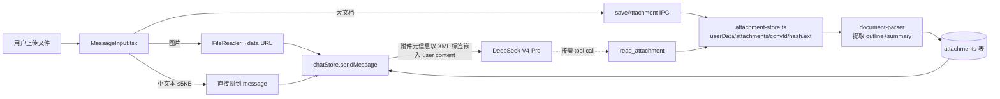

# 对话框附件扩展 Plan

> 状态：待执行 | 创建于 2026-05-01 | 作者：zhi.qu

---

## 一、目标与边界

### 目标

- 对话框允许上传 PDF / Word / PPTX / Excel / TXT / Markdown / 代码文件（在白名单内）
- 大模型像 Cursor 一样**按需读取**附件，不强制把全文塞进 prompt
- 不破坏现有图片走 vision 的链路
- 顺带修复 `[ChatWindow.tsx](desktop-app/src/components/ChatWindow.tsx)` 加载历史丢弃 `image_urls` 的 bug

### 不做（本次范围外）

- 视频 / 音频 / 二进制可执行文件
- 附件搜索面板、附件管理 UI（仅在消息内嵌 chip）
- 附件做 RAG 索引（不入分身知识库，仅本会话可见 —— 用户决策 A）
- 跨会话附件复用 / 全局去重

### 关键约束

- 附件**按会话隔离**：删除会话时联动清除（决策 A）
- 仅 macOS 本地实现（Soul 当前是 Electron 桌面端）
- 必须遵守编码约定（`@author zhi.qu` + `@date` 文件头、`assertSafeSegment` 路径校验、`Logger` 主进程日志）

---

## 二、架构设计

### 数据流（新）




### 三种文件路由


| 类型判断                                   | 处理                   | 模型怎么看到                                                                          |
| -------------------------------------- | -------------------- | ------------------------------------------------------------------------------- |
| `mime.startsWith('image/')`            | 走现有 vision 链路（不动）    | `{type:'image_url', image_url:{url:dataUrl}}`                                   |
| 文本类 + 大小 ≤ 5KB（.txt/.md/.json/.csv/代码） | 直接拼到 user message 正文 | 文本以 fenced code block 包裹                                                        |
| 文档类（PDF/Word/PPTX/Excel）或文本 > 5KB      | 落盘 + 元信息嵌入 + LLM 自取  | `<attachment id="att_xxx" name="..." pages="48" outline="..." summary="..." />` |


### 关键代码风格沿用

- 复用 `[desktop-app/electron/document-parser.ts](desktop-app/electron/document-parser.ts)` 的 `parseFile` 和 `SUPPORTED_PARSE_EXTENSIONS`
- 复用 `[desktop-app/electron/main.ts](desktop-app/electron/main.ts)` 第 1626 行 `read_pdf` 工具的实现思路（`documentParser.parseFile + 截断 8000 字`）
- 复用 `[desktop-app/src/stores/chatStore.ts](desktop-app/src/stores/chatStore.ts)` 第 1879、2081 行的 `effectiveSystemPrompt` 拼接模式注入「附件使用指南」

---

## 三、关键工程决策

### 1. 为什么新增 `read_attachment` 而不是复用 `read_pdf`

`[main.ts` 1625-1642](desktop-app/electron/main.ts) 现有 `read_pdf/docx/pptx` 工具是面向 **workspace 文件**的（用 `workspaceManager.resolveCrossProjectPath` 解析路径）。附件不在 workspace 路径树里，强行复用会让"工具语义"混乱。

新增 `read_attachment(id, page_range?, char_range?)` 按 `attachment_id` 索引，语义清晰且支持**分段读取**（避免 8000 字截断的问题）。

### 2. 为什么 `attachments` 单独建表而不是塞进 `messages.image_urls`

`image_urls` 当前直接 `JSON.stringify` 整个 data URL 数组，**附件如果继续这样做会让 SQLite 体积爆炸**（一个 PDF base64 就好几 MB）。新表只存元信息，文件本体落盘到 `userData/attachments/`。

### 3. 为什么不上传后立即解析全部内容

只在 `saveAttachment` 时做 **outline + summary**（前 500 字 + 大纲），全文解析延迟到 `read_attachment` 工具调用时按需做。这样：

- 上传响应快
- 大文件不阻塞 UI
- 模型用不到的附件不浪费解析时间

### 4. 文件白名单

直接复用 `[document-parser.ts](desktop-app/electron/document-parser.ts)` 导出的 `SUPPORTED_PARSE_EXTENSIONS`（.pdf/.docx/.doc/.pptx/.ppt/.xlsx/.xls/.txt/.md/.csv 等），再加：

- 代码文件：`.ts/.tsx/.js/.jsx/.py/.java/.go/.rs/.sh/.sql/.yaml/.yml/.toml/.xml/.html/.css`
- 配置文件：`.json/.env`（注意 `.env` 要警告用户隐私）

显式拒绝：`.exe/.dmg/.app/.so/.dll/.bin` 等。

---

## 四、子任务拆分（共 8 个，按依赖顺序）

### 子任务 1：基础设施 —— 附件存储 + DB

**新建文件**：`[desktop-app/electron/attachment-store.ts](desktop-app/electron/attachment-store.ts)`（约 150 行）

- `saveAttachment(convId, name, buffer): { id, hash, storedPath }` —— 计算 sha256，落盘到 `userData/attachments/<convId>/<hash>.<ext>`
- `getAttachmentAbsPath(convId, hash, ext): string` —— 用 `assertSafeSegment` 校验
- `deleteAttachmentsByConversation(convId)` —— 删除整个目录

**修改**：`[desktop-app/electron/database.ts](desktop-app/electron/database.ts)`

- 新增 schema v5 migration：建 `attachments` 表
  ```sql
  CREATE TABLE attachments (
    id TEXT PRIMARY KEY,
    conversation_id TEXT NOT NULL,
    message_id TEXT,
    name TEXT NOT NULL,
    mime TEXT NOT NULL,
    size INTEGER NOT NULL,
    hash TEXT NOT NULL,
    ext TEXT NOT NULL,
    summary TEXT,
    outline TEXT,
    parsed_meta TEXT,
    created_at INTEGER NOT NULL,
    FOREIGN KEY (conversation_id) REFERENCES conversations(id) ON DELETE CASCADE
  );
  CREATE INDEX idx_attachments_conv ON attachments(conversation_id, created_at);
  ```
- 新增方法：`insertAttachment / getAttachmentById / listAttachmentsByConversation / linkAttachmentToMessage / deleteAttachmentsByConversation`
- 在 `deleteConversation` 时联动调用 `attachment-store` 清理磁盘

**测试**：`tests/attachment-store.test.ts` —— 落盘/读取/路径穿越拦截 3 个 case

涉及文件：3 个（其中 1 个新建）  
预计代码行数：约 220 行

---

### 子任务 2：IPC 桥接 + 类型扩展

**修改**：`[desktop-app/electron/preload.ts](desktop-app/electron/preload.ts)`

- 新增桥接：`saveAttachment(convId, name, base64Data)`、`getAttachmentMeta(id)`、`listAttachments(convId)`

**修改**：`[desktop-app/electron/main.ts](desktop-app/electron/main.ts)`

- 新增 IPC handler：`save-attachment`、`get-attachment-meta`、`list-attachments`
  - `save-attachment` 内部：base64 → buffer → `attachmentStore.saveAttachment` → `documentParser.parseFile`（仅取 outline + summary 前 500 字）→ `db.insertAttachment`
- 修改 `delete-conversation` handler：调 `attachmentStore.deleteAttachmentsByConversation`

**修改**：`[desktop-app/src/global.d.ts](desktop-app/src/global.d.ts)`

- 新增 `Attachment` 类型与 `electronAPI` 三个方法签名

**修改**：`[desktop-app/src/stores/chatStore.ts](desktop-app/src/stores/chatStore.ts)` 第 64-70 行

- `ChatMessage` 增加 `attachments?: AttachmentRef[]` 字段
- 新增 `AttachmentRef` 类型 `{ id, name, mime, size, summary?, outline? }`

涉及文件：4 个  
预计代码行数：约 130 行

---

### 子任务 3：MessageInput 改造

**修改**：`[desktop-app/src/components/MessageInput.tsx](desktop-app/src/components/MessageInput.tsx)`（约 120 行修改）

- 第 232-233 行：`accept` 从 `image/`* 改为 `image/*,.pdf,.docx,.pptx,.xlsx,.txt,.md,.json,.csv,...`（白名单常量抽到 `@soul/core`）
- 第 64 行：去掉 `image/`* 硬性 return；改为按文件类型分流：
  - 图片 → 走原有 `addImageFile` 逻辑（`compressImage` + `pendingImages`）
  - 文档/文本 → 走新增 `addDocumentFile` 逻辑（调 `electronAPI.saveAttachment` + `pendingAttachments`）
- 第 108-116 行：粘贴扩展支持非图片文件（`item.kind === 'file'`）
- 第 119-124 行：拖拽路径同样分流
- UI：附件预览 chip（图标 + 文件名 + 大小 + 移除按钮），与图片缩略图并列展示
- 大小上限：图片 20MB 不变；文档 ≤ 50MB；文本 ≤ 5MB
- 数量上限：图片+附件总和 ≤ 10

**修改**：`[packages/core/src/index.ts](packages/core/src/index.ts)`

- 新增导出 `ATTACHMENT_WHITELIST_EXTENSIONS`、`MAX_ATTACHMENT_SIZE_BYTES` 等常量

涉及文件：2 个  
预计代码行数：约 130 行

---

### 子任务 4：MessageBubble 渲染 + ChatWindow 历史恢复

**修改**：`[desktop-app/src/components/MessageBubble.tsx](desktop-app/src/components/MessageBubble.tsx)`

- 渲染 `message.attachments` 为附件 chip（与现有图片渲染并列）
- chip 点击时打开本地文件（调 `shell.openPath` 走主进程）

**修改**：`[desktop-app/src/components/ChatWindow.tsx](desktop-app/src/components/ChatWindow.tsx)` 第 146-154 行（**含图片丢失 bug 修复**）

- 当前代码：
  ```146:154:desktop-app/src/components/ChatWindow.tsx
        const dbMessages = await window.electronAPI.getMessages(conversationId)
        if (cancelled) return
        setMessages(
          dbMessages
            .filter(m => m.role === 'user' || m.role === 'assistant')
            .map((m, i) => ({ id: `db-${conversationId}-${i}`, role: m.role as 'user' | 'assistant', content: m.content }))
        )
  ```
- 修正：解析 `image_urls` JSON 字符串恢复图片，调 `electronAPI.listAttachments` 恢复附件 ref
- 渲染时按 `message.id ↔ attachment.message_id` 关联

涉及文件：2 个  
预计代码行数：约 50 行

---

### 子任务 5：chatStore.sendMessage 三路分流

**修改**：`[desktop-app/src/stores/chatStore.ts](desktop-app/src/stores/chatStore.ts)` 第 1849-1989 行

- 第 1851-1852 行模型选择保留：有图片才切 vision，附件不强制切
- 第 1892-1895 行 `saveMessage` 调用增加附件 ID 数组：保存后调 `linkAttachmentToMessage(messageId, attachmentIds)`
- 第 1983-1989 行 content 组装重写：
  - 有图片：保留 `image_url` content part
  - 无图片但有小文本附件：把内容以 fenced code block 拼到 text part
  - 大文档附件：在 text part 头部插入 `<attachment id="..." name="..." pages="..." outline="..." summary="..." />` 标签
- 第 2086-2087 行：仅有图片时才清空 tools；附件场景必须保留 tools（因为模型要用 `read_attachment`）

涉及文件：1 个  
预计代码行数：约 70 行

---

### 子任务 6：新增 `read_attachment` / `search_attachment` 工具

**修改**：`[desktop-app/electron/main.ts](desktop-app/electron/main.ts)`（在第 1625 行 `read_pdf` 块之后）

- `read_attachment(id, char_range?: [start, end], page_range?: [from, to])`
  - 通过 `db.getAttachmentById` 拿到 `stored_path`
  - 调 `documentParser.parseFile`（缓存到内存 LRU，避免重复解析）
  - 按 `char_range` / `page_range` 切片返回（默认前 16000 字）
- `search_attachment(id, keyword)` —— 全文 grep，返回命中行号 + 上下文
- 在工具描述（schema）里强调："读用户当前对话上传的附件，优先于 read_pdf"

**修改**：`[packages/core/src/tool-router.ts](packages/core/src/tool-router.ts)`

- 在 `getToolDefinitions` 注册新工具的 schema（OpenAI function calling 格式）

涉及文件：2 个  
预计代码行数：约 130 行

---

### 子任务 7：System prompt 注入「附件使用指南」

**修改**：`[desktop-app/src/stores/chatStore.ts](desktop-app/src/stores/chatStore.ts)` 第 1866-1879 行（已有 `effectiveSystemPrompt` 拼接先例）

- 检测 `messages` 里最近 5 条是否含 `<attachment>` 标签
- 若有，在 `effectiveSystemPrompt` 拼接段落：
  ```
  【附件使用指南】
  当用户消息中含 <attachment id="att_xxx" .../> 标签时：
  - 不要假装已读全文。先看 outline 和 summary 判断是否需要详读
  - 需要详读时调用 read_attachment(id, char_range 或 page_range)
  - 大文档分段读取，避免一次性 read_attachment 全量
  - 用关键词检索时用 search_attachment(id, keyword)
  - 若 outline + summary 已能回答用户问题，可不调工具直接回答
  ```

涉及文件：1 个  
预计代码行数：约 20 行

---

### 子任务 8：测试用例与回归

**新建**：`desktop-app/electron/__tests__/attachment-store.test.ts`

- 落盘 + 读取（基本流程）
- 路径穿越拦截（`../../etc/passwd` 应抛错）
- 删除会话联动清理

**新建**：`desktop-app/electron/__tests__/database-attachments.test.ts`

- v5 migration 幂等性
- `insertAttachment` + `getAttachmentById` 往返

**新建**：`desktop-app/src/components/__tests__/MessageInput.attachments.test.tsx`

- 上传图片仍走旧路径
- 上传 PDF 进 `pendingAttachments`
- 上传 .exe 被拒

**手工回归清单**：

- 上传 1 个 PDF + 提问，确认模型主动调 `read_attachment`
- 上传 .txt（< 5KB），确认内容直接进正文
- 上传图片，仍切 vision 模型
- 重启 App 重开会话，附件 chip 和图片都还在
- 删除会话后，`userData/attachments/<convId>/` 目录消失

涉及文件：3 个测试文件  
预计代码行数：约 200 行

---

## 五、风险与缓解


| 风险                             | 缓解                                                                 |
| ------------------------------ | ------------------------------------------------------------------ |
| 模型不主动调用 `read_attachment`（直接编） | 子任务 7 在 system prompt 强约束 + 工具描述明确 + 后续观察可加重试机制                    |
| 大文档 `documentParser` 解析超时      | 已有 `_parseFileImpl` 超时机制，工具调用层面再加 30s 超时                           |
| `.env` / 含密码的文件被上传             | 子任务 3 在前端识别 `.env` 时弹 toast 警告 + 让用户二次确认                           |
| schema v5 迁移失败导致老用户启动崩溃        | runMigrations 已有事务包裹；新建表 `IF NOT EXISTS`；本任务不删除 `image_urls` 列保持兼容 |
| 附件目录在用户删库后残留                   | 子任务 1 在 `deleteConversation` 内联动清理；额外提供启动期孤儿目录清理（v6 再做）            |


---

## 六、执行建议

1. **每个子任务在新对话窗口执行**，用 `@.cursor/plans/对话框附件扩展.md` 作为唯一上下文
2. 子任务间严格按 1→2→3→4→5→6→7→8 顺序，3 和 4 可并行（一个改输入，一个改渲染）
3. 每完成一个子任务，回写本文件「执行记录」节，再开下一个窗口
4. 单子任务调试 > 3 轮未解决 → 熔断，输出阻塞原因等待人工决策

---

## 七、执行记录

> 完成于 2026-05-01，作者 zhi.qu。

- **子任务 1**：基础设施 + DB —— 新建 `electron/attachment-store.ts`（约 110 行）、`electron/attachment-store.test.ts`（7 case 全绿）；`database.ts` 新增 v8 migration、`attachments` 表与 5 个 CRUD 方法、`deleteConversation` / `deleteConversationsByAvatar` 联动清理。
- **子任务 2**：IPC + 类型 —— `preload.ts` 暴露 5 个桥接（`saveAttachment` / `getAttachmentMeta` / `listAttachments` / `linkAttachmentToMessage` / `openAttachmentFile`）；`main.ts` 实现对应 handler，`save-attachment` 内调 `documentParser.parseFile` 取 outline + summary（前 500 字）；`global.d.ts` 加 `Attachment` 类型，`chatStore` 加 `AttachmentRef`。
- **子任务 3**：MessageInput 改造 —— 抽取 `packages/core/src/utils/attachment-types.ts` 统一白名单/上限/路由分类；`addFile` 走 `classifyAttachmentRoute`，分流到 `addImageFile` / `addDocumentFile`；UI 同时展示图片缩略图与文档 chip；拖拽/粘贴/点击三路统一。
- **子任务 4**：MessageBubble + ChatWindow（含图片 bug 修复）—— `MessageBubble.tsx` 新增 `formatBytes` / `extOf`，渲染 `imageUrls` 缩略图（`target="_blank"` 大图）+ `attachments` chip（点击 `openAttachmentFile` 用系统应用打开）；**修复历史会话 image_urls 丢失 bug**：`ChatWindow.loadMessages` 改为并发 `getMessages` + `listAttachments`，按 `message_id` 组 Map 关联 chip，并 `JSON.parse` 还原图片 URL 列表。
- **子任务 5**：sendMessage 三路分流 —— `userMessage` 携带 `imageUrls` / `attachments` 用于 UI；`saveMessage` 后调 `linkAttachmentToMessage` 回填 message_id（幂等，关联失败仅记 warn 不阻塞）；构造 `attachmentBlock`：大文档以 `<attachment id name mime size outline summary />` 标签注入，小文本以 fenced code block 拼到正文头部；图片+附件并存时 tools 仅保留 `read_attachment` / `search_attachment`，避免被强制清空。
- **子任务 6**：`read_attachment` / `search_attachment` 工具 —— `chatStore.AVATAR_TOOLS` 新增 2 个 schema（含 char_range / page_range / max_hits）；`main.ts` 新增 LRU 缓存（上限 16 条，按 attachment.id key）+ 两个 handler：`read_attachment` 默认前 16000 字、支持 char_range / page_range 切片，硬上限 32k；`search_attachment` 按行 grep + ±1 行上下文，max_hits 默认 20、上限 100；越权（跨会话）和文件丢失均显式返回 error；`tool-name-map.ts` 加中文名「读取对话附件 / 检索对话附件」。
- **子任务 7**：system prompt 附件指南 —— `effectiveSystemPrompt` 在 @-mention 拼接后增加判定：当前消息有附件 OR 最近 5 条 user 消息含 `<attachment id="att_..."` 时，注入 8 行「对话附件使用指南」（强调用 `read_attachment` 而非 `read_pdf`、分段读取、不要编内容）；普通对话不浪费 token。
- **子任务 8**：测试 + 回归 ——
  - 新增 `electron/database-attachments.test.ts`（6 case：CRUD 往返 + 排序 + 批量回填 + 隔离删除 + cascade + 迁移幂等）；用 `require.cache` 注入 electron stub，并在 better-sqlite3 ABI 不匹配时优雅 `skip`，运行 `npm rebuild better-sqlite3` 后 6/6 全绿。
  - `attachment-store.test.ts` 7/7 全绿（落盘 / 去重 / 路径穿越 / 非法 hash·ext / 删除幂等 / 50MB 上限 / 空 buffer）。
  - 副带修复：`createBaseSchema` 漏建 `agent_tasks` 表的潜在 bug —— 全新安装时 `deleteConversation` 会因 `no such table` 抛错（老用户因走过 v6→v7 迁移而未暴露）。
  - `MessageInput.attachments.test.tsx` 因项目无 React 组件测试基建（无 jsdom + RTL + vitest），不引入新 runner，改为列入下方手工回归清单。

### 手工回归清单（macOS Electron 桌面端）

| # | 场景 | 预期 |
|---|---|---|
| 1 | 在对话框上传 1 个 PDF 并问"这个文档讲了什么" | LLM 主动调用 `read_attachment(id)`（不是 `read_pdf`），回答里能引用文档内容 |
| 2 | 上传 1 个 < 5KB 的 .txt，提问 | 文本以 fenced code block 直接进 user content，**不**触发 `read_attachment` |
| 3 | 上传 1 张图片 | 模型自动切到 vision，且不再注入 `<attachment>` 标签和指南 |
| 4 | 同时上传 1 张图片 + 1 个 PDF | vision 模型生效，且 `tools` 仍包含 `read_attachment` / `search_attachment`（其他 tools 被剥离） |
| 5 | 上传 1 个 .exe / .dmg | MessageInput 显式拒绝并 toast 提示 |
| 6 | 上传 1 个 .env | 弹 toast 警告"含敏感信息" 二次确认 |
| 7 | 上传后立即关闭 App，重启，重开会话 | 附件 chip 与图片缩略图都还在；点击 chip 用系统应用打开文件 |
| 8 | 删除会话 | `userData/attachments/<convId>/` 目录消失，`attachments` 表对应行清空 |
| 9 | 删除整个分身 | 该分身名下所有会话的附件目录全部清理 |
| 10 | 上传一个 60MB 的文件 | 显式报错"附件过大（>50MB）"，不落盘 |
| 11 | 同会话内重复上传同一文件 | 后一次秒上传（hash 命中去重）；DB 里多一条元信息行，文件本体复用 |
| 12 | LLM `read_attachment` 第一次默认前 16000 字 | 返回 `truncated:true` 和续读 hint，模型可根据 hint 用 char_range 续读 |
| 13 | LLM `read_attachment(id, page_range:[1,3])` PDF | 返回前 3 页文本 + `pageRange / charRange / totalPages` |
| 14 | LLM `read_attachment` 跨会话 id（伪造） | 显式返回 error "附件不属于当前会话，无权限读取" |
| 15 | `search_attachment(id, "关键词")` | 返回命中行号 + ±1 行上下文；无命中给提示语 |
| 16 | 拖拽 1 张图 + 1 个 PDF 一起进入对话框 | 同时进 `pendingImages` 和 `pendingAttachments`，chip 与缩略图并列 |

